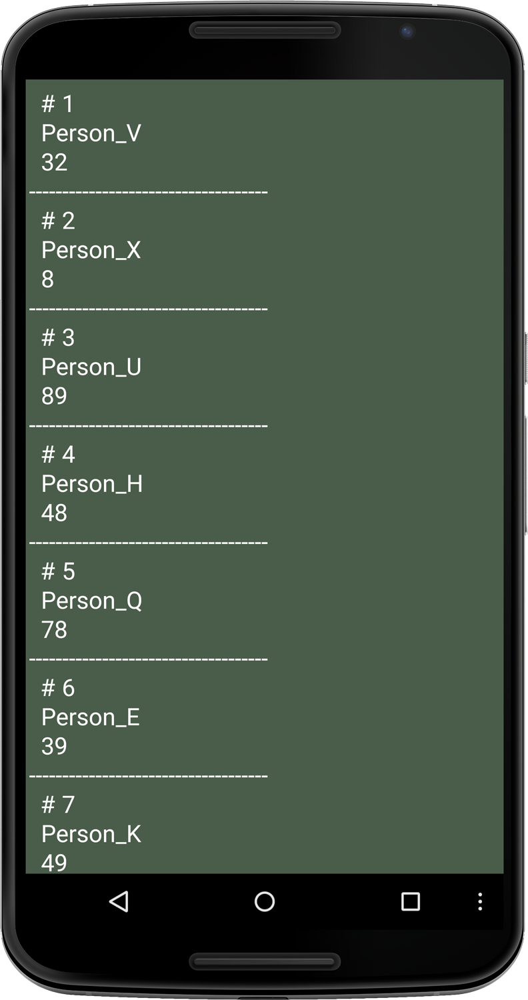
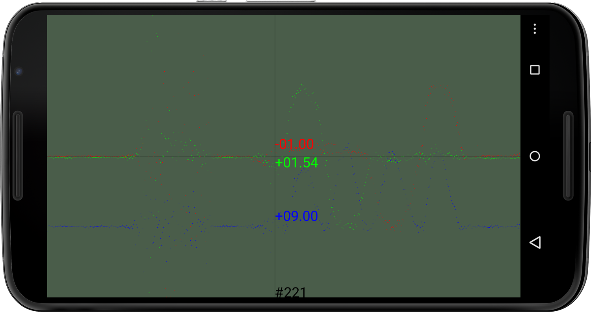
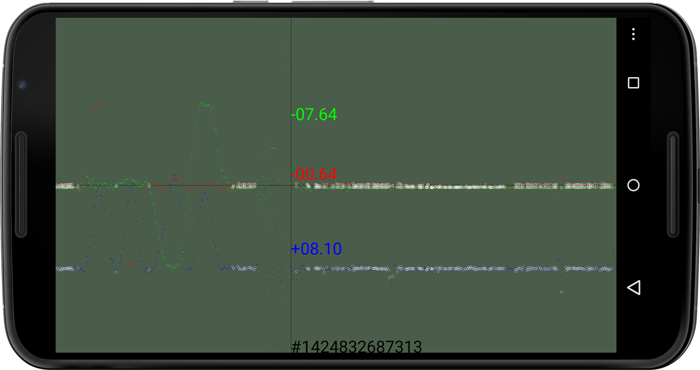

###Chapter 10:

#Using SQLite Databases
 
 In this second part of our introduction to data, we’ll work with SQLite, the popular relational database management system for local clients such as the Android, used also by many browsers and operating systems to store data. It implements the popular Structured Query Language (`SQL`) syntax for database queries, which we can use to access data stored locally on our Android device. 
 
 SQLite is a fairly simple and fast system, is considered very reliable, and has a small footprint that can be embedded in larger programs. It offers less fine-grained control over access to data than other systems like PostgreSQL or MySQL does, but it is simpler to use and administer, which is the main objective of the technology. It works very well as a file format for applications like Computer-Aided Design (`CAD`), financial software, and record keeping.[][0] It is often used in cellphones, tablet computers, set-top boxes, and appliances because SQLite does not require administration or maintenance. This simple database management system can be used instead of disk files, like the tab- or comma-delimited text files we’ve worked with in <!--ref linkend="chp.data-->, replacing them with ad-hoc SQLite disk files. 
 
 In this chapter, we’ll first get SQLite running with a simple sketch and learn how to use `SQL` queries to retrieve data from a SQLite table. Then we’ll create an app that uses SQLite to capture accelerometer data from the sensor built into the Android. We’ll use the recorded sensor values to create a time series visualization of the data. Finally, we’ll query the data set we’ve recorded based on a certain device orientation we are looking for, and we’ll highlight the sensor value that matches our query criteria. 
 
 Let’s take a look at the classes and methods that allow us to use SQLitedatabases for more complex data-driven apps. 
 <sect1 id="sec.sqlite--> 

###Working with SQLite Databases
 
 Now that we’ve seen most of Processing’s `Table` features, it’s time we take a look at the widely used SQLite database management system for local clients. It is based on the the popular Structured Query Language syntax for database queries and will look very familiar if you’ve worked with `SQL` before. Ketai gives us access to Android’s `SQLiteDatabase` class and provides us with the essential methods we need to create, query, and update content in the database tables. 
 
 The Ketai `KetaiSQLite` class is what we need to create full-fledged local SQLite databases on the device. For the projects in this chapter, we’ll use it to store a number of points that we’ll create by tapping the touch screen interface, and later we’ll use it to record accelerometer sensor data using the `KetaiSensor` class we’ve seen in <!--ref linkend="chp.sensors-->. Let’s get started by taking a look at the relevant Processing and Ketai methods we’ll be working with throughout the chapter. 
 
 We’ll create two SQLite projects, one to get us up and running with a few random values in a SQLite database. The next project will take advantage of the `KetaiSensor` class to capture accelerometer data directly into a SQLite database, which we’ll browse and visualize on the Android display. 
 
 For the SQLite app we’ll create in this chapter, we’ll discuss `SQL` queries only very briefly. If you are unfamiliar with the language or would like to explore `SQL` queries further later on, you can find a more thorough reference online for the statements outlined next.[][1] 
 
 Let’s take a look at the `KetaiSQLite` class and SQLight basics. 
 </sect1> <sect1> 

###Working with the KetaiSQLite Class
 
 
 
 To use SQLite on the Android, we’ll work with the following `KetaiSQLite` methods. 
 <table> <row> <col>
`KetaiSQLite`[][2]
 <col> 
 Ketai class for working with SQLite databases&—it can be used to create a KetaiSQLite database or to load an existing database. 
 </row> <row> <col>
`execute()`
 <col> 
 `KetaiSQLite` method for executing a SQLite query to a database, which doesn’t return data 
 </row> <row><col>
`query()`
 <col> 
 `KetaiSQLite` method for sending a SQLite query to a database, returning data 
 </row> <row> <col>
`getRecordCount()`
 <col> 
 `KetaiSQLite` method returning all records in a specified table, using the table name as parameter 
 </row> <row> <col>
`getDataCount()`
 <col> 
 `KetaiSQLite` method returning all records in a database across all tables 
 </row> </table> 
 Now let’s take a look at the most important declarative `SQL` we’ll use in our database project.[][3] 
 <table> <row> <col>
`CREATE`[][4]
 <col> 
 `SQL` statement for creating a table in a database with specified fields and data types 
 </row> <row> <col>
`INSERT`[][5]
 <col> 
 `SQL` statement for creating a new row in a table 
 </row> <row> <col>
`SELECT`[][6]
 <col> 
 `SQL` statement to query a database, returning zero or more rows of data 
 </row> <row> <col>
`WHERE`[][7]
 <col> 
 `SQL` clause used in conjunction with a `SELECT` statement and expressions[][8] 
 </row> <row> <col>
`*`
 <col> 
 `SQL` wildcard that stands for “all” in a query 
 </row> <row> <col>
`INTEGER`, `TEXT`
 <col> 
 `SQL` field data types 
 </row> <row> <col>
`PRIMARY KEY`
 <col> 
 `SQL` statement to make a field the primary key 
 </row> <row> <col>
`AUTOINCREMENT`
 <col> 
 `SQL` statement to make an integer field, which is typically also the primary key to automatically increment by one in order to be unique 
 </row> </table> 
 Now let’s get started with our first `KetaiSQLite` database. 
 </sect1> <sect1> 

###Implement a Data Table in SQLite
 
 In the next project, we’ll create a simple record-keeping sketch using the SQLite data management system, which can store a list of individual names and the IDs associated with them. Using text strings for the names we store and integer values for the associated IDs allows us to explore two different data types within the database. There is essentially no limit to the number of entries we can add to the SQLite table, besides the usual memory restrictions we have in Android’s internal storage. 
 
 The goal of this SQLite project is to familiarize ourselves with the steps we need to follow to create a SQLite database, a new table inside the database, and data entries inside that table. To see whether we are successful, we’ll output the contents of the table to the Android screen as shown in <!--ref linkend="fig.data.sql-->. We’ll use the `KetaiSQLite` class for this project and the remaining projects of this chapter. 
 
#####Figure 10.0 - Working with a SQLiteDatabase.
######This screen output shows the initial five entries inserted in the data table. Each record contains a unique ID assigned by the database management system shown with a # prefix, a random name, and a random age. 
 To implement this SQLite sketch we’ll first create a `KetaiSQLite` object, then create a new table called `data` using a `CREATE TABLE` statement, after that, `INSERT` data into the table, and finally, `SELECT` all the table contents to output it on the device screen. This is the most concise way to complete the necessary steps when we are working with a database. 
 
 To keep it simple, we’ll populate the table only with values for two fields we call `name` and `age`. Besides those two fields, we’ll also implement a field called `_id`, which is good practice: we should always use this to provide a unique identifier for each record. To keep each ID unique, we’ll use `SQL`’s `AUTOINCREMENT` feature, which takes care of incrementing the numeric integer ID each time we add a new record to the table. This ensures that all table rows have a number assigned to it, each unique throughout the table. 
 
 To create five sample entries inside the `data` SQLite table, we’ll use a `for()` loop to generate a random `name` text `String` and a random `age` for the respective fields. 
 
 Note that we are neither using our familiar `setup()` nor the `draw()` method for this sketch. We don’t need them here because we are writing a static sketch that executes our statements to create, populate, and display the database content, and that’s it. In all those cases, we need to use `setup()` and `draw()` as we did in all the sketches we’ve developed so far. 
 
 Let’s take a look at the code. 
 <code id="code.sqlite" file="code/SQLite/SQLite/SQLite.pde" language="java" start="import" end="eof--> 
 We need to take the following steps to implement our SQLite database table. 
 1. 
 Define a `KetaiSQLite` variable called `db`. 
 2. 
 Create the `db` object of type `KetaiSQLite`. 
 3. 
 Check if the `data` table exists from a prior session; if not, create a new `data` table as defined in the query string `CREATE_DB_SQL` using three fields of type `INTEGER`, `TEXT`, and `INTEGER` for the respective fields `_id`, `name`, and `age`. 
 4. 
 Execute the `SQL` query to create the `data` table using the `KetaiSQLite` method `execute()`. 
 5. 
 Loop five times to create five initial entries in the `data` table. 
 6. 
 `INSERT` values for the `data` table into the `name` and `age` fields using a random character suffix to make the “Person_” string unique (characters 65..90 represent A..Z in the ASCII character table[][9]) and using a random integer number ranging 0..99 for `age`. 
 7. 
 Get the record count for the `data` table using `KetaiSQLite`’s `getRecordCount()` method. 
 8. 
 Send a query to the database requesting all (`*`) records from the `data` table. 
 9. 
 Parse all records in the table using a **while** loop until there are no more to be found. 
 10. 
 Create an `output` `String` containing all records in the `data`. 
 11. 
 Show the `output` text to give us feedback on the `data` table contents. 
 
 Let’s run the sketch now. 
 <sect2> 

###Run the App
 
 Run the sketch on your device. You’ll see five records similar to <!--ref linkend="fig.data.sql-->. To retrieve the individual entries of each record, we use the `getString()` and `getInt()` methods, which take the table’s field names as parameters. If we use a field name that doesn’t exist, the `getString()` and `getInt()` methods will return `0`. You can check this out by adding the following line of code to the `output` string. 
 <code language="java--> output += db.getInt(&quot;foo&quot;) + &quot;\n&quot;; //doesn’t exist, so we get ’0’ </code> </sect2> 
 If you are interested in working with an existing SQLite database, you can use the `KetaiSQLite` class to load it from the sketch `data` folder. You’d load the `example.sqlite` database as shown in the following code snippet. 
 <code language="java--> KetaiSQLite db; KetaiSQLite.load(this, &quot;example.sqlite&quot;, &quot;example&quot;); db = new KetaiSQLite( this, &quot;example&quot;); </code> 
 You are now able to work with SQLite databases on the Android, which also lets you explore aspiring data-driven projects. Let’s put the new skills in practice by creating a sketch that lets us record accelerometer sensor data to a SQLite database. 
 </code></sect1> <sect1> 

###Record Sensor Data into a SQLite Database
 
 To see how useful a database can be, let’s go one step further and create an app that lets us record sensor data directly into a SQLite database table. We’ll then use `SQL` queries to browse the sensor data we’ve recorded from the accelerometer and visualize the data on the Android screen as a time series.[][10] A time series plots data points recorded at fixed intervals. For our example, we will record a data point every time we receive a new accelerometer value. 
 
 Alongside the accelerometer sensor values *x*, *y*, and *z*, we’ll record time as Unix time (measured in milliseconds since January 1, 1970 UTC[][11]) using Android’s `System` method, `currentTimeMillis()`.[][12] This allows us to identify precisely at what time (and date) the data has been captured. The Unix time stamp will also serve as the unique ID in our `data` table. So for our `data` table, we’ll need the following table structure and data types created by the following `SQL` query. 
 <code> CREATE TABLE data ( time INTEGER PRIMARY KEY, x FLOAT, y FLOAT, z FLOAT) </code> 
 Let’s look at each part of the `SQL` statement separately. 
 <table> <row><col>
**CREATE TABLE**
 <col> 
 The `SQL` keyword to create a table 
 </row> <row><col>
`data`
 <col> 
 The name we give the created table 
 </row> <row><col>
`time` `INTEGER` `PRIMARY KEY`
 <col> 
 Defines the first `time` field we’ll create with the datatype `INTEGER`&—the `id` field also functions as the `PRIMARY KEY` for the table. In a database that can use multiple tables that relate to each other, the primary key uniquely identifies each record in the table. 
 </row> <row><col>
`x`
 <col> 
 A field of type `FLOAT` that we use to store the value reported from the accelerometer’s *x*-axis 
 </row> <row><col>
`y`
 <col> 
 A field of type `FLOAT` that we use to store the value reported from the accelerometer’s *y*-axis 
 </row> <row><col>
`z`
 <col> 
 A field of type `FLOAT` that we use to store the value reported from the accelerometer’s *z*-axis 
 </row> </table> 
 Here’s our approach to visualizing the time series data from the accelerometer sensor. 
 
 To display our time series on the screen, we’ll work with a pair of variables called `plotX` and `plotY`, taking each of our data points and mapping it to the correct horizontal and vertical positions on the screen. We calculate `plotX` by using the record counter `i` to determine the total number of entries. We then use this number to spread the collected data over the full display `width`. We determine the vertical position `plotY` for each point by mapping each *x*, *y*, and *z* sensor value in relation to the display `height`. 
 
 Because the device reports a value equal to `1` g when it rests on the table (g-force equals 9.81 m/<raise power="2-->s</raise>, as we know from <!--ref linkend="sec.display.accelerometer.values-->), let’s use `2` g as the assumed maximum so we can move and shake the device and still show those higher values on the screen. Values of `0` g are shown centered vertically on the screen; positive values plot in the upper half of the display, and negative values in the bottom half. 
 
 Let’s take a look at the code. 
 <code id="code.capture.sql" file="code/SQLite/DataCapture/DataCapture.pde" language="java" start="import" end="eof--> 
 Let’s take a look at the steps we need to take to implement the sketch. 
 1. 
 Define a `String` called `CREATE_DB_SQL` containing the `SQL` query to create a new table called `data`. Use four columns, or fields (called `time`, `x`, `y`, and `z`) to store sensor data. Associate the data type `INTEGER` with the `time` field and make it the `PRIMARY KEY`, and use the datatype `FLOAT` for the sensor axis. 
 2. 
 Connect to the SQLite database that we’ve associated with the sketch when we created `db`. 
 3. 
 Create the `data` table if it doesn’t already exist in the SQLite database, using the `CREATE_DB_SQL` `String` we’ve declared earlier. 
 4. 
 Send the table query `CREATE_DB_SQL` to the database using `execute()`, a method that doesn’t return values but just executes a query. 
 5. 
 Give some feedback on the display while we are recording data points. 
 6. 
 Call the custom function `plotData()`, taking care of the data visualization. 
 7. 
 If the `DELETE` key is pressed, erase all content in the `data` table using a `DELETE` query, which leaves the table structure intact. 
 8. 
 Capture a `MENU` key event and use it to start and stop recording data. 
 9. 
 Use an `INSERT` `SQL` query to add a record into the `data` table every time we receive a sensor value via `onAccelerometerEvent()`. Use the Android `System` method `currentTimeMillis()` to request the current UTC time in milliseconds. 
 10. 
 If the insertion of the new record fails, print an error message to the console. 
 11. 
 Use a `SELECT` `SQL` statement to request all entries from the `data` table, sorting them by the `UTC` field in descending order. 
 12. 
 Use `while()` to parse through the `data` table for as long as the `next()` method returns `TRUE` and there are more entries to browse. 
 13. 
 Get the *x*-axis value from the record using the `getFloat()` method with the field name `x` as the parameter. Do the same for the *y*- and *z*-axes. 
 14. 
 Draw a red `ellipse()` at the location’s horizontal position `plotX`. 
 15. 
 Show the `x` value in a text label aligned with the ellipse if the horizontal position of the ellipse matches the horizontal finger position. Use the same approach for the *y*- and *z*-axes later on. 
 16. 
 Draw the *y*-axis values using the same approach we took for *x* but with a green fill color. 
 17. 
 Draw the *z*-axis values using the same approach we took for *x* and *y* but using a blue fill color. 
 
 Now let’s run the app. 
 <sect2> 

###Run the App
 
 Run the sketch on the device. When you run it for the first time, the SQLite `data` table will be created first. Press the menu key on the device to start recording accelerometer data. While you record sensor data, you’ll see the record count increase. Press Menu again to stop the recording process. 
 
 You’ll see a screen output similar to <!--ref linkend="fig.data.capture-->, showing the *x*-, *y*-, and *z*-axis values scattered as red, green, and blue dots around the vertical center representing `0`. Positive g-force values are shown on the top half of the display, and negative values on the bottom. 
 
#####Figure 10.1 - Capturing sensor data in SQLite.
######We visualize the recorded x (red), y (green), and z (blue) accelerometer values using SQLite entries. On the left we see increasing device shakes and rest, and on the right, continuous device rotation. 
 You can continue adding points to the database by continuing to periodically press the Recent button. Once you reach a couple hundred points, you will note that it takes a bit longer to write and read the data. Our sensor reports values so fast that we record a couple hundred values into our SQLite database in just a few seconds. And because our database is stored on the device’s SD card, the more values we’ve captured, the longer it will take to write. 
 
 You can reduce the number of entries into our database, for example, by recording only every other sensor value in `onAccelerometerEvent()`. Depending on your application, you can also write to the database at a reduced time interval. If you’d like to erase all data from the database, press the Back button. It triggers a `DELETE` query so we can start from scratch. 
 </sect2> 
 The process of creating tables and inserting and selecting data is in principle the same for any SQLite database project. Whether you have four or forty fields, a hundred or a thousand rows, this project can serve as a template for many of your data-driven Android projects. 
 
 Besides working with all the data in our database table, there is another important aspect of a database we need to explore&—selecting data using a condition and returning only values that match that condition, which brings us to our next section. 
 </code></sect1> <sect1> 

###Refine SQLite Results Using WHERE Clauses
 
 
 
 Since we recorded data into a SQLite database, we can do much more with the data than parsing our `data` row by row. For example, `KetaiSQLite` methods can help us get the minimum and maximum values of a particular field in our table. This comes in very handy when we’re displaying time-series graphs and want to distribute our data points evenly across a display in a way that takes full advantage of the available pixel real estate of each Android device. 
 
 Conditional `SQL` queries using `WHERE` clauses allow us to search table records that match a particular value we specify in our clause. It returns all rows for which the `WHERE` clause is `true`. `WHERE` clauses are often used with one of the following operators: `=`, `&lt;&gt;`, `&gt;`, `&gt;=`, `&lt;`, `&lt;=`, or `LIKE`. 
 
 For instance, adding `WHERE x &gt; 5` to our `SELECT` statement will only return records that have values greater than `5` in the `x` field of our `data` table. Similarly, we could request from the `data` table in our previous sketch <!--ref linkend="code.sqlite-->, only the `name` of a person older than `age` `21`. This way we can quickly implement many of the user-driven interactions we know from searching an online store for books only by a particular author, or shopping for merchandise from a particular brand. 
 
 Let’s explore `WHERE` clauses based on the code we’ve just worked on to visualize sensor data stored in our SQLite database table we’ve called `data`. We’ll leave the structure of the sketch intact but add a query that uses a `WHERE` clause to find only those records that match our condition. 
 
 As a condition for our `WHERE` clause, let’s look for all the records that indicate the device is resting flat on the table (display pointing up). This is only the case if the *z*-axis shows a value of approximately `1` g, or `+9.81`, while the *x*- and *y*-axis values are close to `0`. Let’s use a white circle to indicate data points that match our condition, as shown in <!--ref linkend="fig.data.capture.clause" thispage="yes-->.
 
#####Figure 10.2 - Refining SQL queries using WHERE clauses.
######Data points recorded when the Android remains flat and still are highlighted via white circles. The number on the bottom of the screen indicates the Unix time when the record was created. 
We add the `WHERE` clause to the previous `SELECT` statement we’ve used. We are allowing values differing up to `1` m/<raise power="2-->s</raise> from the value we are looking for. 
 <code language="sql--> SELECT * FROM data WHERE z > 9.5 AND abs(x) < 0.3 AND abs(y) < 0.3 </code> 
 Instead of the scheme we used in our previous sketch, let’s specify time using the Unix time stored in the `time` field of the `data` table. This is more accurate because we don’t receive sensor updates at an exact interval. Instead, we use the exact moment we’ve received new values in the form of a time stamp, and we use this time stamp to plot the data exactly when it occurred on our horizontal time axis. Essentially we are plotting each recorded data point proportional to the lowest (right) and highest (left) recorded time stamp. To correctly represent a Unix time value, we’ll need thirteen digits. For that level of precision, we’ll use the Java long datatype, a datatype that can handle long integers.[][13] The `map()` method we’ve used throughout the book is not designed to handle such large integer values, so we simply build our helper method `getLong()` based on Processing’s `map()` algorithm. 
 
 Let’s look at the `plotData()` and `mapLong()` methods we are now working with, building on the <!--ref linkend="code.capture.sql-->. 
 <code id="code.data.capture.clause" file="code/SQLite/DataCaptureClause/DataCaptureClause.pde" language="java" start="void plotData()" end="eof--> 
 Now let’s see what changes we’ve made to our previous sketch <!--ref linkend="code.capture.sql-->. 
 1. 
 Get the minimum value of the `time` field in the `data` table using `KetaiSQLite`’s `getFieldMin()` method. Use the datatype `long` to hold the returned thirteen-digit Unix time value. 
 2. 
 Get the maximum value of the `time` field in the `data` table using `getFieldMax()`. Use the datatype `long` to hold the time value. 
 3. 
 Parse the data, including the `time` field, which contains a `long` value that we store in the variable `t`. 
 4. 
 Calculate the `plotX` position of our data point based on the `time` value stored in `data`. 
 5. 
 Draw a text label for the data point’s Unix time stamp. 
 6. 
 Use a `WHERE` clause that only returns results where the condition is `true`.[][14] 
 7. 
 Draw a white circle around the data points that match the device’s rest state. 
 8. 
 Define the user-defined method `mapLong()` as working identically to `map()` but handling values of datatype `long`.[][15] 
 
 Now let’s test our sketch. 
 <sect2> 

###Run the App
 
 Run the sketch on the device, and you’ll see it start up empty again, as no database table `data` exists in this modified sketch with a new name. When you start recording using your menu key, make sure to lay the device flat and let it rest in that position for a moment before you move it around a bit. 
 
 Now stop recording data. You’ll see that the data points recorded at rest are highlighted by a white ring. Those data points that don’t match our condition remain without a highlight. This means that our `SQL` query did the job, returning only the records that match *z*-axis values greater than `+9.5` and *x*- and *y*-axis values smaller than `0.3` m/<raise power="2-->s</raise>. 
 
 You can try other `WHERE` clauses and see the same data highlighted differently, depending on the conditions and expressions you’ve used. 
 </sect2> 
 Working with SQLite databases is certainly not limited to sensor data. The tables we create can contain any type of numbers and text strings, making the projects in this chapter an ideal template to explore your other data-driven app ideas. 
 </code></sect1> <sect1> 

###Wrapping Up
 
 Working with local SQLite databases, you can now also develop your aspiring data-driven applications and take advantage of the powerful Structured Query Language to filter, search, and sort your queries. Being able to work with data will allow you to improve all the projects we’ve worked on in this book, as well as your future projects, and help make your apps more usable and useful. 
 
 Now that we’ve learned how to work with the Android file system and databases, we are now ready to work with 3D graphics and with linked assets such as objects, materials, and textures. 
</sect1></chapter>
[0]: http://www.sqlite.org/whentouse.html
[1]: http://en.wikipedia.org/wiki/SQL
[2]: http://ketai.org/reference/data/ketaisqlite
[3]: http://en.wikipedia.org/wiki/Structured_Query_Language#Queries
[4]: http://www.sqlite.org/lang_createtable.html
[5]: http://www.sqlite.org/lang_insert.html
[6]: http://www.sqlite.org/lang_select.html
[7]: http://www.sqlite.org/optoverview.html#where_clause
[8]: http://www.sqlite.org/lang_expr.html
[9]: http://en.wikipedia.org/wiki/ASCII
[10]: http://en.wikipedia.org/wiki/Time_series
[11]: http://en.wikipedia.org/wiki/Unix_time
[12]: http://developer.android.com/reference/java/lang/System.html#currentTimeMillis%28%29
[13]: http://processing.org/reference/long.html
[14]: http://www.sqlite.org/optoverview.html#where_clause
[15]: http://processing.org/reference/map_.html