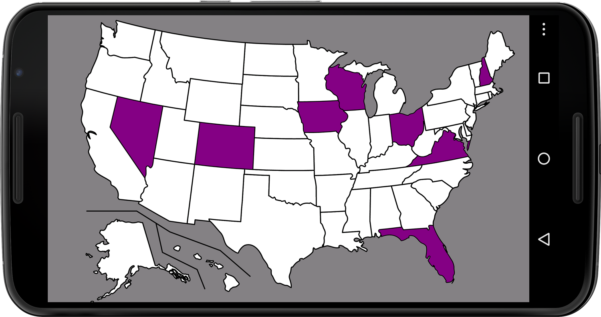
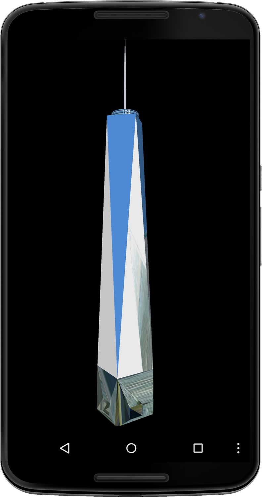
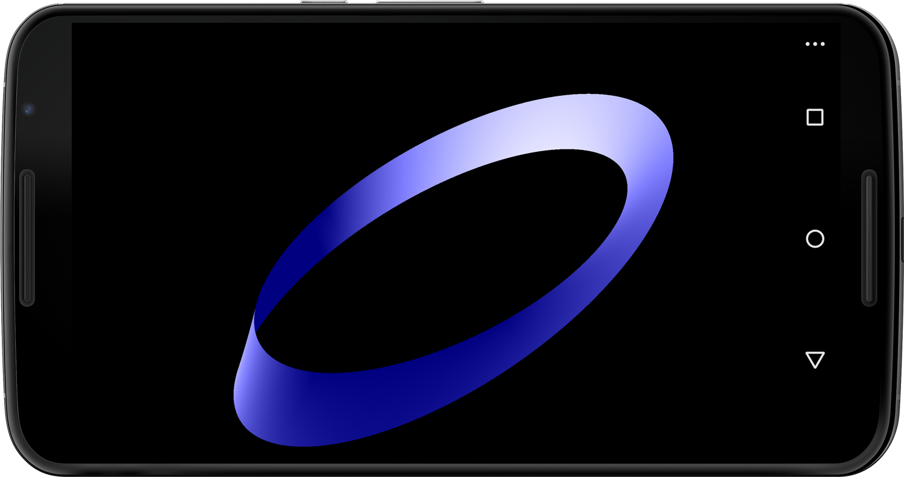
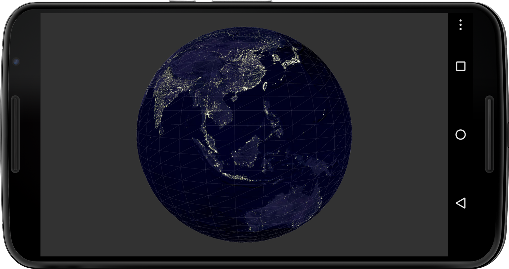

###Chapter 12:

#Working with Shapes and 3D Objects
 
With the basic understanding we’ve gained running 3D sketches on the Android in <!--ref linkend="chp.mobile.3d-->, we’re now ready to tackle some more advanced tasks: working with shapes and objects, generating our own geometric figures, and shifting the point of view of the virtual camera that determines how our scene is rendered. Once we’ve mastered those tasks, we’ll know all we need to create interactive 3D scenes and games and to organize information three-dimensionally. 
 
Processing’s features for handling shapes and other figures are quite extraordinary. The `PShape` class—which we’ll use throughout the chapter for much of this work&—makes it easy for us to work with Scalable Vector Graphics (`SVG`) and 3D Object (`OBJ`) files and to record vertices that define custom shapes and figures algorithmically. `PShape` leverages the `OpenGL` hardware acceleration found on most recent Android phones and tablets and is a great example of how we can tackle complex operations with just one class and a few lines of Processing code. 
 
To show the support that `PShape` provides for handling `SVG` files, we’ll start with a US map saved in that format, and then we’ll give users the ability to zoom and pan over its features. Because this format is based on vectors and vertices, users won’t lose graphics detail or quality as they zoom the map. We’ll also see how to modify the `SVG` file to highlight typical tossup states during recent presidential elections. 
 
To demonstrate how we can use `PShape` to manipulate 3D objects, we’ll load a model of One World Trade Center from an Object file, including its materials and textures, display it on the touch screen, and then rotate and zoom the figure using multitouch gestures. We’ll also create a figure algorithmically and construct a 3D M&#xF6;bius strip using individual vertices that we record. We’ll learn how to store the information we need to draw the figure in the `GPU`’s memory and thereby radically increase the speed with which it’s rendered as well as the number of times per second the image is refreshed. 

To give users a way to interact with the M&#xF6;bius strip, we’ll introduce and use the built-in gyro sensor, a component that now ships with the latest Androids. The gyro makes a useful input device, and we’ll use it to rotate the figure on the screen by rotating the device itself. We’ll conclude the chapter by bringing several of these new features together in a single application that also makes use of Android’s ability to recognize faces. We’ll use our gaze to control the point of view of the virtual camera. The scene consists of Earth and the Moon&—revisiting code from <!--ref linkend="sec.image.texture-->, and face recognition features we’ve explored in <!--ref linkend="sec.face.detection-->. 
 
Let’s look first at the classes and methods Processing provides to us to work with shapes and 3D objects—we’ll use them throughout the chapter. 

###Working with the PShape Class
 
In this chapter, we’ll use [Processing’s `PShape`][0] features for all the projects we’ll create. We can use the class to load 2D vector shape files (`svg`) and 3D object files (`obj`) and work with 3D vertices generated algorithmically. Let’s take a look at the methods we’ll use to load and create the 3D scenes in this chapter. 

<table>
<tr>
<td><a href="1"><code>loadShape()</code></a></td>
<td>A Processing method to load a Scalable Vector Graphic, or <code>svg</code>, file into a <code>PShape</code> object</td>
</tr>
<tr>
<td><a href="2"><code>beginShape()</code></a></td>
<td>A Processing method to start recording a shape using vertices&#x2014;we can connect vertices with the following modes: <code>POINTS</code>, <code>LINES</code>, <code>TRIANGLES</code>, <code>TRIANGLE_FAN</code>, <code>TRIANGLE_STRIP</code>, <code>QUADS</code>, and <code>QUAD_STRIP</code>.</td>
</tr>
<tr>
<td><a href="3"><code>endShape()</code></a></td>
<td> A Processing method to stop recording a shape using vertices </td>
</tr>
<tr>
<td><a href="4"><code>vertex()</code></a></td>
<td>A Processing method to add a vertex point to a shape using either <i>x</i> and <i>y</i> values or <i>x</i>, <i>y</i>, and <i>z</i> values for two and three dimensions, respectively&#x2014;it takes only two vertices to create a shape, but we can add thousands and are only limited by the memory installed in our device. Vertices are connected with straight lines. To create curves, use the <a href="5"><code>bezierVertex()</code></a> or <a href="18"><code>curveVertex()</code></a> instead.</td>
</tr>
<tr>
<td><a href="6"><code>createShape()</code></a></td>
<td>A Processing method to load a 3D primitive or vertices into a <code>PShape</code>&#x2014;the method can also handle parameters for the 3D primitives <code>BOX</code> and <code>SPHERE</code>. It also mirrors the <code>beginShape()</code> method for recording vertices into a <code>PShape</code> object and is used in conjunction with <code>end()</code>-to-end recording.</td>
</tr> 
<tr> 
<td><a href="7"><code>camera()</code></a></td>
<td>A Processing method to define the camera viewpoint (where the camera is looking and how the camera is facing)&#x2014;we use it to navigate a 3D scene while keeping an eye on the particular spot we&#x2019;ve defined.
</td></tr>
</table>

###Working with SVG Graphics and Maps
 
 In addition to the fonts that are used to render text, images such as icons, line art, and maps also depend on outlines that remain accurate and legible at different scales. The pixel-based bitmap images that we’ve worked with so far look best if they are presented with their original size and resolution for a particular device screen.[][8] But in scenarios where we’d like to zoom images or graphic elements and we’d like to be independent of the variation in screen resolution found on different devices, we are best served by using vector graphics wherever we can. 
 
 A picture taken with a photo camera will never be accurately represented by a vector graphic. However, text, icons, symbols, and maps are good candidates because they typically use outlines and a limited number of colors. `SVG` is a popular `XML`-based file format for saving vectors, text, and shapes. It can be displayed on virtually any web browser and handled by most image processing applications. 
 
 `SVG`s are great when we need accurate detail and precise outlines at varying scales. Maps typically contain paths representing geography, city infrastructure, state lines, country borders, nations, or continents. What’s more, we understand maps as images at a particular scale, providing overview and a level of detail for this scale, and we expect that we can adjust the scale seamlessly for maps with digital devices. To accomplish this goal, we can either keep multiple bitmaps in store to adjust for the shifts in scale, or we can use `SVG` files that do not lose accuracy or quality when they scale. 
 
 Maps balance abstraction and detail: we hide a map’s details in order to provide a clear overview of an area, but we must add them as a user dives deeper into a particular region of a map. Shifts in scale always present challenges because we can’t load everything we need at once, and we can’t predict what a user might want to see in more detail at a given moment. So when we work with digital maps, we need to maintain a balance between abstraction and detail and work within the limits of resolution, graphics processing power, and storage of the phones and tablets in the Android universe. With Google Maps and Google Earth, we experience this balance literally as we watch the successive loading process for added detail. 
 
 `SVG` images are not immune to the challenges of rendering large amounts of data. For example, when we work with hundreds of words of text contained in an `SVG` file, we’ll see our frame rate drop quickly because the graphics processor needs to calculate dozens of vector points at different scales for each character. It’s the reason why large amounts of text are typically rendered as bitmap images made for one size, and we’ve explored this approach already in <!--ref linkend="sec.render.text-->. However, when we work with a headline or a few text labels, we definitely can work with `SVG` text and change scale, color, or rotation dynamically without sacrificing text legibility or image quality.
 
Let’s turn now to the first project in this chapter, where we’ll learn how to display a map of the United States that has been stored in an SVG file. 

###Map the United States
 
 For our next project, we’ll work with a US map saved as an `SVG` file, and we’ll load it as a file asset into our sketch. The `SVG` file contains a blank map showing all US states and borders and is available on Wikipedia in the public domain.[][9] The `XML` code in the `SVG` file contains vertex style definitions to determine how to connect those vertex points, including stroke, thickness, and fill color. 
 
 We’ll implement this project in two steps. First we load the map using `loadShape()`, and then we’ll draw it on the Android screen with Processing’s `shape()` method. Second, we’ll alter the fill color of states that political poll takers typically consider as swing states during recent presidential elections and draw them as purple shapes on the screen, as shown in <!--ref linkend="fig.svg-->. In both cases, to zoom and pan the map we’ll return to the multitouch gestures we learned in <!--ref linkend="chp.display-->. 

###Load the `SVG` File
 
Like all file assets we use in Processing, we’ll put our `SVG` file into the sketch’s `data` folder and load it with its file name using our `loadShape()` method.
  

#####Figure 12.0 - Scalable Vector Graphic map of the United States.
######The image shows a US map with typical toss-up states. Line detail remains accurate even if we zoom into the map. 

Let’s take a look at the code for this sketch. 

#####code/ShapesObjects/ScalableVectorGraphics/ScalableVectorGraphics.pde
[include](code/ShapesObjects/ScalableVectorGraphics/ScalableVectorGraphics.pde)

 Here are the steps we take to load and display the `SVG` file. 

1. Define a `PShape` variable called `us` to store the `SVG` file. 
2. Create a `KetaiGesture` class so we can scale the map using a pinch gesture. 
3. Load the Scalable Vector Graphic containing a blank US map. 
4. Set the `shapeMode()` to center so we can scale the map around its center. 
5. Set the matrix `scale()` to the current `scaleFactor`. 
6. Draw the `SVG` map of the United States. 
7. Integrate the pinch distance `d` to increase or decrease the `scaleFactor`. 
8. Constrain the `scaleFactor` to a minimum of `1` of the original map scale and a maximum of `10` times its scale. 
 
Let’s test the app. 

###Run the App
 
Run the app on the device. You’ll see the `SVG` US map appear centered on the screen due to our call on `shapeMode(CENTER)`. Use the pinch gesture to scale the map, and keep zooming in while observing the line detail of the state borders saved in the file. The image does not become pixelated and the lines remain accurate. 

Now that we’ve learned how to load, display, and scale an `SVG` file on the Android device, let’s take it one step further and modify the properties of the shapes it contains. 

###Manipulate Shapes Within the SVG File
 
Now for this second part of our mapping project, we want to take advantage of the fact that `SVG` files can contain individual shapes that we can work with. In the `XML` hierarchy of our US map `SVG`, each state shape is labeled with a two-letter abbreviation, such as “fl” for Florida, which we can call to manipulate the shape’s style definitions. To verify, open the `SVG` map in your favorite photo or vector editor and you’ll see that the image consists of individual vector shapes grouped into individual layers and folders that you can edit as you wish. 
 
For this project, we’ll highlight the eight states typically considered toss-up states during recent presidential elections. We’ll need to single out each of those states in our `SVG` file, overwrite its style definition, and set its fill to purple before we draw it. 
 
We’ll use the `getChild()` method to find individual state shapes using the two-letter abbreviations saved in the `SVG` file. We’ll store the state abbreviations we are looking for in `String` array, namely “co” (Colorado), “fl” (Florida), “ia” (Iowa), “nh” (New Hampshire), “nv” (Nevada), “oh” (Ohio), “va” (Virginia), and “wi” (Wisconsin). If we find a matching abbreviation in the `SVG` file, we’ll grab the shape and assign it to a `PShape` array we’ll provide. 
 
To change the shape’s color to purple, we’ll use `disableStyle()` to ignore the style definitions included in the file and replace them with our own. We’ll also reuse the `mouseDragged()` method to move the map horizontally and vertically so that we can browse the whole map while being zoomed in at a state level. 
 
Let’s take a look at the code we’ve modified based on earlier <!--ref linkend="code.svg-->. 

#####code/ShapesObjects/ScalableVectorGraphicsChild/ScalableVectorGraphicsChild.pde
[include](code/ShapesObjects/ScalableVectorGraphicsChild/ScalableVectorGraphicsChild.pde)

Here are the additional steps we take to highlight potential toss-up states. 

1. Create a `String` array containing the two-letter abbreviations of toss-up states. 
2. Create a `PShape` array called `tossup` of the same length as the `tossups` `String` array. 
3. Assign a child shape in the `us` map to the `tossup` `PShape` array. 
4. Disable the color and opacity style found in the `SVG`. 
5. Move to the `x` and `y` location. 
6. Scale the matrix to our calculated `scaleFactor`. 
7. Set the new `fill()` color to purple. 
8. Draw the individual swing states. 
9. Use the `KetaiGesture` callback method `onPinch()` to calculate the map `scaleFactor`. 
10. Use the `mouseDragged()` callback method to set the horizontal and vertical position of the map on the device screen. 
 
Let’s run the app. 

###Run the App
 
Run the modified sketch on the device again. This time the app starts up showing “purple states,” and we can still zoom into the map and move it horizontally and vertically. 

This completes our mapping project and our investigation of Scalable Vector Graphics. 

Now that we’ve learned how to work with shapes and vertices contained in a Scalable Vector Graphic, it’s time we looked at another file type comparable to `SVG` and used for three-dimensional objects—the Object file format. 

###Display an Architectural Model Loaded from an Object File
 
For this project, we’ll work with three-dimensional coordinates for vertices that define a figure contained in an Object file, as well as material definitions and image textures linked from that file. We’ll use a model of One World Trade Center, also known as Freedom Tower,[][10] the lead building of the World Trade Center complex planned by architect Daniel Libeskind and designed by David Childs (to be completed in 2013). The model contains a 3D geometric figure for the main building’s architecture and some image textures, shown here: 

#####Figure 12.1 - Displaying an Object file.
######The Object file contains vertices and links to materials and textures for displaying One World Trade Center as a 3D PShape object. 

Working in 3D, Object (`obj`) is a very popular and versatile file format. We can use an `OBJ` as a self-contained 3D asset and load it into a 3D app on our Android. All the textures for our figure are already predefined in the `OBJ` file, making it fairly easy to handle in Processing with our familiar `PShape` class. Yes, it handles `OBJ` files as well. 
 
Object files are not `XML`-based in their organizational structure, but they still contain data segments with coordinates for the vertices that define the figure and data segments that link to assets such as materials and textures to the file. The model we’ll work with was loaded from [Google Sketchup’s 3D warehouse][11] and converted into the Object format using Autodesk Maya. 
 
We now have a file called `OneWTC.obj`, a linked material file of the same name, `OneWTC.mtl`, and twelve `JPEG` images named `texture0.jpg`...`texture12.jpg` in our sketch `data` folder. 
 
The code for this project is fairly concise and very similar in structure to our `SVG` map project <!--ref linkend="code.svg-->. We’ll first load our Object file from the data folder into the sketch and display it using the `shape()` method. Then we use the `onPinch()` method to allow for scaling the object and `mouseDragged()` for rotating the building and moving it up and down vertically. 
 
Here’s the code. 

#####code/ShapesObjects/ObjectFiles/ObjectFiles.pde
[include](code/ShapesObjects/ObjectFiles/ObjectFiles.pde)

1. Load the Object file into a `PShape` variable called `wtc` using `loadShape()`. 
2. Switch on the default `lights()`. 
3. Move the matrix horizontally to the center of the screen and vertically to the position `y`, determined by moving a finger across the screen. 
4. Scale the matrix to the `scaleFactor` determined by our pinch gesture. 
5. Rotate the building around the *x*-axis so it appears upright in the `PORTRAIT` mode and not upside-down. 
6. Rotate the building around the *x*-axis so we can look at all its sides when we drag one finger horizontally. 
7. Draw the `wtc` Object file. 
8. Calculate the object’s `scaleFactor` using the `onPinch()` `KetaiGesture` callback method. 
9. Determine the vertical position `y` of the building on the screen and its rotation `r` using Processing’s `mousePressed()` method. 
 
Let’s test the app now. 

###Run the App
 
Now run the app on the device. When the 3D scene starts up, the tall One World Trade Center building will appear fullscreen in `PORTRAIT` mode. Move your finger across the screen horizontally to rotate the building. It’s a fairly demanding model for the graphics processor on the Android, and initially shown at 4% of its original scale, so the frame rate is not as high as for most other projects we’ve worked with so far. Pinch to scale the building, and move your finger across the screen to rotate the building or move it up and down. 

Now that we’ve looked at 3D primitives, Scalable Vector Graphics, and Object files, the missing piece is how to create a figure from scratch using individual vertex points and algorithms. 

###Create a M&#xFbius Shape and Control It Using the Gyroscope
 
 In our next project, we’ll generate a figure from scratch and use a **for** loop and a sequence of translations and rotations to create a M&#xF6;bius strip based on individual vertices that we record. Topologically speaking, the M&#xF6;bius strip is an interesting example of a 3D figure that does not have a determinable surface area. Practically, it’s pretty simple to understand and easy to create using just a piece of paper. If you’d like to try, cut or fold a piece of paper into a strip at least five times as long as it is wide. Hold both ends, and twist one of them 180 degrees while holding the other stationary. Now connect the two ends with a piece of tape and you’ve got yourself a M&#xF6;bius strip. It’s basically a ring twisted by half a revolution, as shown in <!--ref linkend="fig.gyro.moebius-->.
  

#####Figure 12.2 - Control a M&#xF6;bius strip using the gyro.
######The image shows a PShape object composed of individual vertices that are illuminated by blue ambient light and a white point light source positioned in the center of the strip. 

You can confirm that a M&#xF6;bius strip has only one side by taking a pen and drawing a continuous line in the center of your paper strip until you’ve reached the beginning of your line again. You’ll need two revolutions to get there, because the M&#xF6;bius strip is [a surface with only one side and only one border.][12] In this project, we’ll create this shape using custom vertices. To navigate the 3D scene with our M&#xF6;bius strip by just rotating our Android device, we’ll use a sensor that we haven’t yet given the attention it deserves: the gyroscope sensor. 

###Introducing the Gyroscope Sensor
 
The Nintendo Wii was the first device to introduce millions of users to gesture-based games, but now similar apps can be purchased for phones and tablets as well. At its heart is an onboard gyroscope sensor. The gyroscope sensor was introduced in 2010 with the iPhone 4 (June 2010), followed by the Samsung Galaxy S (July 2010). Augmented reality (`AR`) applications are especially able to take advantage of the precise pitch, roll, and yaw angles the sensor provides in real time. The gyro is able to determine the device rotation around gravity, for example, when we point the device camera toward the horizon and we rotate it following the horizon line&—the accelerometer cannot help us there. Apple’s “Synchronized, Interactive Augmented Reality Displays for Multifunction Devices” patent from July 2011 suggests that AR will have an increasing role in the mobile space. 
 
The gyro provides us with information about an Android’s rotation, reporting so-called angular rates in degrees for the *x*-, *y*-, and *z*-axes. We can access these readings with the `KetaiSensor` class and the `onGyroscopeEvent(x, y, z)` callback method. The angular rate is a positive or negative floating point value reflecting the change for each axis since we last read it. We’ll use [the standard convention][13] and refer to the rotation around the device’s *x*-axis as pitch, around the *y*-axis as roll, and around the *z*-axis as yaw. 
 
Unlike the accelerometer, the gyro is independent of g-force, unfazed by device shakes, and very responsive to device rotation. It’s the best sensor for games and 3D scenes that are controlled by moving and rotating the device. The sensor is less ubiquitous than the accelerometer, but it is now found in most Android phones and tablets. 
 
When a device sits on a table, its gyro reports +-`0.000` degrees for pitch, roll, and yaw. To calculate how much a device has rotated, we just need to integrate the values for each of its axes, or in other words, add them all up. Once we’ve done that we’ll know the pitch, roll, and yaw of the device in degrees. The gyro is not aware of how the device is oriented relative to the ground (g-force) or to magnetic north. For that, we’d need to enlist the onboard accelerometer and the magnetic field sensor. But while that information might be critical for a navigation and/or augmented reality app, it’s more than we need to know for this one. 
 
 A limitation of the gyro is that over time it’s susceptible to drift. If we integrate all gyro values while the device is sitting still on the table, we should receive `0.000` degrees for all three axes. However, the values slowly drift after just a few seconds and significantly after a few minutes because we integrate fractions of floating point values many thousands of times per minute, and the sum of all those tiny values won’t add up perfectly to `0.000` degrees. For gaming or 3D apps this drift is less relevant, as instantaneous feedback on device rotation outweighs accuracy over extended periods of time. In scenarios where this drift causes problems, the accelerometer can be used to correct the drift. 

###Record the Vertices for a M&#xF6;bius Shape
 
To create the M&#xF6;bius shape, we’ll use an approach that resembles the one we used to create a paper model. To set this up, we’ll use a `for` loop and a series of translations and rotations in three different matrices to determine the individual vertex points we’ll use to [draw the M&#xF6;bius shape in three-dimensional space.][14] We’ve used these methods earlier in <!--ref linkend="sec.multi.touch-->, and elsewhere. 
 
As with our paper model, we’ll choose a center point around which to rotate our band. While we rotate the band one full revolution around the *z*-axis, we also rotate it by `180` degrees around the *y*-axis, or half a revolution. Once we’ve assembled all the vertex points we need to define the two edges of our band in `setup()`, we can draw the resulting shape in `draw()` using the `beginShape()` and `endShape()` methods. 
 
As the [reference for `beginShape()`][15] points out, “Transformations such as `translate()`, `rotate()`, and `scale()` do not work within `beginShape()`,” so as a workaround, we take each of our vertex points through multiple transformations and look up their final position within our 3D scene, the so-called model space. The model space *x*, *y*, and *z* coordinates, which we’ll get using [`modelX()`][16], `modelY()`, and `modelZ()`, gives us the final absolute position of our vertex in the scene, and we’ll take that position and write it to a `PVector` array list that we can then use to `draw()` our shape. 
 
In `draw()`, we’ll use the `beginShape(QUAD_STRIP)`, `vertex()`, and `endShape(CLOSE)` methods to assemble the shape, which we draw using the `QUAD_STRIP` mode, where each of the vertices are connected, and we’ll end up with a closed strip surface to which we can assign a fill color. 
 
Using both a blue `ambientLight()`, as well as a white `pointLight()` located in the M&#xF6;bius’s center, we’ll get a good impression of the three-dimensional shape surface. Because we’ll use the device’s built-in gyro to rotate the M&#xF6;bius shape in 3D space around its center point, we’ll get to look at all sides by just rotating our Android phone or tablet around its *x*- (pitch), *y*- (roll), and *z*- (yaw) axes. 
 
Let’s take a look at the code. 
 
#####code/ShapesObjects/Moebius/Moebius.pde
[include](code/ShapesObjects/Moebius/Moebius.pde)
  
Let’s take a look at the steps we take to create the figure and control the scene using the gyro. 

1. Create an `ArrayList` of type `PVector` to store all the vertices for our M&#xF6;bius strip. 
2. Define the number of sections, or quads, used to draw the strip. 
3. Use a **for** loop to calculate the *x*, *y*, and *z* positions for each vertex used to define the M&#xF6;bius strip. 
4. Add a new matrix on the matrix stack for our first rotation. 
5. Rotate by one degree around the *z*-axis to complete a full `360`-degree revolution after `3600` iterations, as defined by `sections`. 
6. Add a new matrix on the matrix stack for our next transformation. 
7. Move the vertex along the *x*-axis by half the screen `height`, representing the radius of our M&#xF6;bius strip. 
8. Add another matrix on the stack for our next rotation. 
9. Rotate around the *y*-axis by `180` degrees for the twist along the M&#xF6;bius strip. 
10. Set the first vertex point for the current quad element model position in the M&#xF6;bius strip, displaced by `50` pixels along the *z*-axis with regard to the current matrix’s origin. 
11. Set the first vertex point for the current quad element model position in the M&#xF6;bius strip, displaced by `-50` pixels along the *z*-axis with regard to the current matrix’s origin. 
12. Set a blue ambient light source using the `ambientLight()` method. 
13. Set a white point light source in the center of the M&#xF6;bius strip using `pointLight()`. 
14. Enumerate the gyroscope `x` values to calculate the pitch of the device since the app started. 
15. Enumerate the gyroscope `y` values to calculate the pitch of the device. 
16. Enumerate the gyroscope `z` values to calculate the pitch of the device. 
17. Begin recording the `QUAD_STRIP` vertices that make up the M&#xF6;bius strip. 
18. End recoding vertices for the strip, and close the connection to the first recorded vertex using `CLOSE`. 
19. Receive the gyroscope sensor values for the `x`-, `y`-, and `z`-axes and assign the `radians()` equivalent of their degree values to `rotationX`, `rotationY`, and `rotationZ`. 
20. Reset the `pitch`, `roll`, and `yaw` to `0` so we can reset the rotation of the M&#xF6;bius strip in 3D space by tapping the device screen. 
 
Let’s test the app. 

###Run the App
 
Run the sketch on the device. The M&#xF6;bius strip begins lying “flat” in front of our camera. Because the gyro takes care of rotating the M&#xF6;bius shape, it slowly drifts if we don’t do anything. Pick up the Android phone or tablet and rotate it up and down along the *x*-axis, left and right along the *y*-axis, and finally flat around the *z*-axis. The M&#xF6;bius strip counters this device movement in virtual space, and we are able to take a closer look at the figure. Tap the screen to reset the strip to right where we started. 
 
Now let’s take a look at how we are doing on graphics performance for this scene, consisting of 7200 vertices, or `3600` `sections` times 2 vertices for the band. I’m using the Google Nexus 6 phone for this test. Look at the `frameRate` printed to the Processing console, and you’ll see that the sketch is running at a default `60` frames per second, which is good. 
 
Let’s multiply the number of `sections` by 10 and look again. Go ahead and change the `sections` value in the code from `3600` to `36000` and rerun the sketch on the device. On the Nexus 6, the frame rate drops to about `12` frames per second. 

This drop in the frame rate can be avoided if we take advantage of Processing’s `OpenGL` support for retaining a shape in the `GPU`’s memory. Let’s take a look at an alternative method to draw our M&#xF6;bius shape using the `PShape` class. 

###Use GPU Memory to Improve Frame Rate
 
Keeping vertices and textures in the `GPU`’s memory becomes very useful when we deal with more complex figures that do not change over time. Processing’s `PShape` object allows us to create a shape from scratch using the `createShape()` method, which works much like `beginShape()`. In this modified sketch based on <!--ref linkend="code.gyro.moebius-->, we create the M&#xF6;bius strip as a `PShape` in setup, and then we use the `shape()` method to draw the shape on the screen. All the transformations remain the same. We keep the `QUAD_STRIP` drawing mode, and we close the shape we create using the `end(CLOSE)` method. 
 
Let’s examine the changes we’ve made in the code. 
 
#####code/ShapesObjects/MoebiusRetained/MoebiusRetained.pde
[include](code/ShapesObjects/MoebiusRetained/MoebiusRetained.pde)
 
Let’s take a look at the steps we take to record the shape into a `PShape` object. 

1. Create a `PShape` variable called `moebius` to record vertex points into. 
2. Create the `QUAD_STRIP` `PShape` object `moebius` using the `createShape()` method. 
3. Add our first strip `vertex()` to the `moebius` `PShape`. 
4. Add the second strip `vertex()` to the `moebius` `PShape`. 
5. `CLOSE` the `PShape` object using the `end()` method. 
6. Draw the `moebius` strip using Processing’s `shape()` method. 
 
Let’s test the app. 

###Run the App
 
Run the sketch on the device. We’ve also used `36000` `sections` as we’ve done in the code before, but the frame rate is back up to `60` frames per second. The `PShape` class and its ability to leverage `OpenGL` is definitely one of the main improvements since Processing 2.0. 

You are now able to create figures from scratch by recording the coordinates for the vertices that define the figure. Finally, let’s explore how to change the viewpoint of our virtual camera in a 3D scene. 

###Control a Virtual Camera with Your Gaze
 
 For this final chapter project, we’ll implement an experimental and lesser-known method to interact with a 3D scene&—using our gaze to rotate a constellation of planets containing Earth and the Moon. By looking at the scene displayed on our device screen from a specific angle, we can control the rotation of Earth and the Moon around the *x*- and *y*-axes, as illustrated in <!--ref linkend="fig.gaze.camera-->. Similar to a scenario where we look around a fixed object by moving our head slightly sideways, we cause Earth to rotate and reveal the continents located on its sides accordingly. 
 

#####Figure 12.3 - Control the camera location via gaze detection.
######The 3D scene containing Earth and the Moon is controlled by the relative location of our eyes looking at the device camera. 

We’ll place Earth at the center of the scene, since the Moon rotates around Earth in this two-body system. To navigate the 3D scene, we move the camera this time, and not the figure. Earlier, we’ve rotated the 3D primitives we’ve worked with around the scene’s *y*-axis and left the virtual camera where it is by default. This time, we are moving the `camera()` while keeping it continuously pointed at the center of our scene, where we placed Earth&—independent of our camera’s viewpoint. As a result, we’ll always keep an eye on Earth. Compared with the `NASA` texture image we used in <!--ref linkend="sec.image.texture-->, we’ll use a higher resolution version of the same image for more accurate detail. We’ll use the maximum resolution the `PShape` can handle&—`2048` pixels wide or high. 
 
The Moon is about `3.7` times smaller than Earth and located roughly `110` times its diameter from Earth. We’ll use these ratios to add a white sphere to our scene and then cause it to revolve around our home planet. Because the Moon is quite far from Earth, both in reality and in our 3D scene, we’ll hardly catch it in our camera view. Feel free to place it closer when we test the sketch. 
 
To implement this sketch, we’ll translate our coordinate system to the center of the screen located at `[width/2, height/2, 0]`. Then we place Earth at this new center, `[0, 0, 0]`. Finally we rotate the Moon around Earth and translate it `110` times its diameter away from Earth. 
 
Our camera is located at `[0, 0, height]`, which means it’s also centered horizontally and vertically on the screen but at a *z* distance of `height` away from the center of Earth’s sphere. With a sphere size of Earth set to `height/3`, both the camera distance and the display size of Earth are defined in relation to the screen height, keeping the scene proportional and independent of the Android device we are using. 
 
To control the scene, we’ll use Ketai’s `KetaiSimpleFace` class, which can recognize the midpoint and distance between the eyes of a face detected by the front-facing device camera&—as we’ve done already in <!--ref linkend="sec.face.detection-->. We’ll assume only one face in the scene less than an arm’s length away from the device, which is why we set the maximum number of faces to be recognized to `1`. If we find a face, we’ll use the **x** and **y** ` location` of the face to calculate the position of our camera in the scene. If we don’t find a face, we’ll fall back to a touch screen input, where we use the `mouseX` and `mouseY` position of the fingertip instead. 
 
Let’s take a look at the code. 

#####code/ShapesObjects/LiveFaceDetectionAndroid/LiveFaceDetectionAndroid.pde
[include](code/ShapesObjects/LiveFaceDetectionAndroid/LiveFaceDetectionAndroid.pde)

Let’s take a look at the steps we need to control the scene with our gaze. 

1. Define a `PVector` `camLocation` to keep track of the camera position within the scene we’ll calculate. 
2. Increase the number of vertices per full `360`-degree revolution around the sphere to `36`, or one tessellation per 10 degrees longitude. 
3. Set the `camera()` viewpoint to our calculated location, looking at the exact center of the scene. 
4. Detect up to one face in the camera image. 
5. Map the horizontal position of the `PVector` `camLocation` from the `cam` preview width to the screen `width`. 
6. Map the vertical position of the `PVector` `camLocation` from the `cam` preview height to the screen `height`. 
7. Set the `camLocation` to the fingertip if we are not using gaze control. 
8. Rotate the Moon slowly around Earth, one revolution per 10 seconds at an assumed device frame rate of `60` frames per second. 
9. Place the white Moon sphere at its relative distance to Earth (about 110 times its diameter). 
10. Draw the Moon’s sphere. 
11. Start face detection with the Menu button. 
 
Let’s test the app next. 

###Run the App
 
Run the sketch on the device. When it starts up, you’ll see a sphere drawn on a black background and painted with the NASA-provided image of Earth that we used earlier in this chapter. The camera will not yet have started, and until it is activated, it won’t recognize faces. 
 
Move your finger to the center of the screen and observe a view straight ahead at Earth’s sphere. Move it left across the screen and you’ll move the virtual camera to the left in the scene, move it up and you’ll move the camera up, and so on. We get an impression of the movement we can expect when we start the face tracker. 
 
Now press the menu key to start up the camera and begin recognizing faces, indicated by the text printed to the console but also by switching the black background to dark gray. Hold the device comfortably, as you would when you look straight at the screen. Now move your head sideways and see Earth reveal its sides; move your head up and down and see Earth reveal its poles. 
 
Because we are moving the camera and do not rotate Earth, we are getting the side effect that Earth seems to scale—it doesn’t. Instead, we are observing what in the motion picture world would be called a [tracking shot][17], where a camera is mounted on a dolly on a track. In our scenario, the track is straight, so we are actually moving further away from Earth as we move left and right, up and down. We could mitigate this effect by putting our camera on a “circular track”; however, it would be a less dynamic “shot” as well. 

This completes our exploration of 3D apps in Processing. 
 
###Wrapping Up
 
You are now able to create 3D apps in Processing using `OpenGL`’s hardware acceleration to render shapes, text, objects, textures, lights, and cameras. Each one of those subjects deserves further exploration. The basic principles of creating or loading shapes and objects, using image textures, working with different types of lights, and animating camera movements also remain the same for more complex 3D apps. 
 
Let’s apply our knowledge about hardware-accelerated graphics now in our last chapter, where we’ll develop cross-platform apps running in the `HTML5` browsers installed on all smart phone devices shipped today. 

[0]: http://processing.org/reference/PShape.html
[1]: http://processing.org/reference/loadShape_.html
[2]: http://processing.org/reference/beginShape_.html
[3]: http://processing.org/reference/endShape_.html
[4]: http://processing.org/reference/vertex_.html
[5]: http://processing.org/reference/bezierVertex_.html
[18]: http://processing.org/reference/curveVertex_.html
[6]: http://processing.org/reference/createShape_.html
[7]: http://processing.org/reference/camera_.html
[8]: http://en.wikipedia.org/wiki/Bitmap
[9]: http://commons.wikimedia.org/wiki/File:Blank_US_map_borders.svg
[10]: http://en.wikipedia.org/wiki/One_World_Trade_Center
[11]: http://sketchup.google.com/3dwarehouse
[12]: http://en.wikipedia.org/wiki/M%C3%B6bius_strip
[13]: http://developer.android.com/reference/android/hardware/SensorEvent.html
[14]: http://processing.org/learning/transform2d/
[15]: http://processing.org/reference/beginShape_.html
[16]: http://processing.org/reference/modelX_.html
[17]: http://en.wikipedia.org/wiki/Tracking_shot