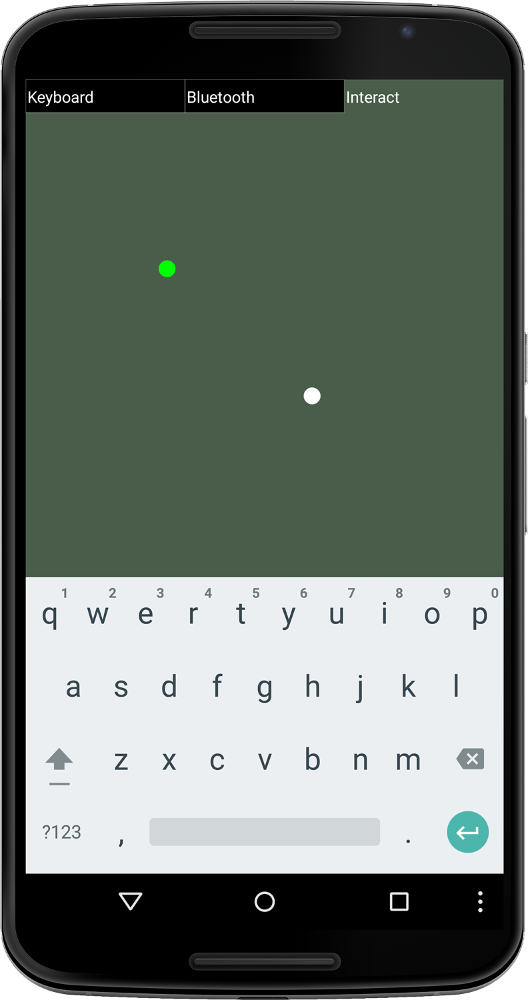
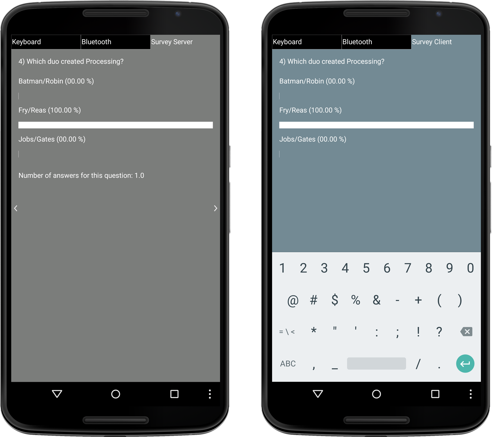

###Chapter: 7

#Peer-to-Peer Networking Using Bluetooth and Wi-Fi Direct

In this chapter, we’ll give peer-to-peer (`P2P`) networks the attention they deserve. We’ve mastered the exchange of data between Android devices using Wi-Fi. Now it’s time to end our dependence on wireless infrastructure. Popular services such as Skype and BitTorrent are only two examples that use peer-to-peer technology.[][0] However, the concept of P2P communication doesn’t stop with telephony or file sharing and has little do with copyright.

P2P networking has several advantages. First of all, it’s free. We don’t require a carrier network or access to `Wi-Fi` infrastructure, and we won’t be restricted by data quotas. P2P still works if wireless infrastructure is unavailable or overwhelmed due to high demand, for instance. It uses less power due to its short range and can help protect privacy because information remains decentralized. And finally, information flows directly from one device to the other&—we can control the information flow and choose whether data is saved or retained.

P2P communication between two devices doesn’t preclude us from also reaching out to web or cloud servers. For example, if we are connected P2P while we are on the move, we can update an online database as soon as a carrier network becomes available. Both networking paradigms can coexist and complement each other. P2P has the advantage that it can reliably provide us with instantaneous feedback across devices due to the very small lag time, and it provides the transmission rates that are crucial for some multiuser or multiplayer apps.

The most common way to implement P2P exchanges of data between Android devices is to use Bluetooth, which is available on all Android devices shipping today. We’ll start by building a remote cursor app, where we visualize the cursor position of two devices connected via Bluetooth. Then we’ll build a peer-to-peer survey app that lets us create a poll for multiple users. Connected via Bluetooth, users pick answers from a common multiple choice questionnaire displayed on their device screens. Individual answers are gathered and visualized in real time, giving each user immediate feedback on the collective response and the distribution of answers as they accumulate.

Then we’ll move on to Wi-Fi Direct, an emerging peer-to-peer networking standard where each device can serve as the Wi-Fi access point for the network. We’ll revisit the remote cursor app and modify it to use Wi-Fi Direct so that we can directly compare its performance to Bluetooth. Wi-Fi Direct is designed to provide a higher bandwidth and better network range than Bluetooth. To get started, let’s first take a look at the main classes we’ll use in this chapter.


###Introducing Short-Range Networking and UI Classes

For the apps we’ll develop in this chapter, we’ll use the following networking and UI classes from the Ketai library:

  * *[`KetaiBluetooth`][1]*   A Ketai class for working with [Bluetooth on Android devices][2]—the class contains the necessary methods for Bluetooth discovery, pairing, and communication using the popular Bluetooth standard

  * *[`KetaiWiFiDirect`][3]*   A Ketai class to simplify working with [Wi-Fi Direct on Android devices][4]—the class contains the necessary methods for Wi-Fi Direct peer discovery and data exchange. In a Wi-Fi Direct network, every Wi-Fi Direct-enabled device can serve as the access point for the other devices in the Wi-Fi network.

  * *[`KetaiOSCMessage`][5]*   A Ketai class that is identical to the oscP5 library’s `OscMessage` class we worked with in <!--ref linkend="sec.osc-->, with the difference being that it allows us to create `KetaiOSCMessage` using a byte array&—it makes some private methods in `OscMessage` public so we can use it for Bluetooth communication.

  * *[`KetaiList`][6]*   A Ketai UI class that makes it easier to work with the native Android `ListView` widget&—this class contains methods to populate, display, refresh, and retrieve strings from a selected list item. A `KetaiList` can be created using a `String` array or a `String` [`ArrayList`][7].

  * *[`KetaiKeyboard`][8]*   A class included in the Ketai `UI` package that allows us to toggle the Android software keyboard on and off without importing additional Android UI classes

We’ll start with Bluetooth because it’s the most ubiquitous peer-to-peer technology. Let’s take a closer look at the Bluetooth methods that Ketai provides.


###Working with the KetaiBluetooth Class

Besides the usual `start()` and `stop()` methods, `KetaiBluetooth` provides the following methods for discovering, pairing, and connecting Bluetooth devices:

  * *`onBluetoothDataEvent()`*   Returns data sent via Bluetooth, including the device name where it originated as a `String` (useful when more than one Bluetooth device is connected) and the Bluetooth data as `byte[]` array

  * *`makeDiscoverable()`*   Makes a Bluetooth device discoverable for 300 seconds

  * *`discoverDevices()`*   Scans for discoverable Bluetooth devices

  * *`getDiscoveredDeviceNames()`*   Returns a list of all Bluetooth devices found within range of the Bluetooth radio

  * *`connectToDeviceByName()`*   Connect to a device using its assigned Bluetooth name

  * *`broadcast()`*   Writes data to all connected Bluetooth devices

  * *`getPairedDeviceNames()`*   Provides a list of devices that have been successfully paired with the Android device—paired devices can reconnect automatically if they are discoverable and within range, and they do not need to repeat the pairing process.

Now that we’ve seen the classes and methods that we’ll use to build apps in this chapter, let’s now take a closer look at Bluetooth, the most ubiquitous peer-to-peer standard.


###Introducing Bluetooth

Every Android device ships with a Bluetooth radio. It is a popular communication standard used for consumer electronics, health and wellness devices, PC peripherals, sports and fitness equipment, and smart home appliances, and it is typically found in wireless game controllers, headsets, keyboards, printers, and heart rate sensors, [to name a few.][9] Because it is so ubiquitous, it will remain an important protocol even as new networking standards emerge.

The standard is managed by the Bluetooth Special Interest Group, which includes more than sixteen thousand member companies. “Bluetooth” refers to a tenth-century Danish king who united dissonant tribes into a single kingdom. The implication is that Bluetooth has done the same for the device and accessory market, [uniting communication protocols into one universal standard.][10]

Bluetooth uses short-wavelength radio frequencies of 2400--2480 MHz and allows us to transfer data within a range of about 30 feet. It requires relatively little power and rarely experiences interference from other devices. But before we can transfer data, [we must first *pair* the devices][11] involved. Once we’ve done that successfully, the Android stores a list of known devices, which we can use to reconnect them without pairing them again. If we already know the unique 48-bit address of the Bluetooth device to which we’d like to connect, we can skip the pairing process entirely.

If the Bluetooth radio is powered on, any Bluetooth-enabled device can send an inquiry to initiate a connection. If a device is discoverable, it sends information about itself to other Bluetooth devices within reach, including its own device name, allowing the devices to pair and exchange data securely. If we send data between Android devices, pairing and acceptance of the connection by the device owner is required for security reasons.

Let’s now connect two Android devices via Bluetooth.

###Working with the Android Activity Life Cycle
When we launch a Processing sketch as an app on the Android, we create an [Android activity][12] ready for us to interact via the touch screen interface. We typically don’t need to deal with the [activity life cycle][13] on the Android because Processing takes care of it for us. To activate Bluetooth (and later `NFC`), we need to initialize the Bluetooth object we’ll be working with at the very beginning of the activity life cycle.

When a new app or activity starts up, Android adds it to the stack of activities already running and places it on top of the stack to run in the foreground. The previous activity goes in the background and will come to the foreground again when the current activity exits.

We can summarize the four states an activity can take like this:


*   The activity is active and running in the foreground on top of the stack.


*   The activity lost focus because another non-fullscreen activity runs on top of the activity.


*   The activity stopped because another activity is covering it completely.


*   The paused or stopped activity is killed to make memory available for the active activity.

When an activity goes though this life cycle, Android provides the following callback methods for us to use. When the activity starts up, Android calls the following:

 <table> <row><col>[`onCreate()`][14]

 <col>  Called when the activity is starting

 </row> <row><col>`onStart()`

 <col>  Called after `onCreate()` when the activity starts up&—if the activity is already running, `onRestart()` is called before `onStart()`.

 </row> <row><col>`onResume()`

 <col>  Called after `onStart()` when the activity becomes visible

 </row> </table>  After `onResume()`, the activity is running in the foreground and active. If we launch another activity, Android calls these methods:

 <table> <row><col>`onPause()`

 <col>  Called when another activity comes in the foreground

 </row> <row><col>`onStop()`

 <col>  Called after `onPause()` when the activity is no longer visible

 </row> <row><col>`onDestroy()`

 <col>  Called after `onStop()` when the activity is finishing or destroyed by the system

 </row> </table> <sect2>

###Enabling Bluetooth
To work with Bluetooth for the Bluetooth apps we’ll create in this chapter, we will need to launch a new activity to initialize our Bluetooth right at the beginning when the activity starts up using `onCreate()`. Once Bluetooth is active, this activity returns to us the Bluetooth object we need via [`onActivityResult()`,][15] which is called when the app starts up immediately before [`onResume()`][16] in the activity life cycle. We’ll look at the code to enable Bluetooth in more detail in this <!--ref linkend="code.p2p.enable.bluetooth-->.

For the projects in this book, we’ll need to deal with the life cycle only for Bluetooth and `NFC`. We’ll work more with the activity life cycle in <!--ref linkend="sec.nfc.bluetooth.activity.lifecycle-->, where we initiate `NFC` and Bluetooth. For all other apps, we can let Processing handle the life cycle. Future versions of Processing might allow libraries to work with lifecycle callback methods, so we don’t need to include such code inside the sketch.

###Connect Two Android Devices via Bluetooth
In the following sketch, we’ll work with three tabs. The main tab, `BluetoothCursors`, contains our usual `setup()` and `draw()` methods and global variables. The second tab, `EnableBluetooth`, contains code that is necessary to enable Bluetooth on startup, registering our Bluetooth class when the so-called [Android activity][17] is created (this step might not be necessary in future versions of Processing). Processing allows us to not dive too deep into the Android application life cycle, and we’ll try to keep it that way. The third tab, called `UI`, contains all the code we’ll use for GUI elements like menus, an Android list to select Bluetooth devices, and the software keyboard to enter user input. When the sketch is complete, we’ll get a screen similar to the one shown in <!--ref linkend="fig.bluetooth.cursors-->.


#####Figure 7.0 - Bluetooth Cursors app.
######The illustration shows the local (white) and the remote (red) mouse pointer positions, marked as ellipses on the screen. The software keyboard is made visible using the keyboard tab shown at the top. Also shown are the Bluetooth and Interact tabs, which we use to interact with the cursors.  The code needs to facilitate the Bluetooth pairing process as follows: We start by making both Androids discoverable for Bluetooth by listing discovered devices. Then we choose the device to connect to from the list of discovered devices (you might be surprised to see what shows up). Finally, we pair and connect the devices to transfer the data via OSC, which we’ve already used in <!--ref linkend="sec.osc-->. We’ll need to confirm the Bluetooth connection in a popup window because we will be connecting the devices for the first time.

We’ll use the Android software keyboard to discover other Bluetooth devices, make the device itself discoverable, connect to another device, list already paired devices, and show the current Bluetooth status. To work with the keyboard, we’ll use the `KetaiKeyboard` class. And to show and pick discoverable Bluetooth devices to connect to, we’ll use the `KetaiList` class, making it easy for us to work with a native Android list without importing additional packages.


###Working with a KetaiList

We can create a `KetaiList` object using either a `String` array or a `String` [`ArrayList`][18]. Because an `ArrayList` stores a variable number of objects and we have a variable number of discoverable Bluetooth devices to connect to, it’s the better choice for us here. We can easily add or remove an item dynamically in an `ArrayList`, and because we work with Bluetooth device names in our sketch, we’ll create an `ArrayList` of type `String`.

Andreas Schlegel has updated his excellent [ControlP5][19] UI library (as of 09/2012) to also work with the Android mode in Processing 2, making it a great tool to develop all custom aspects of UI elements, such as controllers, lists, sliders, buttons, and input forms. Although the UI elements do not use Android’s native UI classes, ControlP5 elements can be fully customized to match the look and feel of your app while still maintaining consistency with the [Android’s UI style guide.][20]

Let’s get started with the main tab of our `BluetoothCursors` sketch.

#####code/P2P/BluetoothCursors/BluetoothCursors.pde 
[include](code/P2P/BluetoothCursors/BluetoothCursors.pde)  
 
Here are the steps we need to take.

 1.  Import the `os.Bundle` Android package containing the `onCreate()` method we need to initialize Bluetooth.

 2.  Import the `content.Intent` Android package containing the `onActivityResult()`, which is called when the app starts up.

 3.  Create a `KetaiBluetooth` type variable, `bt`.

 4.  Create a `KetaiList` variable that we’ll use to select the device to connect to.

 5.  Create a `String` variable, `info`, to store changing status messages that we want to output to the Android screen.

 6.  Start the `bt` Bluetooth object.

 7.  Provide instructions for connecting to the other device using the keyboard.

 8.  Create an `ArrayList` of type `String` to store the Bluetooth device, `devices`.

 9.  Retrieve a Bluetooth status update and assign it to our `info` variable for screen output when we press `i` on the keyboard.

 10.  Get a list of paired devices and assign it to the `devices` `ArrayList` to update the `KetaiList` when we press the `p` on the keyboard.

 11.  Get a list of discovered devices and assign it to the `devices` `ArrayList` to update the `KetaiList` when we press `d` on the keyboard.

 12.  Append each Bluetooth device entry in `devices` to our `info` text output, converting each individual `ArrayList` item into human-readable text using the `toString()` method.

 13.  Use the `x` and `y` components of the `remoteCursor` `PVector`, which stores the remote cursor location, and draw an ellipse at the exact same *x* and *y* location.

 14.  Create a new `OSC` message `m` to add our `mouseX` and `mouseY` cursor position to.

 15.  Broadcast the `OSC` message containing the cursor position to all connected devices using the `OSC` `broadcast()` method. Alternatively, we can use `writeToDevice(String _devName, byte[] data)` to send the message to only one specific device.

 16.  Receive the `byte[]` array when the new Bluetooth `data` is sent from the remote device.

 17.  Receive the `data` as an `OSC` message.

 18.  Check if the `OSC` message contains two integer values for the mouse *x* and *y* position. We’ve also checked if the `OSC` message is valid and if the message we’ve sent contains the label “remoteCursor.”

 19.  Return a `String` containing Bluetooth status info, including if Bluetooth `isStarted()` and `isDiscoverable()`, as well as the individual names of connected Bluetooth devices.

 20.  Get a list of all connected Bluetooth devices using `getConnectedDeviceNames()`.

We’ve completed the crucial components of our sketch in `setup()` and `draw()`. To enable Bluetooth when the app starts up, we’ll need to work with the activity life cycle as described in <!--ref linkend="sec.activity.lifecycle-->. We’ll put the code to enable Bluetooth into the tab named `EnableBluetooth`. Let’s take a look.

#####code/P2P/BluetoothCursors/EnableBluetooth.pde 
[include](code/P2P/BluetoothCursors/EnableBluetooth.pde)  
 
These are the steps we need to take to enable Bluetooth.

 1.  Use the Android `onCreate()` method to initialize our Bluetooth object. The method is called when the activity is starting.

 2.  Initialize the Bluetooth object `bt` when the activity is created.

 3.  Return the `bt` object to the sketch using ` onActivityResult()`, called right before `onResume()` in the activity life cycle.

We looked at the required `onCreate()` and `onActivityResult()` methods to initialize Bluetooth at the beginning of the activity.

###Programming the UI

Now let’s return to the part of the code that is responsible for all the UI elements, which we’ll put in the `UI` tab of the sketch. It takes care of GUI elements and keyboard menu items.

Because the Bluetooth pairing process requires us to select a device from a whole list of discovered devices (you’ll probably be surprised by how many Bluetooth devices are broadcasting around you), we’ll use a `KetaiList` to simplify the selection process. We’ll also need the keyboard to make menu selections during the pairing process, and we’ll use the `KetaiKeyboard` class to toggle the keyboard on and off. For the `KetaiList`, we’ll use the `onKetaiListSelection()` method to capture when the user picks an item from the list. And to show and hide the `KetaiKeyboard`, we’ll work with the `toggle()` method.

  Here are the steps to programming the UI.

 #####code/P2P/BluetoothCursors/UI.pde 
 [include](code/P2P/BluetoothCursors/UI.pde)  
 
 Let’s take a look at the steps.

 1.  Toggle the Android’s software keyboard using `toggle()`. Make the `KetaiKeyboard` visible if it’s hidden; hide it if it’s visible.

 2.  Set the boolean variable `isConfiguring` to `true` so we can switch to the Bluetooth configuration screen and for the pairing process.

 3.  Assign the list of paired Bluetooth devices to the `KetaiList` `connectionList`, given there are paired devices.

 4.  Assign the list of discovered Bluetooth devices to the `KetaiList` `connectionList` using the String array returned by `bt.getDiscoveredDeviceNames()`, given there are discovered devices.

 5.  Discover Bluetooth devices using `discoverDevices()` when we press `d` on the software keyboard.

 6.  Make the device discoverable using the `makeDiscoverable()` method.

 7.  Save the current style settings using `pushStyle()` to preserve the stroke, text size, and alignment for the UI elements. Use the method in combination with `popStyle()` to restore the previous style settings.

 8.  Draw the Keyboard UI tab.

 9.  Draw the Bluetooth UI tab.

 10.  Draw the Interact UI tab.

 11.  Call the `onKetaiListSelection()` event method when a user selects an item from the `KetaiList`.

 12.  Get the `String` that the user picked from the `KetaiList`.

 13.  Connect to the selected Bluetooth device using the `connectToDeviceByName()` method.

 14.  Remove all items from the list by setting the `connectionList` object to `null`.

  Now let’s test the app.


###Run the App
  Let’s set the correct Android permissions before we run the sketch. Open the Android Permission Selector as we’ve done previously (see <!--ref linkend="sec.sketch.permissions-->), and check the following permissions:

*   `BLUETOOTH`

*   `BLUETOOTH ADMIN`

*   `INTERNET`

Now connect your first device to your workstation with a USB cable and run the sketch. When the app is compiled, all three tabs in the sketch, `BluetoothCursors`, `EnableBluetooth`, and `UI`, will be compiled into one app. You will see our Bluetooth tab active and the menu options displayed on the screen. Before we interact, let’s install the app on our second Android device.

Disconnect your first device from the USB port, connect your second Android, and install the identical `BluetoothCursors` sketch on the device. The sketch launches, and we are ready to pair the two devices.

On your first device (currently disconnected from USB), show the software keyboard by pressing the Keyboard tab. Then press `b` on the keyboard. If Bluetooth is turned off for your device (Settings &mapsto; Bluetooth), you will be prompted to allow Bluetooth, as shown below. Otherwise the device will become discoverable for 300 seconds.


```
 Android 1 
 [b] - make this device discoverable 
 [d] - discover devices 
 [c] - pick device to connect to 
 [p] - list paired devices 
 [i] - show Bluetooth info 
 
 %%%b 
 Alert: An app on your phone 
 wants to make your phone 
 discoverable by other Bluetooth 
 devices for 300 seconds. 
 %%%ALLOW
```
  Now switch to your second device (currently connected to USB), and follow the process of discovering devices. Pick the name of the first Android device:


```
 Android 2 
 %%%d 
 Discovered Devices 
 [0] Nexus 6 
 %%%c 
 %%%Nexus 6
```

```
 Android 1 
 Bluetooth pairing Request 
 %%%pair
```

```
 Android 2 
 %%%p 
 Paired Devices 
 [0] Nexus 6 
 %%%i 
 Sever Running: true 
 Device Discoverable: true 
 
 Connected Devices: 
 Nexus S (78:47:1D:A6:20:48)
```
When your screen output looks like what’s shown above, the Bluetooth server is running on your second device and you have your first device show up in the list of connected devices. You are now ready to interact.

Press the Interact screen tab on both devices. You’ll see a white dot for the local cursor and a red one for the remote one. As you move your finger over the screen surface of one Android device, observe the other device and see how the red dot moves magically to that position.

Congratulations! You’ve established a data connection between two Android devices using Bluetooth. Now it all depends on your Bluetooth antenna, which should reach a distance of about thirty feet. If you have a friend nearby to test this, try it out. Otherwise, it will not be possible to observe how the connection goes out of range.

The process of discovering and pairing Bluetooth devices can seem cumbersome. However, Bluetooth can’t just accept an incoming connection without confirmation for good security reasons. Once paired, we can reconnect automatically by picking the device address again from the list of paired devices. This is a sketch refinement you can try. If you’d like to “unpair” previously paired devices on your Android, tap the device name under Settings &mapsto; Bluetooth &mapsto; Paired Devices, and choose Unpair.

  We will implement this remote cursor’s app using Wi-Fi Direct later in this chapter <!--ref linkend="sec.wifidirect.remote.cursors-->, and you can then compare how the two standards perform in terms of update rate and wireless range.

Since you’ve mastered peer-to-peer networking using Bluetooth, let’s build on our Bluetooth skills and create a survey app for multiple Bluetooth users.

###Create a Survey App Using Bluetooth

We’ll now move on to the chapter project, which is a survey app for multiple users using Bluetooth networking. Such an app is useful for teaching, decision-making, and learning assessments. We’ll build on our Bluetooth skills and put them into practice. We’ll learn how to send different data types via `OSC` over Bluetooth, share numeric data across devices in real time, and learn how to work with custom Processing classes.

For this survey app, we’ll broadcast a number of questions that you can imagine as text slides shared by multiple users. All survey participants respond to the questions through each person’s individual device by picking one out of three answers from a multiple choice list. We’ll tally the responses in real time and send an update to all peer devices as illustrated in <!--ref linkend="fig.bluetooth.survey-->, giving each user instantaneous feedback on the survey as it unfolds.


#####Figure 7.1 - Bluetooth survey app.
######The illustration shows the Bluetooth server running on one device (left) and a client running on the other (right). The server determines which question is displayed on the client screens by pressing the arrow pointing to the right (next question) and left (previous question). Both server and client receive real-time feedback on how the question was answered.  There are many examples of survey and polling applications that are available online. They typically use proprietary online databases or a dedicated hardware infrastructure. Virtually no app exists using peer-to-peer connectivity on mobile devices&—let’s change that. Let’s go ahead and write a survey app using some of the code we’ve already created for the remote cursor app in <!--ref linkend="sec.p2p.bluetooth-->.

For this survey app, we’ll work with four tabs for this sketch: the main tab, which we’ll name `BluetoothSurvey`, the `EnableBluetooth` tab, which is identical to the tab with the same name <!--ref linkend="code.p2p.enable.bluetooth-->, a `Question` tab for a custom Processing class we’ll write to take care of our Q & A, and a slightly modified version of the `UI` tab, which we developed <!--ref linkend="code.p2p.bluetooth.ui-->.

Our approach is as follows. We’ll write a sketch that we’ll load onto every device participating in the survey. This way we can distribute the app without making adjustments for each individual device. The app needs to figure out whether it serves as the Bluetooth server for the other devices or connects as a client. As participants, we then send different messages to the other devices using `OSC` (<!--ref linkend="sec.osc-->), for example, to request the current question, to submit an answer, or to get an update on the statistics. We’ll give each `OSC` message a dedicated label, which we can then use to determine what to do when an `OSC` event occurs. When we receive an `OSC` message, we check its label using `checkAddrPattern()`, and depending on what pattern we detect, we can respond accordingly.

###Program the BluetoothSurvey Main Tab
Let’s take a look at our main tab, which contains the following methods: `setup()`, `draw()`, `onBluetoothDataEvent()`, `getBluetoothInformation()`, `loadQuestions()`, `requestQuestions()`, and `findQuestion()`.

#####code/P2P/BluetoothSurvey/BluetoothSurvey.pde 
[include](code/P2P/BluetoothSurvey/BluetoothSurvey.pde)  These are the main steps we need to take to implement the survey app.

 1.  Create an `ArrayList` called `questions`, which we’ll use to store objects of the custom `Question` class we’ll write to store questions and corresponding answers.

 2.  Store the current question in a variable, `currentQuestion`, which is presented on all devices simultaneously for the survey.

 3.  Set the `currentQuestion` to the first question in the `questions` `ArrayList`.

 4.  Present the `currentQuestion` on the screen as formatted output `String`, using our custom `toString()` method in the `Question` class.

 5.  Check if the `OSC` message we receive via `onBluetoothDataEvent()` contains the label “poll-request.”

 6.  Create a new `OscMessage` `msg` with the label “poll-question” for each object in our `questions` `ArrayList`, add the question and answers stored in the `Question` object to the `OSC` message, and `broadcast()` the message to all connected users.

 7.  Check if we received an `OSC` message labeled “poll-question.”

 8.  Check if the `OSC` message labeled “poll-question” contains an `integer` followed by four `String` values, if we are connected as a client.

 9.  Create a new `Question` object based on the received `integer` and `String` data.

 10.  Check if the received `OSC` message is labeled “poll-answer.”

 11.  Check if the “poll-answer” message contains two `integer` values if we are the server app.

 12.  Find the corresponding question to the answer we’ve received and process the answer, adding to the tally of responses.

 13.  Check if the `OSC` message is labeled “poll-update.”

 14.  Check if the `OSC` message labeled “poll-update” contains four `integer` values.

 15.  Update the poll statistic for the question we’ve received via OSC by updating the total number of responses for each answer.

 16.  Load the questions from the `questions.txt` flat file located in the `data` folder of the sketch using `loadStrings()` if we operate as the server.[][21] `loadStrings()` loads each line of the text file as an item in the `String` array `lines`. If we are connected as a client, we receive the questions peer-to-peer from the server.

 17.  `add()` the `Question` object to the `questions` `ArrayList`.

 18.  Request question if we don’t have any in our `questions` `ArrayList`. Retry every thirtieth frame, or once a second, at a default `frameRate` of `30` fps.

 19.  Find the corresponding question to the received answer ID in the `questions` `ArrayList` method.

 20.  When the custom method `broadcastStats()` is called and the device is serving as the Bluetooth server, send an update with all totals to all connected client devices using an `OSC` message labeled “poll-update.”

###Program the Question Tab

Let’s now work on our questions and answers. We’ll build a custom [Processing class][22] called `Question` that can take care of multiple questions and the corresponding answers for us. To make the number of questions we can work with flexible, we’ve already set up an `ArrayList` for the `questions` variable. Each question comes with three possible answers, which belong to a specific question; that’s why it’s best we work with a custom class.

A *class* is a composite of data stored in variables and methods. If we use a custom class, we can keep the Q & A data together in one object that consists of the actual question, three answers, three totals, and the answer given by the individual participant. We can also write a couple of methods that help us keep track of the totals for each answer and return the statistic back to us for a text output.

Now let’s take a look at the Question class, which gets its own tab in the sketch.

#####code/P2P/BluetoothSurvey/Question.pde 
[include](code/P2P/BluetoothSurvey/Question.pde)

Let’s take a closer look at the `Question` class variables and methods.

 1.  Create a custom Processing `class` called `Question`. The class definition does not take parameters.

 2.  Create the constructor for the `Question` class, taking one `String` parameter `_row`.

 3.  Split the `String`, which contains one row of `questions.txt`. Use the tab character, `\t`, as a delimiter to [`split()` the string.][23]

 4.  Add a second constructor for `Question`, taking five parameters instead of a `String` like the first constructor does. Custom classes can be overloaded with multiple constructors to accommodate multiple types of parameters, here an `integer` for the ID, followed by a `String` for the question, followed by three `String` values for the answers.

 5.  Update the totals for each answer when we receive an answer from a participant.

 6.  Process the statistic for each answer (how many times each answer has been picked compared to the total number of answers).

 7.  Get the statistic for each answer.

 8.  Save each answer and its statistic.

 9.  Return the `String` output presented on the screen. If no answer has been given yet on the device, show the question and the multiple choice answers; otherwise, show the statistics as well.

Now it’s time modify the `UI` tab.

###Program the UI Tab

We need to make few adjustments to the `UI` tab to modify it for our survey app based on the previous code <!--ref linkend="code.p2p.bluetooth.ui-->. Most of it is redundant and otherwise called out.

#####code/P2P/BluetoothSurvey/UI.pde 
[include](code/P2P/BluetoothSurvey/UI.pde)  

Here are the changes we’ve made to the `UI` tab.

 1.  Jump to the previous question by decrementing the ID for `currentQuestion`.

 2.  Jump to the next question by incrementing the ID for `currentQuestion`.

 3.  Send an `OSC` message called “poll-answer” if we press `1` on the keyboard. The message contains the current question ID followed by the answer `1`.

 4.  Send an `OSC` message called “poll-answer” if we press `2` that contains the current question ID followed by the answer `2`.

 5.  Send an `OSC` message called “poll-answer” if we press `3` that contains the current question ID followed by the answer `3`.

  Now it’s time to test the app.

###Run the App

Run the app on the Android device you’ve currently connected via USB. When the app is compiled, disconnect that device and run it on the other device. If you have a third (or fourth) device available, load the sketch onto as many Android devices as you’d like to test with.

Now follow the steps we took earlier in <!--ref linkend="sec.run.bluetooth-->, to connect two devices via Bluetooth for the remote cursor app.

Finally, press the Survey tab and answer your first question. Press the left and right arrows to move through the questions. Respond to the questions using the software keyboard and notice how the statistics change as you punch in `1`, `2`, and `3`.

You’ve completed a survey app for multiple Bluetooth devices, where we’ve been diving deep into the peer-to-peer networking process. Although very ubiquitous, Bluetooth has its limitations in terms of transmission bandwidth and range.

Less ubiquitous than Bluetooth but more powerful in terms of bandwidth and range, is the emerging Wi-Fi Direct P2P networking standard. Let’s take a look at the final networking standard we’ll discuss in this chapter, which is also fairly easy to work with.

###Working with Wi-Fi Direct

Wi-Fi Direct was introduced in Android 4.0 (API level 14) to enable Android devices to connect directly to each other via Wi-Fi without a fixed Wi-Fi access point. Each device in a Wi-Fi Direct network can serve as an access point for any of the other devices in the network. Like Bluetooth, Wi-Fi Direct allows us to discover Wi-Fi Direct devices and connect to them if confirmed by the user. Compared to Bluetooth, Wi-Fi Direct offers a faster connection across greater distances and is therefore the preferred networking protocol for multiplayer games or multiuser applications, when every connected device supports Wi-Fi Direct.

In many ways, Wi-Fi Direct is very familiar to us when it comes to allowing devices to connect to each other. We’ve also worked with Wi-Fi already and sent `OSC` messages over the wireless local area network in <!--ref linkend="chp.wifi-->. When we use Wi-Fi Direct, we combine the P2P aspects and pairing process of Bluetooth with the ease of use of Wi-Fi.

Wi-Fi Direct is currently supported on a few of the newest Android devices, so the following section may describe operations that are not possible on your device just yet. But because it’s a powerful standard, we’ll discuss it now and compare it to Bluetooth’s wireless peer-to-peer performance using our earlier remote cursor sketch <!--ref linkend="code.p2p.bluetooth-->.

  Let’s take a look at the [`KetaiWi-FiDirect` class first,][24] which makes working with [Android’s Wi-Fi Direct features][25] an easy task. For this sketch, we’ll work with the following `KetaiWi-FiDirect` methods:

 <table> <row><col>`connectToDevice()`

 <col>  Connects to a specific Wi-Fi Direct-enabled device

 </row> <row><col>`getConnectionInfo()`

 <col>  Gets the status of the Wi-Fi Direct connection

 </row> <row><col>`getIPAddress()`

 <col>  Gets the IP address of a specified `Wi-Fi` Direct device

 </row> <row><col>`getPeerNameList()`

 <col>  Returns the list of connected `Wi-Fi` Direct devices

 </row> </table>  Now, let’s go ahead and implement the remote cursor app using Wi-Fi Direct.

 </sect1> <sect1 id="sec.wifidirect.remote.cursors-->

###Use Wi-Fi Direct to Control Remote Cursors

We’ve already implemented the remote cursors app earlier in this chapter in <!--ref linkend="sec.p2p.bluetooth-->. In order to compare Wi-Fi Direct to Bluetooth, we’ll implement the same remote cursor app, replacing its Bluetooth peer-to-peer networking functionality with Wi-Fi Direct. Large portions of the code are identical to the Bluetooth version of the sketch shown <!--ref linkend="code.p2p.bluetooth--> and <!--ref linkend="code.p2p.bluetooth.ui-->, so we will focus only on the code that we’ll change from Bluetooth to Wi-Fi Direct.

Using Wi-Fi Direct, we’ll be able to use the `OSC` protocol again to send data to remote devices, as we’ve already done in <!--ref linkend="sec.osc.networking-->.

###Modify the Main Tab

#####code/P2P/WiFiDirectCursors/WiFiDirectCursors.pde 
[include](code/P2P/WiFiDirectCursors/WiFiDirectCursors.pde)  
Let’s take a look at the steps we took to change our remote cursor app to use Wi-Fi Direct.

 1.  Import the Ketai library’s Wi-Fi Direct package.

 2.  Create a variable `direct` of the type `KetaiWiFiDirect`.

 3.  Create an `ArrayList` for discovered Wi-Fi Direct devices.

 4.  Create a `OscP5`-type variable, `oscP5`, as we’ve used already in <!--ref linkend="chp.wifi-->.

 5.  Create a `String` variable to hold the client IP address.

 6.  Create the `WiFiDirect` object, `direct`.

 7.  Include a keyboard menu item `o` to start the `OSC` server

 8.  Get the Wi-Fi Direct network information.

 9.  Get the list of connected Wi-Fi Direct peer devices.

 10.  Check if the Wi-Fi Direct server IP address is different from our device IP, which means we are connecting as a client.

 11.  Set the `clientIP` variable to the device IP address, since we’ve determined we are connecting as a client to the Wi-Fi Direct network.

 12.  Get the Wi-Fi Direct information, including our IP address and the server’s IP address.

  For the UI, we won’t change very much compared to the previous `UI` <!--ref linkend="code.p2p.bluetooth.ui-->. Let’s take a look.

 </sect2> <sect2>

###Modify the UI Tab
  Now it’s time to see what’s needed to modify the `UI` tab to support Wi-Fi direct. We’ll need to adjust the discover key (`d`) to call the Wi-Fi Direct `discover()` method and the info key (`i`) to get the Wi-Fi Direct connection info using `getConnectionInfo()`. Also, we need to introduce an `OSC` key (`o`) to the menu, allowing us to start `OSC` networking now over Wi-Fi Direct.

 #####code/P2P/WiFiDirectCursors/UI.pde [include](code/P2P/WiFiDirectCursors/UI.pde)  Now let’s see what we adjusted for the `UI` tab of the Wi-Fi Direct remote cursor sketch.

 1.  Discover Wi-Fi Direct devices if we press `d` on the keyboard.

 2.  Get the Wi-Fi Direct information.

 3.  Initialize the `OSC` connection on port `12000`.

  Everything looks quite familiar from the Bluetooth version of this sketch. The difference is that we are connecting and sending `OSC` messages like we’ve done in <!--ref linkend="chp.wifi-->.

  Now let’s test the app.

 <sect3>

###Run the App
  Run the app on your Wi-Fi Direct--enabled Android device. Disconnect the USB cable, and run the app on your second Wi-Fi Direct device. Press `d` on the keyboard to discover Wi-Fi Direct devices. Then press `c` to show the list of discovered devices and pick your second device. You need to allow the Wi-Fi Direct connection request. Once you do, press the Interact tab on both devices and move your finger across the screen. Notice how quickly both cursors respond; there seems to be no noticeable delay, and the motion is continuous at a high frame rate.

  Compare the performance of the Wi-Fi Direct remote cursor app to the Bluetooth remote cursor app we’ve installed earlier. You can observe that Wi-Fi Direct performs better. Now grab a friend and put the connection range to the test for both flavors of the remote cursor sketch and see which one has the better range.

 </sect3> </sect2>  This concludes our explorations in the world of peer-to-peer networking. Now you are independent of networking infrastructure and ready to program your multiuser and multiplayer apps for users within close proximity.

 </sect1> <sect1>

###Wrapping Up
  We’ve learned that we don’t need Wi-Fi/3G/4G infrastructure to interact with other Android users. We can write a range of apps that use peer-to-peer principles. We’ve learned about Bluetooth discovery, pairing, connecting, and exchanging data. We’ve learned that Wi-Fi Direct uses a similar discovery process as Bluetooth but it provides more bandwidth and greater connection distances.

  With a range of networking projects under our belt, it’s time now to move on to another emerging standard, near field communication, or NFC, which allows us not only to interact with other NFC-enabled Android devices but also with NFC tags embedded in stickers, posters, objects, or point-of-sale p

</sect1></chapter>
[0]: http://en.wikipedia.org/wiki/Peer-to-peer
[1]: http://ketai.org/reference/netbluetooth/ketai-bluetooth/
[2]: http://developer.android.com/guide/topics/wireless/bluetooth.html
[3]: http://ketai.org/reference/net/wifidirect/
[4]: http://developer.android.com/guide/topics/wireless/wifip2p.html
[5]: http://ketai.org/reference/net/ketaioscmessage/
[6]: http://ketai.org/reference/ui/ketailist/
[7]: http://processing.org/reference/ArrayList.html
[8]: http://ketai.org/reference/ui/ketaikeyboard/
[9]: http://www.bluetooth.com/Pages/market.aspx
[10]: http://en.wikipedia.org/wiki/Bluetooth
[11]: http://en.wikipedia.org/wiki/Bluetooth#Pairing.2FBonding
[12]: http://developer.android.com/reference/android/app/Activity.html
[13]: http://developer.android.com/reference/android/app/Activity.html#ActivityLifecycle
[14]: http://developer.android.com/reference/android/app/Activity.html#onCreate%28android.os.Bundle%29
[15]: http://developer.android.com/reference/android/app/Activity.html#onActivityResult%28int,%20int,%20android.content.Intent%29
[16]: http://developer.android.com/reference/android/app/Activity.html#onResume%28%29
[17]: http://developer.android.com/reference/android/app/Activity.html
[18]: http://processing.org/reference/ArrayList.html
[19]: http://sojamo.de/libraries/controlP5
[20]: http://developer.android.com/design/style
[21]: http://processing.org/reference/loadStrings_.html
[22]: http://processing.org/reference/class.html
[23]: http://processing.org/reference/split_.html
[24]: http://ketai.org/reference/net/wifidirect/
[25]: http://developer.android.com/guide/topics/wireless/wifip2p.html
