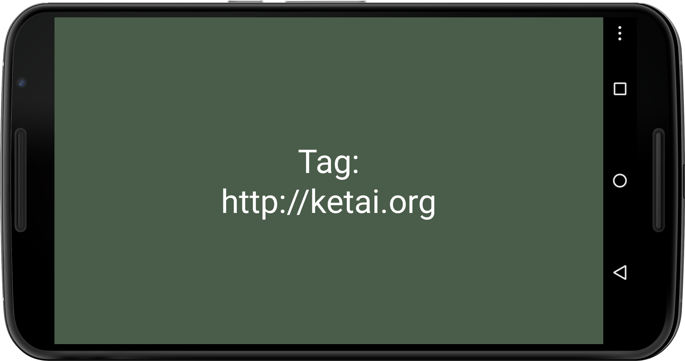
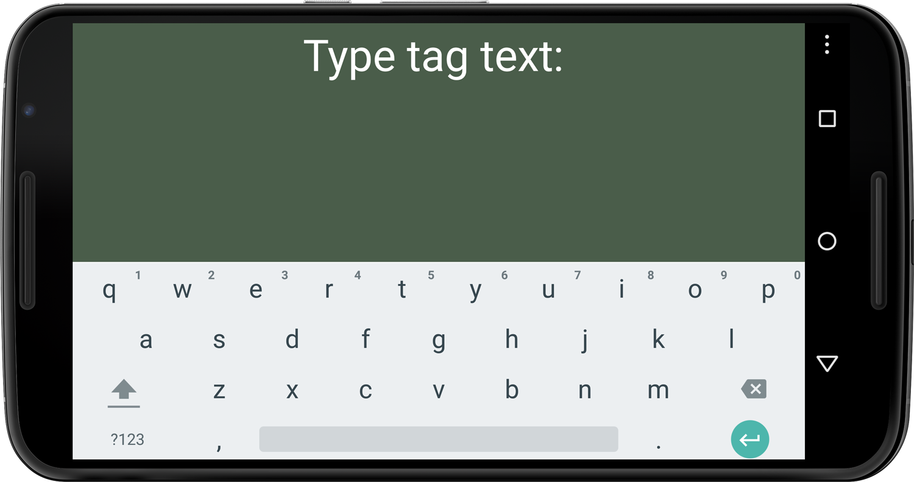

###Chapter 8:

#Using Near Field Communication (NFC)
 
 Now that we’ve learned how to create peer-to-peer networks using Bluetooth and Wi-Fi Direct, it’s time for us to dive into a more user-friendly method for connecting Android devices and sharing data. Near field communication (`NFC`) is an emerging short-range wireless technology designed for zero-click transactions and small data payloads. In a zero-click transaction between Android devices, you simply touch them back-to-back—that’s it. For instance, we can invite a friend to join a multiplayer game or exchange contact information simply by touching our devices. 
 
 Using `NFC`, we can also exchange images, apps, and other data between devices without first pairing them—a feature that Google calls Android Beam. Beam is Android’s trademark for `NFC` when the protocol is used for device-to-device communication. It was introduced with the release of Ice Cream Sandwich and is now a standard feature with all new Android devices. Google began promoting Beam with the release of Jelly Bean. When two unlocked Android devices facing back-to-back are brought near each other, Beam pauses the app that is currently running in the foreground and waits for us to confirm the `NFC` connection by tapping the screen. We’ll use Android Beam’s `NFC` features for the peer-to-peer networking app we’ll write in this chapter. 
 
 With a maximum range of about four centimeters—slightly less than the length of a AA battery—NFC’s reach is limited when compared to that of Bluetooth or Wi-Fi Direct, providing a first level of security. One shortcoming of the technology is that it’s fairly slow and not designed for large data payloads. We can use it, however, to initiate a higher-bandwidth connection, for instance via Bluetooth, which we’ll do later in this chapter. 
 
 Because `NFC` is quick and user-friendly, it promises to revolutionize the point-of-sale (`POS`) industry, which has been monetized by services such as [Google Wallet][0] and other merchandise services promoting `NFC`. For example, we can pay for a purchase at a MasterCard PayPass or Visa payWave terminal or read an `NFC` tag embedded in a product. Most Android smart phones shipped in the US today, and some tablets like the Nexus 7, come with `NFC` built in. 
 
 In addition to simplifying device interaction, `NFC` also promises to bridge the worlds of bits and atoms seamlessly, enabling us to interact with physical objects that have `NFC` chips embedded in them, also known as tags. Tags are `RFID` chips that contain `NFC`-formatted data. They can be mass produced for less than a dollar each and can store a small amount of data, often in the form of a [URL that points to a website with more information.][1] Most tags are read-only, some can be written to, and some can even be programmed. 
 
 In this chapter, we’ll first use `NFC` to initiate a P2P connection between two Android devices by simply touching them back-to-back. Then we’ll use that connection to send an increasingly detailed camera preview from one device to another, introducing us also to recursion as a programming concept. At the end of this chapter we’ll be writing apps to read and write `NFC` tags. If you don’t have an `NFC` tag at hand, you can get them at your local (online) store. 
 
 Let’s take a closer look at the `NFC` standard first. 

###Introducing NFC
 
 Near field communication can be used to exchange data between any pair of `NFC` equipped devices. When we develop peer-to-peer apps for mobile devices, zero-click interaction via `NFC` is the key to effortless networking via Bluetooth or Wi-Fi Direct. [Support for `NFC`][2] was first added to Android in 2011 with the release of Ice Cream Sandwich, and although the technology is not yet ubiquitous, most Android phones and some tablets sold in the US today ship with it. 
 
 With `NFC`, we don’t need to make a device discoverable, compare passcodes, or explicitly pair it with another because we establish the `NFC` network simply by touching one device to another. Only the deliberate back-to-back touch of two devices will trigger an `NFC` event. Simply walking by a payment reader or getting close to another device on a crowded bus is not sufficient. Front-to-front contact between devices won’t do the trick either. Only when both devices are within four centimeters of each other will a connection result. 
 
 `NFC` is high frequency (`HF`) [`RFID` technology][3] operating at 13.56 MHz. It’s a subset of `RFID`, but near field communication overcomes many of the [security and privacy concerns][4] that businesses and individuals have expressed about the use of `RFID`, which was reflected in the `RFID` mandates implemented in 2005 by Walmart and the United States Department of Defense for their [global supply chains.][5] `RFID` does not have a range limitation, but `NFC` does.
 
 `NFC` tags are passive devices and don’t require batteries. They get their power through induction from a powered `NFC` device such as an Android phone or tablet. Induction occurs when a conductor passes through a magnetic field, generating electric current. If an `NFC` tag (conductor) comes close to the magnetic coil embedded in a powered `NFC` device (magnetic field), an electric current is induced in the tag, reflecting radio waves back to the `NFC` device (data). Because the tags lack power and only reflect the radio waves emitted by an `NFC` device, they are also referred to as *passive* tags. 
 
 `NFC` tags come in different shapes and sizes and are roughly between the size of a quarter and a business card, as shown here:
 
 
#####Figure 8.0 - NFC tags.
######Different types of tags with different form factors: (from left to right) a heat resistant token, round and square stickers, and a machine washable tag `NFC` tags carry small amounts of data, typically between 40 bytes or characters and 1 kilobyte. Because of this limited amount of usable memory, tags are commonly used to store a URL that points to more information online. 
 
 Android devices respond to `HF` `RFID` tags because they are using the same radio frequency that `NFC` uses. For example, when you touch your biometric passport, the `RFID` tag inside the book from your library, the tag from your last marathon attached to your shoe, or a tagged high-end product or piece of clothing, your Android signals with a beep that it has encountered a tag. This doesn’t mean that we can successfully decipher such an `RFID` tag. The information stored on your ID card, passport, PayPass, or payWave card is encrypted. What’s more, `RFID` tags embedded in products typically store inventory IDs that don’t comply with the [`NFC` specification,][6] which means we can’t decipher the tag. 
 
 However, it is possible for our `NFC`-enabled Android phone or tablet to emulate an `HF` `RFID` tag, which is the reason we can use the Android to pay at a PayPass or payWave terminal. Because the PayPass and payWave tag content is proprietary and encrypted, we also can’t simply write a point-of-sale app of our own—like Google Wallet and bank-issued apps, we need to comply with the proprietary encryption to get a response. An increasing number of transit authorities have started to use `RFID` and `NFC` as well and are collecting fares using this wireless technology. 
 
 The first level of security and privacy protection for near field communication is proximity. Due to `NFC`’s limited range, we don’t need to make our device discoverable or browse for nearby Bluetooth devices. When we use `NFC` to exchange data directly between two Android devices, the second level of security is that the apps running on both devices must be running in the foreground—otherwise a dialog pops up to confirm. Also, when we use Beam, we need to tap the screen once while the devices are near each other to confirm the exchange. The data we exchange via `NFC` is not encrypted by default on the Android. If your goal is to write an app that requires security, like your own point-of-sale app, you need to deal with encryption separately. 
 
 We’ll use the `KetaiNFC` class for the apps in this chapter, making it simpler for us to work with Android’s `NFC` package. Let’s take a look at the `KetaiNFC` class next. 

###Working with the KetaiNFC Class and NDEF Messages
 
 `KetaiNFC` allows us to easily access the NFC methods of [Android’s `nfc` package][7] from within a Processing sketch. It allows us to receive `NFC` events and read and write tags in the NFC Data Exchange Format (NDEF), the official specification defined by the [`NFC` Forum.][8] Android implements this data format with the `Ndef` class, which provides methods for us to read and write `NdefMessage` data on `NFC` tags. An [`NdefMessage`][9] can contain binary data (`NdefMessage(byte[])`) or `NdefRecord` objects (`NdefMessage(NdefRecord[]`). An [`NdefRecord` object][10] contains either MIME-type media, a `URI`, or a custom application payload. `NdefMessage` is the container for one or more `NdefRecord` objects. 
 
 We’ll use the `KetaiNFC` class to write `NDEF` data. Depending on the data type provided to `write()`, it will create the corresponding `NdefMessage` for us accordingly. For the projects in this chapter, we’ll use the following `NFC` methods: 
 
  * *[`write()`][11]*   A Ketai library method to write a text `String`, `URI`, or `byte[]` array—depending on the datatype provided to `write()` as a parameter, it sends an `NFC` message formatted in that datatype. 
  
  * *`onNFCEvent()`*   An event method returning `NDEF` data of different types, such as a text `String` or `byte` array—depending on the datatype returned, `onNFCEvent()` can be used to respond differently depending on the `NDEF` message returned. 
   
 Let’s get started by creating a peer-to-peer connection using `NFC`. 

###Share a Camera Preview Using NFC and Bluetooth
 
 The idea of this project is to allow two or more individuals to quickly join a peer-to-peer network using `NFC` and Bluetooth. `NFC` is a good choice because it reduces the number of steps users must complete to create a network. We’ll take advantage of the user-friendly `NFC` method to pair devices and rely on the `NFC`-initiated higher-bandwidth Bluetooth network to handle the heavy lifting. 
 
 Our sketch will use a recursive program to send an increasingly accurate live camera image from one Android device to another. Once we’ve paired the two devices via `NFC`, we’ll begin with a camera preview that consists of only one large “pixel,” which we’ll draw as a rectangle in our program. Each time we tap the screen on the remote device, we will increase the resolution of the transmitted camera preview by splitting each pixel of the current image into four elements, as illustrated in <!--ref linkend="fig.nfc.bt" thispage="yes-->. In the next level, each of those pixels is split again into four, and so on—exponentially increasing the preview resolution until the image becomes recognizable. The color is taken from the corresponding pixel of the camera preview pixel located exactly in the area’s center. 
 

#####Figure 8.1 - Broadcast pixels using NFC and Bluetooth.
######Touching NFC devices back-to-back initiates the Bluetooth connection, starting a two-directional pixel broadcast. The camera preview is then sent from one device to the other and displayed there. The top image shows the sampled camera image after four taps, the bottom image after two. 

When we run the app on the networked Androids, we will get a sense of how much data we can send via Bluetooth and at what frame rate. We’ll revisit concepts from previous chapters where we worked with a live camera preview, <!--ref linkend="chp.camera-->, and sent Bluetooth messages, <!--ref linkend="chp.p2p-->, now using `NFC` to initiate the network. 

###Generate a Low-Resolution Preview
 
 Let’s go ahead and work on the main tab of our sketch, where we’ll put our camera code, and write a function to generate images of the camera preview at higher and higher resolutions. The program works by repeatedly calling itself, a technique known to programmers as [recursion.][12] This technique allows us to iterate through the image until we reach a number of divisions that we’ll set beforehand with a variable we’ll name `divisions`. Setting a limit is important since the recursion would otherwise continue forever, eventually “freezing” the app. Let’s name the recursive function `interlace()`. Each time it runs when we tap the screen, it will split each pixel in the current image into four new pixels. 
 
 The `interlace()` method we’ll create works with the `divisions` parameter to control how many recursions will be executed. We’ll start with a `divisions` value of `1`, for one division. Each time we tap the screen, `divisions` will increase to `2`, `3`, and so on, which will also increase the `level` parameter in our `interlace()` method. There we are using `level` to check that it has a value greater than `1` before recursively calling the `interlace()` method again to split each pixel into four. 
 
 In the main tab we also **import** the Ketai camera package, which is familiar to us from <!--ref linkend="chp.camera-->. We’ll create a `KetaiCamera` object that we’ll name `cam`. The `cam` object will read the image each time we receive a new frame from the camera. 
 
 For this sketch, we’ll use the following tabs to organize our code: 
 
  * *`NFCBTTransmit`*  Contains the main sketch, including our `setup()` and `draw()` methods, along with the `interlace()` method for recursively splitting the camera preview image. It also contains a `mousePressed()` method to increase the global variable `divisions`, used as a parameter for `interlace()`, and a `keyPressed` method that allows us to toggle the local camera preview on and off. 
 
  * *`ActivityLifecycle`*  Contains all the methods we need to start `NFC` and Bluetooth correctly within the activity life cycle. We require a call to `onCreate()` for launching Bluetooth, `onNewIntent()` to enable `NFC`, and `onResume()` to start both `NFC` and Bluetooth. 
 
  * *`Bluetooth`*  A tab for the two Bluetooth methods, `send()` and `onBluetoothDataEvent()`, to send Bluetooth messages and receive others in return. 
  
  * *`NFC`* The tab that contains the `setupNFC()` method to create the `NFC` object we are working with and the `onNFCEvent()` method that launches the Bluetooth connection when we received the other device’s Bluetooth `ID` via `NFC`. 
   
We’ll create each of those tabs step by step and present the code for each component separately in the following sections. 
 
Let’s first take a look at our main tab. 
 
#####code/NFC/NFCBTTransmit/NFCBTTransmit.pde
[include](code/NFC/NFCBTTransmit/NFCBTTransmit.pde) 
 
Here are the steps we need to recursively process the live camera image.
 
 1. Set the initial number of divisions to `1`, showing one fullscreen rectangle. 
 2. Center the rectangle around the horizontal and vertical location where it is drawn, using `rectMode()`. 
 3. Call the recursive function with starting values for each parameter, starting in the center of the camera preview. 
 4. Use the following parameters for `interlace()`: horizontal position `x`, vertical position `y`, rectangle width `w`, rectangle height `h`, and the number of `divisions`. 
 5. Get the pixel color at the defined `x` and `y` location in the camera preview image from the pixel located in the exact center of each rectangular area we use for the low-resolution preview. 
 6. Send the pixel data using our user-defined function `send()`. 
 7. Decrease the `limit` variable by 1 before recalling the recursive function. Decrease this variable and call the function only if the limit is greater than 1 to provide a limit. 
 8. Call `interlace()` recursively from within itself using a new location and half the width and height of the previous call as parameters. 
 9. Increment the number of divisions when tapping the screen. 
 
Now that we are done with our coding for the camera and the recursive program to create a higher-and-higher resolution image preview, let’s create the code we need to activate `NFC` and Bluetooth in the activity life cycle. 

###Enable NFC and Bluetooth in the Activity Life Cycle
 
To use `NFC` and Bluetooth, we need to take similar steps in the activity life cycle as we’ve done for our Bluetooth peer-to-peer app. In <!--ref linkend="sec.activity.lifecycle-->, we looked at the callback methods called during an activity life cycle. For this project, we need tell Android that we’d like to activate both `NFC` and Bluetooth. Let’s put the lifecycle code for the activity into an `ActivityLifecycle` tab. 
 
At the very beginning of the life cycle, `onCreate()`, we’ll launch `KetaiBluetooth` by initiating our `KetaiBluetooth` object, and we’ll tell Android that we intend to use `NFC`. We do so using an [intent,][13] which is a data structure to tell Android that an operation needs to be performed. For example, an intent can launch another activity or send a result to a component that declared interest in it. Functioning like a kind of glue between activities, an intent binds events between the code in different applications. We need an Intent to launch `NFC`. 
 
When `NFC` becomes available because our activity is running in the foreground on top of the activity stack, we get notified via `onNewIntent()`, because we asked for such notification with our intent in `onCreate()`. This is where we tell Android that we use the result of the returned intent with our `ketaiNFC` object, launching `NFC` in our sketch. An activity is always paused before receiving a new intent, and `onResume()` is always called right after this method. 
 
When Bluetooth is available as the result of the Bluetooth activity we launched `onCreate()` while instantiating `KetaiBluetooth`, the connection is handed to us via `onActivityResult()`, which we then assign to our `bt` object. 
 
Finally, `onResume()`, we start our Bluetooth object `bt` and instantiate our `NFC` object `ketaiNFC`. 
 
Let’s take a look at the actual code for `ActivityLifecycle`. 
 
#####code/NFC/NFCBTTransmit/ActivityLifecycle.pde 
[include](code/NFC/NFCBTTransmit/ActivityLifecycle.pde) 
 
We need these steps to initiate `NFC` and Bluetooth correctly within the activity life cycle.
  
1. Instantiate the Bluetooth object `bt` to start a Bluetooth activity. Register the `NFC` intent when our activity is running by itself in the foreground using `FLAG_ACTIVITY_SINGLE_TOP`. 
2. Receive the `NFC` intent that we declared in `onCreate()`, and tell Android that `ketaiNFC` handles it. 
3. Receive the Bluetooth connection if it started properly when we initiated it in `onCreate()`. 
4. Release the camera when another activity starts so it can use it. 
5. Stop Bluetooth and the camera when the activity stops. 
 
All of this happens right at the beginning when our sketch starts up. The callback methods we are using require some getting used to. Because `NFC` and Bluetooth launch in separate treads or activities from our sketch—and not sequentially within our sketch—we need the callback methods to get notified when the Bluetooth activity and the `NFC` intent have finished with their individual tasks. 
 
And because we depend on the successful delivery of the `NFC` payload for our Bluetooth connection, we need to use those callback methods and integrate them into the activity life cycle of our sketch. Processing and Ketai streamline many aspects of this programming process; when it comes to peer-to-peer networking between Android devices, we still need to deal with those essentials individually. 
 
Now let’s move on to the `NFC` tab, where we put the `NFC` classes and methods. 

###Add the NFC Code
 
We don’t need much code to import `NFC` and make the `KetaiNFC` class available to the sketch. When we receive an `NFC` event using `onNFCEvent()`, we take the Bluetooth address that has been transferred as a text `String` and use it to connect to that device using `connectDevice()`. 
 
Let’s take a look at the code. 
 
#####code/NFC/NFCBTTransmit/NFC.pde 
[include](code/NFC/NFCBTTransmit/NFC.pde) 
 
Here are the `NFC` steps we take. 

1. Receive the `String` from the `NFC` event using the `onNFCEvent()` callback method. 
2. Connect to the Bluetooth address we’ve received, removing the prefix “bt:” first. 
 
Finally, let’s take a look at the `Bluetooth` tab. 

###Add the Bluetooth Code
 
In the `Bluetooth` tab, we import the necessary Ketai Bluetooth and `OSC` package to send the Bluetooth messages. Let’s use a custom function called `send()` to assemble the `OSC` message, sending out the color, location, and dimension of our pixel. 
 
If we receive such a pixel from the networked Android via `onBluetoothDataEvent()`, we unpack the data contained in the `OSC` message and draw our pixel rectangle using a custom function, `receive()`. 
 
Let’s take a look at the code. 
 
#####code/NFC/NFCBTTransmit/Bluetooth.pde 
[include](code/NFC/NFCBTTransmit/Bluetooth.pde) 
 
Here are the steps we take to send and receive `OSC` messages over Bluetooth. 
 1. Add individual values to the `OscMessage` `m`. 
 2. Send the `byte` data contained in the `OSC` message `m` via Bluetooth using `broadcast()`. 
 3. Receive individual values sent via `OSC`, and draw a rectangle in the size and color determined by the received values. 
 4. Check if all seven integers in the `OSC` message are complete before using the values as parameters for the `receive()` method. 
 
Now with our recursive program, camera, `NFC`, and Bluetooth code completed, it’s time to test the app. 

###Run the App
 
Before we run the app, we need to set two permissions. Open the Permission Selector from the Sketch menu and select `CAMERA` and `INTERNET`. 
 
Now browse to the sketch folder and open `AndroidManifest.xml` in your text editor, where you’ll see that those permissions have been set. Add `NFC` permissions so the file looks something like this: 
 
#####code/NFC/NFCBTTransmit/AndroidManifest.xml 
[include](code/NFC/NFCBTTransmit/AndroidManifest.xml) 
 
Run the app on the device that is already connected to the PC via USB. When it launches, disconnect and run the app on your second Android device. Now it’s time for the moment of truth—touch both devices back-to-back and confirm the P2P connection. 
 
You should see a colored rectangle on each display, taken from the camera preview of the other device. If you move your camera slightly, you’ll recognize that its color is based on a live feed. Tap each screen to increase the resolution and observe what happens on the other device, then tap again. Each new division requires more performance from the devices as the number of pixels we send and display increases exponentially. 
 
Keep tapping and you will observe how the app slows as the size of the data payload increases. 

Now that we’ve learned how to send a Bluetooth ID via `NFC` Beam technology to another device, let’s move on to reading and writing `NFC` tags. 

###Read a URL from an NFC Tag
 
Moving on to the world of `NFC` tags, our sketches will get significantly shorter. Tags come in different shapes and sizes, as illustrated in <!--ref linkend="fig.nfc.tags-->, and they mostly store a few dozen characters, which is why most tags contain a `URL` pointing to a website. For this first app, we’ll create a sketch that can read `NFC` tags. 
 
Because we are dealing mostly with `URL`s, let’s also include some Processing code that lets us open the link in the device browser. We’ll check if it is a valid URL before we launch the browser. When we launch our sketch on the device, the app will wait for an `NFC` event to occur, which will be triggered when we touch the tag with the device. We’ll also want to display the tag’s content on the device, as shown in <!--ref linkend="fig.nfc.read-->. 
 

#####Figure 8.2 - Read an NFC tag.
######When you approach the NFC tag with the Android device, it outputs the collected text/URL on the display. Tapping the screen will take you to the URL saved on the tag. 

###Enable NFC
 
To get started, let’s enable `NFC` using the now familiar activity lifecycle methods we used in the previous sketch. All the lifecycle code we need to enable `NFC` goes into our `EnableNFC` tab. 
 
This tab is identical to <!--ref linkend="sec.nfc.bluetooth.activity.lifecycle-->, with the exception that we don’t have to start up Bluetooth as well. Let’s take a look at the code. 
 
#####code/NFC/NFCRead/EnableNFC.pde 
[include](code/NFC/NFCRead/EnableNFC.pde) 
 
Now let’s move on to our main sketch, `NFCRead`. 

###Add the Main Tab
 
Now that we’ve set up everything so `NFC` can start up properly, let’s take a look at the main tab, where we read the tag. When we receive an `NFC` event that includes a text `String`, we then use Processing methods to clean the `String`, check if it’s a valid `URL`, and link to the browser. We use [`trim()`][14] to remove whitespace characters from the beginning and the end of the `String`. Then we can use the resulting `String` directly with Processing’s `link()` method, which opens the browser and shows the website stored on the tag. To check if it’s a valid `URL`, we use the [`indexOf()` method][15], which tests if a substring is embedded in a string. If it is, it returns the index position of the substring, and if not, it returns `-1`. 
 
Here is the code. 
 
#####code/NFC/NFCRead/NFCRead.pde 
[include](code/NFC/NFCRead/NFCRead.pde) 
 
 1. Specify how to display the content of the tag stored in `tagText` on the device display. 
 2. Receive a `String` from the tag when the device touches it and an `NFC` event occurs. 
 3. Assign a clean version of the `String` to `tagText` after removing whitespace characters from the beginning and end using [`trim()`][16].
 4. Receive a `String` from the tag when the device touches it and an `NFC` event occurs. 
 5. Jump to the link stored on the tag using `link()`. Follow the link in the device browser when tapping the screen, given there is text stored on the tag. 
 
Before we run the sketch, we’ll again need to make sure that we have the appropriate `NFC` permissions. 

###Set NFC Permissions
 
Because `NFC` permissions are not listed in Processing’s Android Permissions Selector, where we usually make our permission selections (<!--ref linkend="sec.sketch.permissions-->), we need to modify `AndroidManifest.xml` directly to enable `NFC`. Processing typically takes care of creating this file for us when we run the sketch, based on the selection(s) we’ve made in the Permission Selector, and it re-creates the file every time we change our permission settings. Also, when we make no permission selections at all, Processing creates a basic manifest file inside our sketch folder. 
 
Since we are already editing the Android manifest file manually, let’s jump ahead and also add an [intent filter][17] that launches our app when a tag is discovered. This way, `NFCRead` will start when the app is not yet running and resume when it is running in the background. 
 
Let’s take a look at the sketch folder and see if `AndroidManifest.xml` already exists inside it. Open the sketch folder by choosing Sketch &mapsto; Show Sketch Folder. You should see two Processing source files in the folder for this sketch, one named `EnableNFC` and the other `NFCRead`. 
 
Now to create a manifest, return to Processing and choose Android &mapsto; Sketch Permissions from the menu. Although we won’t find an `NFC` check box in there, it will still create an `AndroidManifest.xml` template for us that we can modify. 
 
To modify the manifest, navigate to the sketch folder and open `AndroidManifest.xml`. Make your changes to the manifest so it looks like the following `xml` code. 
 
#####code/NFC/NFCRead/AndroidManifest.xml 
[include](code/NFC/NFCRead/AndroidManifest.xml) 
 
In the manifest `xml`, we take the following steps. 
 
 1. Set `NFC` permission. 
 2. Have the app look for a tag. 
 3. Make Android look for an `NDEF` tag. 
 4. If an `NDEF` tag is discovered and the app is not already running in the foreground, make the activity the default. 
 
Now that the appropriate `NFC` permissions are in place, let’s run the app. 

###Run the App
 
Run the app on the device. When it starts up, our `tagText` `String` is empty. You can tap the screen but nothing happens, because we don’t yet have a link to jump to. 
 
Now approach your tag with the back of your device. A few centimeters before you touch the tag, you will hear a beep, which signals that an `NFC` event has occurred. The `URL` stored on the tag should now appear on your display (<!--ref linkend="fig.nfc.read-->). If you have another one, try the other tag and see if it has a different `URL`. 

Now that you’ve successfully read `NFC` tags, it’s time to learn how to write them as well, either to add your own URL or to change the `NDEF` message on there. 

###Write a URL to an NFC Tag
 
The `NFC` device built into the Android can also write to `NFC` tags. Most tags you get in a starter kit can be repeatedly rewritten. So if you’d like to produce a small series of `NFC`-enabled business cards, provide a quick way to share information at a fair booth, or create your own scavenger hunt with `NFC` stickers, you can write tags with your Android. 
 
Let’s build on our previous sketch and add a feature to do that. The app must still be able to read a tag to confirm that our content has been successfully written. To write tags, let’s use the software keyboard to type the text we want to send as a `String` to the tag, as illustrated in <!--ref linkend="fig.nfc.write-->. If we mistype, we need the backspace key to delete the last character in our `String`. Once we’ve completed the `String`, let’s use the `ENTER` key to confirm and `write()` the tag. The transmission to write the actual tag is then completed when we touch the tag. Finally, when we come in contact with the tag again, we read its content.
  

#####Figure 8.3 - Read and write NFC tags.
######Use the keyboard to input a URL and press Enter. The string will then be written to the tag on contact. 

Let’s introduce a variable called `tagStatus` to provide us with some onscreen feedback during this process. The sketch itself is structured identically to our previous example <!--ref linkend="code.nfc.read-->. We’ll keep the `EnableNFC` tab and the permissions we set for `AndroidManifest.xml`. 
 
Let’s take a look at the main tab.
  
#####code/NFC/NFCWrite/NFCWrite.pde 
[include](code/NFC/NFCWrite/NFCWrite.pde) 
 
Let’s take a look at the steps we need to take to write a tag. 

 1. Import the Ketai user interface package to show and hide Android’s software keyboard. 
 2. Declare a variable `tagStatus` to give us feedback on the text input and writing status. 
 3. Show the tag status and the current text input to write to the tag. 
 4. Toggle the Android software keyboard to type the text `String`. 
 5. Adjust the display layout to `TOP`-align vertically so we can accommodate the software keyboard. 
 6. Check if the key press is `CODED`. 
 7. Add the last character typed on the software keyboard to the `tagText` `String`. 
 8. Check if the Enter [`key`][18] is pressed on the keyboard. 
 9. Prepare writing the content of the `tagText` variable to the tag on contact using `write()`. 
 10. Check if the coded backspace button `67` is pressed on the software keyboard to remove the last character in `tagText`. 
 11. Remove the last character in the `tagText` `String` using the `String` method `substring()` and `length()`. Determine the current `length()` of the `String` and return a `substring()` from the first character `0` to the next-to-last character. 

###Run the App
 
Run the app on the device and follow the instruction on the display. Start by tapping the screen, which will cause the software keyboard to appear. Type your text. If you mistype, you can correct it using the backspace button. When you are done, finish up by tapping the Enter key. Now the device is ready to write to the tag. Touch the tag with the back of the device, and if the sketch is operating properly, you should hear a beep, which indicates the device has found and written to the tag. Touch the tag again to read what’s now on it. That’s it! 

Now that we’ve completed both reading and writing tags, we know how easy this kind of interaction is to do and we’ve got an idea of how useful it can be. 

###Wrapping Up
 
With all those different networking techniques under your belt, you’ve earned the networking badge of honor. Now you’ll be able to choose the right networking method for your mobile projects. You already know how to share data with a remote device and you’ve mastered peer-to-peer networking for those that are nearby. You’ve seen how near field communication can be used to initiate a peer-to-peer connection between two devices and to read `NFC` tags. Each of these highly relevant mobile concepts complement each other and can be combined—making for a whole lot of apps you can build. 
 
Now that we've seen how to share all kinds of data between networked devices, it's time to take a closer look at the databases and formats we can use both locally and remotely.

[0]: http://www.google.com/wallet/
[1]: http://en.wikipedia.org/wiki/Uniform_resource_identifier
[2]: http://developer.android.com/guide/topics/nfc/index.html
[3]: http://en.wikipedia.org/wiki/Rfid
[4]: http://en.wikipedia.org/wiki/Radio-frequency_identification#Privacy
[5]: http://www.rfidjournal.com/article/articleview/607/1/1/
[6]: http://www.nfc-forum.org/aboutnfc/interop/
[7]: http://developer.android.com/reference/android/nfc/package-summary.html
[8]: http://www.nfc-forum.org/specs/spec_list/
[9]: http://developer.android.com/reference/android/nfc/NdefMessage.html
[10]: http://developer.android.com/reference/android/nfc/NdefRecord.html
[11]: http://ketai.org/reference/netnfc/ketainfc/
[12]: http://en.wikipedia.org/wiki/Recursion_%28computer_science%29
[13]: http://developer.android.com/reference/android/content/Intent.html
[14]: http://processing.org/reference/trim_.html
[15]: http://processing.org/reference/String_indexOf_.html
[16]: http://processing.org/reference/trim_.html
[17]: http://developer.android.com/guide/components/intents-filters.html
[18]: http://processing.org/reference/key.html