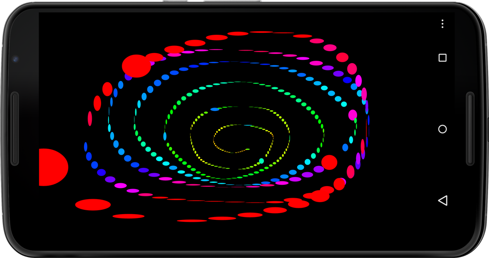
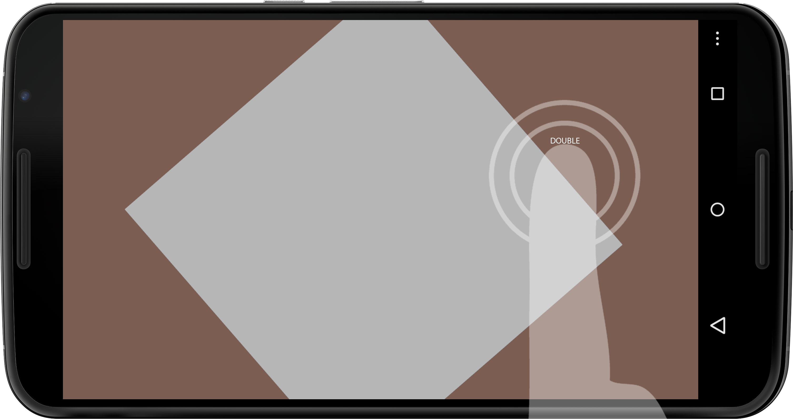

### Chapter 2: 

#Working with the Touch Screen Display

Now that we've completed our first Android app, let's explore a device feature that has become particularly popular with mobile phones and tablets—multitouch. Virtually all Android devices ship today with a capacitive touch screen panel. It's a device we've gotten so accustomed to that we hardly "see" it as the hardware sensor that it is.

User interaction (UI) with Android touch screens differs somewhat from that of a mouse on a traditional computer display. First of all, we don't have one omnipresent mouse pointer for interacting with UI elements via rollovers, clicks, right-clicks, and double-clicks. In fact, we don't have a rollover or a physical "click" on the touch screen panel at all, hence UI interactions often require adjustments for the touch screen. Typically the Android device uses audiovisual cues such as click sounds or small device vibrations for user feedback.

There are a number of advantages to the multitouch screen interface to point out. First and foremost, the capacitive touch screen panel affords us more than one mouse pointer. We can work with two, five, even ten fingers on the Android, although more than three are rarely used. [Multitouch][1] allows us a variety of distinct finger gestures compared to the mouse, which we can only use to interact with the UI elements and other components displayed on the screen. The two most common multitouch gestures are the pinch and rotate gestures, typically used for scaling and rotating objects on the screen. 

In this chapter, we'll get started by learning to use the mouse callback methods available in Processing for Android. Then we'll dive into the different color modes Processing has to offer, an essential topic that we need to address to work with graphics and images throughout the book. Building on the [basic drawing sketch](../gettingStarted.html#processing_ide_basicdrawing-sm), we'll use the mouse speed to manipulate the hues of the ellipses we draw.

Finally, we'll dedicate the second part of the chapter to the multitouch features of the Android touch screen and create a sketch that showcases the most common gestures, including the tap, double-tap, long press, flick, pinch, and rotate gestures. In the sketch we'll develop, we'll manipulate the scale, position, rotation, and color of a rectangle using multitouch gestures.

To make working with multitouch gestures easy, we'll use the [Ketai library for Processing,][2] which greatly simplifies the process. We'll work with Ketai throughout the book, as it also simplifies working with sensors, cameras, location, and networking—all the hardware features that are typically difficult to work with. We'll download and install the library step by step and take a quick look at the main Ketai classes.

Let's take a look at how the touch screen panel works.

[1]: http://en.wikipedia.org/wiki/Multi-touch
[2]: http://ketai.org


###Introducing the Android Touch Screen

The capacitive touch screen panel of an Android device consists of a glass insulator coated with a transparent conductor. When we interact with the touch screen surface, our fingertips act as electrical conductors—not very good ones, but good enough to be detected. A touch on the screen surface distorts the electrostatic field, causing a change in its electric capacitance, which can be located relative to the screen surface. The horizontal and vertical position of the fingertip relative to the screen is then made available to us through the Android OS; it is updated only when we touch or move a fingertip across the screen.

The apps we write in Processing have a flexible screen orientation by default, which means our app switches orientation automatically from portrait to landscape depending on how we are holding the phone or tablet–this is detected by the accelerometer sensor we'll get to know in [Display Values from
the Accelerometer](../sensors#Display Values from the Accelerometer). We can lock the orientation using [Processing's ```orientation()``` method using either the ```PORTRAIT``` or the ```LANDSCAPE``` parameter.][3]

<!-- 
2.1 REVISION
Changed previous link (footnote 3 - old link is dead) from
http://wiki.processing.org/index.php?title=Android#Screen.2C_Orientation.2C_and_the_size.28.29_command to http://android.processing.org/reference/environment/orientation.html
-->

For compatibility, Processing uses the constants ```mouseX``` and ```mouseY``` when it's running in Android mode, corresponding in this case to the position of a user's fingertip relative to the upper left corner of the device touch screen rather than the position of the mouse cursor on a desktop screen. This allows us to use the same code across modes. When using ```mouseX``` in Android mode, we refer to the horizontal position of the fingertip on the touch screen panel, and when we use ```mouseY```, we refer the fingertip's vertical position. Both are measured relative to the [coordinate system's][4] origin in the upper left corner of the touch screen. Moving the finger to the right on the screen will increase ```mouseX``` values; moving the finger down will increase ```mouseY```.

In Android mode, we can also use the following mouse methods, which are available in all Processing modes. The Android touch screen gestures correspond to the following mouse events:

* [```mousePressed()```][5] This callback method is called every time a finger touches the screen panel. It corresponds to a mouse-pressed event on the desktop when the mouse button is pressed down.
* [```mouseReleased()```][6] This callback method is called every time a finger lifts off the touch screen surface, but only if its position has changed since first touching the panel. It corresponds to a mouse-up event on the desktop.
* [```mouseDragged()```][7] This callback method is called every time a new finger position is detected by the touch screen panel compared to the previously detected position. It corresponds to a mouse-dragged event on the desktop when the mouse moves while the button is pressed.

All three methods respond only to one finger's touch. When you use more than one finger on the multitouch surface, the finger that triggers callback events is the first one that touches the screen panel&emdash;the second, third, or more are ignored. If you hold down one finger on the screen surface, add another one on, and remove the first, then the second finger one will now be first in line and take over mouse events. We will work with multiple fingers and multitouch gestures in just a bit in [Detect Multitouch Gestures](#detect-multitouch-gestures).

Let's put the mouse callback methods to the test with a simple sketch that prints the mouse position and events into the Processing console. We'll need ```draw()``` to indicate that this sketch is running and listening to the mouse continuously. Then we add our callback methods and have each print a brief text string indicating which mouse method has been called at what finger position.

Create a new Android sketch by choosing  File  &mapsto;  New  from the Processing menu. If your new sketch window is not yet in Android mode, switch it to Android using the drop-down menu in the upper right corner. Add a few lines of code to the sketch window:

```
void draw()
			{
				// no display output, so nothing to do here
			}
			
			void mousePressed ()
			{
				println("PRESSED x:" + mouseX + " y: " + mouseY);
			}
			
			void mouseReleased ()
			{
				println("RELEASED x:" + mouseX + " y: " + mouseY);
			}
			
			void mouseDragged ()
			{
				println("DRAGGED x:" + mouseX + " y: " + mouseY);
			}
```

Let's go ahead and test the touch screen panel of an Android device.

[3]: http://android.processing.org/reference/environment/orientation.html
[4]: http://processing.org/learning/drawing/
[5]: http://processing.org/reference/mousePressed_.html
[6]: http://processing.org/reference/mouseReleased_.html
[7]: http://processing.org/reference/mouseDragged_.html

###Run the App

With your Android device connected to your desktop via a USB cable, run the sketch on the device by pressing the "Run on Device" button in the sketch window. When the sketch is installed and launched on the device, we don't need to pay attention to the screen output of the touch screen panel, but keep an eye on the Processing console at the bottom of the sketch window.

Hold your device in one hand and get ready to touch the screen surface with the other. Take a look at the console and tap the screen. In the console, you'll see output similar to this:

```
PRESSED x:123 y:214
```

Lift your finger and see what happens. If you see no additional mouse event, don't be surprised. Although we might expect a ```RELEASED``` here, we shouldn't get this event if we just tap the screen and lift the finger. The ```mouseX``` and ```mouseY``` constants always store and maintain the last mouse position. To get a mouse-released event, touch the screen, move your finger a bit, and release. Now you should see something like this:

```
PRESSED x:125 y:208
DRAGGED x:128 y:210
DRAGGED x:130 y:209
RELEASED x:130 y:209
```

Because we touched the screen, we first trigger a ```mousePressed()``` event. By moving the finger slightly while touching the surface, we trigger ```mouseDragged()``` until we stop moving. Finally, we get a ```mouseReleased()``` event because we've updated our position since we pressed or touched the screen.

Now that we can now work with the mouse callback methods, we're ready to take a look at the color support that Processing provides, which is one of its strengths. Knowing how to control color values is a fundamental skill that we'll frequently return to as we work with graphics and images throughout the book. We'll come back to the Android touch screen and its multitouch features later in this chapter. 

###Using Colors

Any geometric primitive we draw on the screen uses a particular ```fill()``` and ```stroke()``` color. If we don't say otherwise, Processing will default to a black stroke and a white fill color. We can use the ```fill()``` and ```stroke()``` methods to change default values, and we can also use grayscale, RGB, HSB, or hexadecimal color in the Android apps we create. The ```background()``` method uses color in the same way, with the exception that it cannot set a value for opacity, formally known as the alpha value. 

By default, Processing draws all graphic elements in the RGB (red, green, blue) color mode. An additional alpha value can be used as a fourth parameter to control the opacity of graphic elements drawn on the screen. An alpha value of ```0``` is fully transparent, and a value of ```255``` is fully opaque. Values of ```0..255``` control the level of opacity for an individual pixel. 

The ```background()``` color of a Processing window cannot be transparent. If you provide an alpha parameter for ```background()```, the method will just ignore its value. Within ```draw()```, the ```background()``` method is used in most cases to clear the display window at the beginning of each frame. The method can also accept an image as a parameter, drawing a background image if the image has the same size as the Processing window. 

Processing provides us with two different color modes that we can switch between using the [```colorMode()``` method.][8] The color mode can be set to RGB or HSB (hue, saturation, brightness), which we'll explore further in [Using HSB Colors](#using-colors). ```colorMode()``` changes the way Processing interprets color values. Both RGB and HSB can handle alpha values to make objects appear transparent.

We can adjust the value range of the parameters used in ```colorMode()``` as well. For example, white in the default RGB color mode is defined as ```color(255)```. If we change the range to ```colorMode(RGB,1.0)```, white is defined as ```color(1.0)```. 

Here are the parameters ```colorMode()``` can take. We can specify ```mode``` as either RGB or HSB and specify  ```range``` in the value range we prefer.

* ```colorMode(mode)```
* ```colorMode(mode, range)```
* ```colorMode(mode, range1, range2, range3)```
* ```colorMode(mode, range1, range2, range3, range4)```

Let's now take a look at the three different color methods Processing has to offer. They are good examples of how Processing uses as few methods as possible to get the job done.

[8]: http://processing.org/reference/colorMode_.html

###Using Grayscale and RGB colors

The ```fill()``` and ```stroke()``` methods can take either one, two, three, or four parameters. Since the ```background()``` method doesn't accept alpha values, it takes either one or three parameters:

```
fill(gray)
stroke(gray)
background(gray)
```

```
fill(gray, alpha)
stroke(gray, alpha)
```

```
fill(red, green, blue)
stroke(red, green, blue)
background(red, green, blue)
```

```
fill(red, green, blue, alpha)
stroke(red, green, blue, alpha)
```

As you can see, your results will differ depending on how many parameters you use. One parameter results in a grayscale value. Two parameters define a grayscale and its opacity (as set by an alpha value). If alpha is set to ```0```, the color is fully transparent. An alpha value of ```255``` results in a fully opaque color. Three parameters correspond by default to red, green, and blue values. Four parameters contain the red, green, and blue values and an alpha value for transparency. Through this approach, Processing reduces the number of core methods by allowing for a different number of parameters and by interpreting them differently depending on the color mode. 

To recall the syntax of any particular method, highlight the method you want to look up in the sketch window and choose the Find in Reference option from  Help. It's the quickest way to look up the syntax and usage of Processing methods while you are working with your code.

###Using Hex Colors

Processing's color method can also handle hexadecimal values, which are often less intuitive to work with but are still fairly common as a way to define color. We'll take a closer look at hexadecimal color values in [Read Comma-
Separated Web Color Data](). Hex color method parameters, such as the ```hex``` code ```#ff8800``` for orange, are applied like this:

```
fill(hex)
stroke(hex)
background(hex)
```

```
fill()
stroke()
```

Now let's take a look at the ```HSB``` color mode, which, as we learned earlier, can define a color using hue, brightness, and saturation.

###Using HSB Colors

Why should we care about HSB? Because it's a rather excellent color mode for working algorithmically with color, such as when we want to change only the saturation of a UI element. When we switch the default RGB color mode to HSB, the values of the color parameters passed to ```fill()``` and ```stroke()``` are not interpreted any more as red, green, blue, and alpha values, but instead as hue, saturation, brightness, and alpha color values. We can achieve seamless transitions between more- and less-saturated color values for UI highlights, for instance, which is very difficult to do properly in RGB. So for the objective of algorithmic color combinations, transitions, and animations that need to be seamless, HSB is great.

When we switch to HSB using the ```colorMode(HSB)```, the ```fill()```, ```stroke()```, and ```background()``` methods will be interpreted like this: 

```
fill(hue, saturation, brightness)
stroke(hue, saturation, brightness)
background(hue, saturation, brightness)
```

```
fill(hue, saturation, brightness, alpha)
stroke(hue, saturation, brightness, alpha)
```

When we work algorithmically in HSB, we can access the hue directly using Processing's [```hue()``` method.][9] It takes a color as a parameter and extracts only the hue value of that color. Similarly, we can get the brightness by using the  [```brightness()``` color method,][10] and we can access the [```saturation()```][11] separately as well. The HSB color cylinder is a very useful illustration of this color space to further investigate and better understand the [HSB color mode,][12] where all hues are represented within the 360-degree circumference of the color cylinder. Take a quick look at it; we'll come back to it in the next project, [Use Mouse Speed
to Control Hues](#use-mouse-speed-to-control-hues).

Now that we've learned about the different ways to assign color values, let's also take a look at the Processing ```color``` type, which Processing provides for the specific purpose of *storing* colors. 

<!-- 2.2 REVISION
Old link (footnote 12) is dead:
http://upload.wikimedia.org/wikipedia/commons/1/16/Hsl-hsv_models_b.svg
Replaced with: https://upload.wikimedia.org/wikipedia/commons/thumb/1/16/Hsl-hsv_models_b.svg/1000px-Hsl-hsv_models_b.svg.png
-->

[9]: http://processing.org/reference/hue_.html
[10]: http://processing.org/reference/brightness_.html
[11]: http://processing.org/reference/saturation_.html
[12]: https://upload.wikimedia.org/wikipedia/commons/thumb/1/16/Hsl-hsv_models_b.svg/1000px-Hsl-hsv_models_b.svg.png

###Using the Color Type

The [Processing ```color``` type][13] can store RGBA or HSBA values in one variable, depending on the ```colorMode()``` you choose. It's a great type for any app that we build using a color scheme of multiple colors. Using the ```color``` type, we simply call the ```color``` variable and apply it to the objects we draw. We can create a color palette in our app without requiring a bunch of individual variables for each value of an RGBA or HSBA color. We would apply the ```color``` type like this:

```
fill(color)
```

```
fill(color, alpha)
```

If ```color``` included an alpha value of, let's say, ```127.5```, a primitive drawn with ```fill(color)``` would be drawn with ```50%``` opacity (given a possible max alpha value of ```255```). In the unlikely scenario that the same color that already contains an alpha value is used in conjunction with an additional alpha parameter, such as ```fill(color, 128)```, the resulting color would be drawn half as transparent as before, or at ```25%``` opacity. 

Processing color methods are overloaded, so they can handle a range of situations—you can use one method for many applications. In other languages, remembering which syntax to use for a particular color effect can be a challenge, but with Processing you need to remember only a small number of methods. When a color value exceeds the default maximum value of ```255```, Processing caps it for us. So ```fill(300)``` has the same result as ```fill(255)``` does. The same is true for values lower than the default minimum, ```0```.

Now that we've learned about the different color modes, methods, and types available to define colors in an Android app, let's refine our previous drawing sketch.

[13]: http://processing.org/reference/color_datatype.html

###Use Mouse Speed to Control Hues

Now let's explore the HSB mode on the device touch screen display. By adding ```colorMode()``` to our sketch, we switch the color mode, and by modifying our ```fill()``` method to work with HSB values, we change our app from grayscale to shades of color. Here's the result:


#####Figure 4 — Using mouse speed to control color. 
######The hue of the ellipses changes depending on how fast you move your finger across the touch screen surface. Slow movements result in greenish, medium in blueish, and fast movements in reddish values.

In this project, we'll keep the screen ```orientation()``` flexible, which is the default setting for our Processing apps, and we don't have to set anything to make the app change orientation when we hold the device upright or sideways. This means it will change orientation when the built-in device accelerometer sensor decides that the app should adapt to the particular orientation at that moment. When such an orientation change occurs, our ```setup()``` method will be called again, reinitializing the sketch and executing all the statements we've included in ```setup()```. Because we set the screen to black, erasing its contents using the ```background(0)``` method, a change in the app's orientation will reset the ```background()``` to black, erasing all the ellipses we've drawn prior to changing the orientation.

We have only two modifications to make using the [code from chapter 1](../gettingStarted.html#processing_ide_basicdrawing-sm). First we switch the color mode to HSB, which also customizes its value range. Then we calculate the speed of our movement by measuring the distance between the previous and the current mouse position using [Processing's ```dist()```][14] method. The method takes two points as parameters and returns the distance between them. Finally, we apply the distance we've calculated to the hue in the ```fill()``` method for the ellipses we draw. The default value range for the HSB color modes is ```0..255``` by default. We'll override the default hue value to use floating point ranges of ```0..100``` instead, allowing us to use the calculated mouse speed directly to the hue parameter. For the saturation and brightness values, we'll override the default values to use floating point ranges of ```0..1.0```.

Let's take a look at the project code. 

<!-- code id="code.mouse.speed.hue" file="code/Display/MouseSpeedHue/MouseSpeedHue.pde" -->

Here are the modifications we've made.

1. Switch the default RGB color mode to HSB using the ```colorMode(HSB, 100, 1, 1)``` method. Set the second parameter for hue to ```100```, allowing for floating point hue values of ```0..100```. Set the third parameter to ```1```, defining the color saturation values for the range ```0..1.0```. Also set the brightness range as ```0..1.0``` in the fourth parameter.

2. Now set the color ```fill()``` of the ellipse in our defined HSB mode. Use  ```dist()``` to calculate the distance between the previous mouse position (```pmouseX```, ```pmouseY```) and the current one (```mouseX```, ```mouseY```), and apply the result to the hue parameter. Use ```1``` for saturation and brightness. We've defined ```1``` as the maximum saturation and brightness, so both are set to ```100``` percent.

Let's test the app.

[14]: http://processing.org/reference/dist_.html

####Run the App

Rerun the sketch on the device now switched to HSB color, and see how the  hue of the ellipses that are drawn changes depending on how fast you move your finger across the screen surface. The changes in the hues occur independently of their saturation and brightness, so all the colors are drawn with maximum saturation and brightness.

If you go back to the HSB color wheel we looked at earlier, you will see how the ```360``` degrees of the HSB or the wheel correspond to the different colored ellipses you draw on the screen. Slow movement results in yellow color values, and then, with increasing speed, you'll see green, cyan, blue, and magenta as the maximum speed values.

Now that we've mastered the use of ```color``` in Processing, let's continue our investigation into the multitouch screen panel. We'll go ahead and install a Processing library that will help us work with multitouch gestures and extend the core features Processing provides us. Besides multitouch, the Ketai library makes it easy for us to work with other hardware devices and sensors built into Android phones and tablets. Let's take a look at the Ketai classes and the features it provides. We'll be using these throughout the rest of the book.

###Introducing the Ketai Library

The [Ketai library for Processing][15] focuses particularly on making it easy to work with the mobile hardware features built into Android phones and tablets. The [term "Ketai"][16] is used in Japan to describe its cell phone culture, enabled by mobile handheld devices. The mobile device translates as Keitai Denwa and literally means "something carried in the hand," or handheld. The Ketai library is free software published under the [GNU General Public License Version 3 (GPL v3),][17] and it is compatible with Android versions 2.3 Gingerbread, 3.0/3.1 Honeycomb, 4.0 Ice Cream Sandwich, 4.1/4.2/4.3 Jelly Bean, 4.4 KitKat, and 5.0 Lollipop. NFC, Wi-Fi Direct, and updated camera features introduced in 4.0 Ice Cream Sandwich are not available in Gingerbread or Honeycomb. Therefore the Ketai library is available as [separate downloads][18] for Gingerbread/Honeycomb and for Ice Cream Sandwich/Jelly Bean. Please refer to [Run a Sketch on an Android Device](../gettingStarted#run-a-sketch-on-an-android-device), to find out which version of Android you are running on your device. 

Compared to the desktop, the defining feature of a mobile handheld device is that we use it on the go, where we expect cameras, location, and orientation sensors to help us navigate traffic, find relevant locations near by, and snap pictures while we are on the move. We also might be networking with Bluetooth accessories, interacting with products through embedded NFC tags, or paying for  merchandise with our mobile devices. The Ketai library helps us develop apps for all of these scenarios.

Libraries are arguably one of the most successful aspects of the open source Processing project. There are more than 130 libraries available for Processing; however, on the Android device we can only use those Java libraries that do not make use of desktop hardware. Libraries extend the easy-to-learn Processing core with classes written for particular contexts, including 3D, animation, compilations, computer vision, data and protocols, geometry, graphic interface, hardware interface, import and export, math, simulation, sound, tools, typography, and video—to name the main categories listed on the [Processing website][19], where the libraries are organized.

Many interface, sound, computer vision, and import/export libraries use code that is specific to the desktop context and are not designed for use on Android devices. Many libraries that could be compatible with Processing for Android are currently updated by library authors to eventually be available for us to use in Android mode. The Library Manager added to Processing 2.0 makes it easy to install libraries from within Processing. We'll use it to install the Ketai library in <!--ref linkend="sec.install.library" -->.

There is hardly any computational topic that is not addressed in the Processing libraries. Because all libraries are open source and come with examples and tutorials, Processing is a favorite of students and creative coders alike. Most of the supplemental libraries have been developed for artists and designers for a particular project, so their use is often illustrated with the actual project that inspired it. Some of those projects can also be found in the online [Processing exhibition.][20] This site makes browsing in and "shopping" for free libraries a fun activity and inspiring in its own right. As you download libraries and install them in your Processing sketchbook's ```libraries``` directory, they remain at this location and available even after you upgrade to a new version of the Processing IDE. The idea of this structure is to separate the Processing developer environment from the sketches that you write and the libraries you collect, keeping them independent of updates to Processing itself.

While there are scores of Processing libraries, only a small number of them work on Android phones and tablets. The Ketai library is designed particularly to provide programmer access to Android sensors, cameras, and networking; it is the only library that has been developed to run solely in Android mode.

I've been working on the Ketai library with Jesus Duran since 2010, with the objective to make it really easy to write apps that can effectively use the mobile hardware features built into Android phones and tablets. Convinced by the idea that phones and tablets evolve rapidly alongside the open source Android OS, the Ketai library makes it possible to consider such devices as a great complement to microcontrollers such as the Arduino—an open hardware sister project to Processing that is built on the same IDE.

Besides their compact form factor, multicore Android phones and tablets are computationally quite powerful, are equipped with a wide range of sensors, and run an operating system that is open source, free, and doesn't require subscriptions—characteristics that are advantageous to innovation, academic use, and [DIY culture.][21] What's more, once a mobile phone or tablet is outdated, it remains an inexpensive device, available in abundance and way too functional for a [landfill.][22]

The Ketai library values conciseness and legibility in its syntax and makes hardware features available using just a few lines of code. For example, the simple code we use for our accelerometer project (<!--ref linkend="code.accelerometer" -->) uses less than thirty lines of code altogether, while the Java sample included in the [Android SDK][23] completes the task with more than one hundred lines of code. This ratio increases significantly with more complex subjects such as <!--ref linkend="chp.p2p" -->, and <!--ref linkend="chp.nfc" -->, where Ketai is significantly more concise and easier to understand than the SDK.

Ketai includes a number of classes that make Android hardware sensors and devices available within Processing. The following classes are included in the library, described in more detail in <!--ref linkend="sec.ketai.classes" -->, and explained within the relevant chapters:


* KetaiSensor
* KetaiLocation
* KetaiCamera
* KetaiFaceDetector
* KetaiBluetooth
* KetaiWiFiDirect
* KetaiNFC
* KetaiData
* KetaiList
* KetaiKeyboard
* KetaiGesture


Let's go ahead and install the Ketai library now.

[15]: http://ketai.org
[16]: http://iipc.utu.fi/imaginaryjapan/Kusahara.pdf
[17]: http://www.gnu.org/licenses/gpl.html
[18]: http://ketai.org/download/
[19]: http://processing.org/reference/libraries/
[20]: http://processing.org/exhibition/
[21]: https://en.wikipedia.org/wiki/DIY_ethic
[22]: https://en.wikipedia.org/wiki/Mobile_phone_recycling
[23]: https://developer.android.com/studio/intro/index.html

###Install the Ketai Library

Follow these steps to activate the Processing library. It's a one-time process; you won't need to repeat it.

You can install the Ketai library from within the Processing IDE using the "Add Library..."  menu item.

1. Choose  "Add Library...," which you can find under Sketch  &mapsto;  "Import Library..."
2. At the bottom of the window that opens, enter "Ketai."
3. Select the Ketai library that appears in the list and press the Install button on the right.
4. The download starts immediately, and a bar shows the download's progress. When the library is installed, the button on the right changes to  Remove.

Alternatively, you can download and install the library manually from the dedicated website that comes with every Processing library. This process has the advantage that you can read about the library and preview its features alongside a reference and example code for the library.

1. Go to the Ketai library website, http://ketai.org/download, and download the latest ```zip``` file.
2. Extract the file to the ```Documents/Processing/libraries``` folder. If the ```libraries``` subfolder doesn't exist in your sketchbook, create it now and put the Ketai folder inside it.
3. Restart Processing so it can load the newly added library.
4. Check whether the installation was successful by opening  Sketch&mapsto; "Import Library..." Under  Contributed  libraries you should now see the name "Ketai." If it doesn't show up in the list, please refer to {{ book.troubleshooting }}.

The process for downloading and installing the Ketai library is identical for any other Processing library.

Let's now move on to our first project—putting the Ketai library to work.

###Working with the KetaiGesture Class


```KetaiGesture``` gives us access to the most common multitouch gestures used on mobile devices. It provides us with the callback methods that we need to highlight, scale, drag, and rotate objects and UI elements. To select, zoom, focus, and organize the elements we display on the touch screen, we can use a number of gestures that have become user interaction standards on mobile devices. Working off established UI standards, we can build apps that are more intuitive to use and that enable the user to get the job done quickly while on the move.

Using the [```KetaiGesture``` class][24], we can work with the following callback methods, which report back to us when a certain event has occurred on the touch screen surface, which was triggered by a particular user interaction or [multitouch gesture.][25]

Let's take a look at the main methods included in ```KetaiGesture```:

```
onTap(float x, float y)
```

* *Single Tap*—triggered by one short tap on the device screen. Returns the horizontal and vertical position of the single-tap gesture.

```
onLongPress(float x, float y)
```

* *Long Press*—triggered by tapping and holding a finger at one position on the touch screen for about one second. Returns the horizontal and vertical position of the long press gesture.

```
onFlick(float x, float y, float px, float py, float v)
```

* *Flick*—triggered by moving a finger in any direction, where the beginning and the end of the gesture occur at two different screen positions while the finger doesn't come to a full stop before lifting it from the screen surface. Returns the horizontal and vertical position where the flick is released, the horizontal and vertical position where the flick started, and the velocity of the flick.

```
onPinch(float x, float y, float d)
```

* *Pinch*—triggered by a two-finger gesture either away from each other (pinch open) or toward each other (pinch close). The pinch is typically used for zooming in and out of windows or for scaling objects. Returns the horizontal and vertical position of the pinch's centroid and the relative change in distance of the two fingers to each other.

```
onRotate(float x, float y, float angle)
```

* *Rotate*—triggered by the relative change of the axis rotation defined by two fingers on the touch screen surface. Returns the centroid of the rotation gesture and the relative change of the axis angle.

Let's build an app that puts ```KetaiGesture```'s multitouch methods to use.

[24]: http://ketai.org/reference/ui/ketaigesture
[25]: http://en.wikipedia.org/wiki/Multitouch

###Detect Multitouch Gestures

For this project, we'll implement the most common user interactions using just one simple geometric primitive—a rectangle—drawn on the screen using Processing's [```rect(x, y, width, height)``` method.][26] To begin, we'll place a rectangle in a specified size of ```100``` pixels in the center of the screen. Then we use a series of ```KetaiGesture``` callback events to trigger changes to the rectangle, including a change of scale, rotation, color, and position, as illustrated in <!--ref linkend="fig.display.gestures" -->.


#####Figure 6 — Using multitouch gestures. 
######The illustration shows a rectangle scaled with a two-finger pinch gesture, turned by a two-finger rotation gesture, placed on a brown background color, and triggered by a flick, as well as a gray fill color caused by a long press. The text "DOUBLE" appears due to a double-tap gesture at the position indicated by the hand silhouette.

We have a number of callback events for the touch surface to try out, so we'll assign each of them with a particular purpose. We'll zoom to fit the rectangle onto the screen using ```onDoubleTap()```, randomly change its fill color ```onLongPress()``` using [Processing's ```random()``` method,][27] cale it ```onPinch()```, rotate it ```onRotate()```, drag it using ```mouseDragged()```, and change the background color ```onFlick()```. Besides manipulating color properties and the rectangle, we'll keep track of the multitouch events as they occur by printing a text string to the Processing Console. The code we use to manipulate the properties and the callback methods themselves are not complicated in any way, but we're now dealing with a bit more code than we have before because we're using a series of callback methods in one sketch.

[26]: http://processing.org/reference/rect_.html
[27]: http://processing.org/reference/random_.html

###Introducing 2D Transformations

For this project, we'll lock our app into ```LANDSCAPE``` ```orientation()``` so we can maintain a clear reference point as we discuss 2D transformations in reference to the coordinate system. To center our rectangle on the screen when we start up, to scale from its center point using the pinch gesture, and to rotate it around its center point using the rotate gesture, we need to work with [two-dimensional (2D) transformations.][28]

We'll use the [Processing's ```rectMode(CENTER)``` method][29] to overwrite the default way a rectangle is drawn in Processing, which is from the upper left corner of the rectangle located at position ```[x, y]``` with a specified ```width``` and ```height```. Instead we draw it from its center point using ```rectMode(CENTER)```, which allows us to rotate and scale it around its center point.

A common metaphor to explain 2D transformations is a grid or graph paper. Using this analogy, each grid cell stands for one pixel of our app's display window. The default origin in Processing's coordinate system is always the upper left corner of the window. Each graphic element is drawn relative to this origin onto the screen. To move and rotate our rectangle, we'll use Processing's transformation methods: [```translate()```][30] and [```rotate()```][31]. We also have a [```scale()```][32] method, which we won't use in this sketch.

When we draw graphic objects in Processing on our grid paper, we are used to specifying the rectangle's horizontal and vertical coordinates using *x* and *y* values. We can use an alternative method, which is necessary here, where we move our grid (paper) to specified horizontal and vertical coordinates, rotate, and then draw the rotated rectangle at position *x* and *y* ```[0, 0]```. This way the rectangle doesn't move to our intended position, but our grid paper (coordinate system) did. The advantage is that we can now ```rotate()``` our ```rect()``` right on the spot around its center point, something we can't do otherwise.

What's more, we can introduce a whole stack of grid paper if we'd like to by using the Processing methods ```pushMatrix()``` and ```popMatrix()```. When we move, rotate, and scale multiple elements and would like to transform them separately, we need to draw them on separate pieces of grid paper. The ```pushMatrix()``` method saves the current position of our coordinate system, and ```popMatrix()``` restores the coordinate system to the way it was before pushing it.

Like our first project in this chapter, in which we used Processing's ```mousePressed()```, ```mouseReleased()```, and ```mouseDragged()``` callback methods to identify touches to the screen, some of the multitouch gestures introduced here fulfill the same purpose. If we'd like to use Processing's mouse methods alongside multitouch methods provided by ```KetaiGesture```, we'll need to notify the [superclass method][33] ```surfaceTouchEvent()``` to notify the Processing app that a surface touch event has occurred.

Now let's take a look at our multitouch code.

[include](code/display/gestures.pde)
<!-- code id="code.gestures" file="code/Display/Gestures/Gestures.pde" language="java" start="import" end="eof"-->

Let's take a look at the steps we need to take to capture and use multitouch gestures on the Android touch screen.

1. Import Ketai's ```ui``` package to give us access to the ```KetaiGesture``` class.
2. Import Android's ```MotionEvent``` package.
3. Define a variable called ```gesture``` of type ```KetaiGesture```.
4. Set a variable we call ```rectSize``` to ```100``` pixels to start off.
5. Define the initial color ```c``` (white), which we'll use as a fill color for the rectangle and text.
6. Define the initial color ```bg``` (dark green), which we'll use as a background color.
7. Instantiate our ```KetaiGesture``` object ```gesture```.
8. Set the initial value for our variable ```x``` as the horizontal position of the rectangle.
9. Set the initial value for ```y``` as the vertical position of the rectangle.
10. Push the current matrix on the matrix stack so that we can draw and rotate the rectangle independent of other UI elements, such as the text.
11. Move to the position ```[x, y]``` using ```translate()```.
12. Pop the current matrix to restore the previous matrix on the stack.
13. Use the Processing method ```surfaceTouchEvent()``` to notify Processing about mouse/finger-related updates.
14. Use the callback method ```onTap()``` to display the text string ```SINGLE``` at the location ```(x, y)``` returned by ```KetaiGesture```.
15. Use the callback method ```onDoubleTap()``` to display the text string ```DOUBLE``` at the location returned by ```KetaiGesture```, indicating that the user triggered a double-tap event. Use this event to decrease the rectangle size to the original ```100``` pixels if it's currently enlarged, and increase the rectangle scale to the display height minus ```100``` pixels if it's currently minimized to its original scale.
16. Use the callback method ```onLongPress()``` to display the text string "LONG" at the location ```(x, y)``` returned by ```KetaiGesture```. Use this event to randomly select a new color ```c``` using ```random()```, which we'll use as a fill color for the rectangle.
17. Use the callback method ```onFlick()``` to display the text string ```FLICK``` at the location ```x``` and ```y``` returned by ```KetaiGesture```. Also, receive the previous location where the flick has been initiated as ```px``` and ```py```, as well as the velocity ```v```.
18. Use the callback method ```onPinch()``` to calculate the scaled ```rectSize``` using the pinch distance ```d``` at the location ```x``` and ```y``` returned by ```KetaiGesture```.
19. Use the callback method ```onRotate()``` to calculate the rotation angle ```rectAngle``` using the ```angle``` returned by ```KetaiGesture```.
20. Use Processing's ```mouseDragged()``` callback to update the rectangle position  (```x``` and ```y```) by the amount of pixels moved. Determine this amount by subtracting the previous ```pmouseX``` from the current ```mouseX```, and ```pmouseY``` from ```mouseY```. Move the rectangle only if absolute distance between the rectangle and the mouse position is less than half the rectangle's size, or when we touch the rectangle.

Let's test the app.

[28]: http://processing.org/learning/transform2d/
[29]: http://processing.org/reference/rectMode_.html
[30]: http://processing.org/reference/translate_.html
[31]: http://processing.org/reference/rotate_.html
[32]: http://processing.org/reference/scale_.html
[33]: https://processing.org/reference/super.html

####Run the App

Run the app on your device. You'll see a square show up in the center of the screen. Drag it to a new location, flick to change the background color, and give it a long tap to change the foreground fill color.

To test the multitouch gestures, put two fingers down on the screen and pinch, and you'll see how the rectangle starts scaling. Now rotate the same two fingers to see the rectangle rotate. If you use more than two fingers, the first two fingers you put down on the screen are in charge.

Finally, double-tap the screen to zoom the square to full screen, and double-tap again to scale it to its initial size of ```100``` pixels.

This completes our investigation into the multitouch features of the touch screen panel.

###Wrapping Up

You've used the touch screen panel as the first hardware device we've worked with. You've learned about mouse speed and all the different color features in Processing and worked with the HSB color mode to manipulate the hue values of the geometric primitive we've drawn. And finally, you are now able to use mouse events and multitouch gestures for your app's user interfaces to control the object you display on the device screen.

You are now well positioned to move on to the next chapter, where we'll focus on the hardware sensors built into Android devices. After all, the "native" user experience of mobile apps relies heavily on hardware devices and sensors, and we are now ready to incorporate them into our apps.
