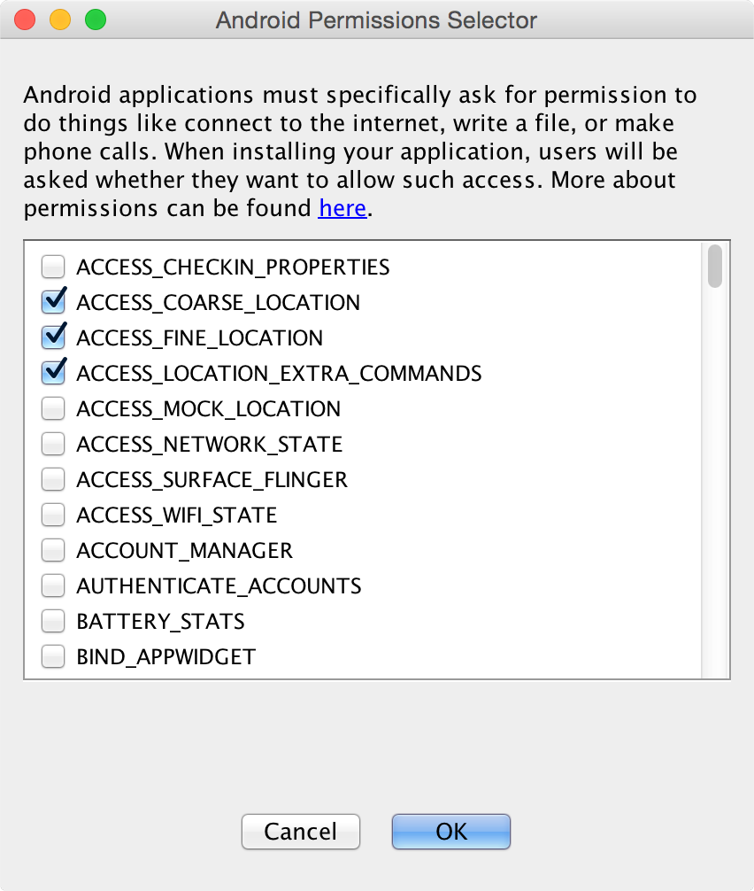
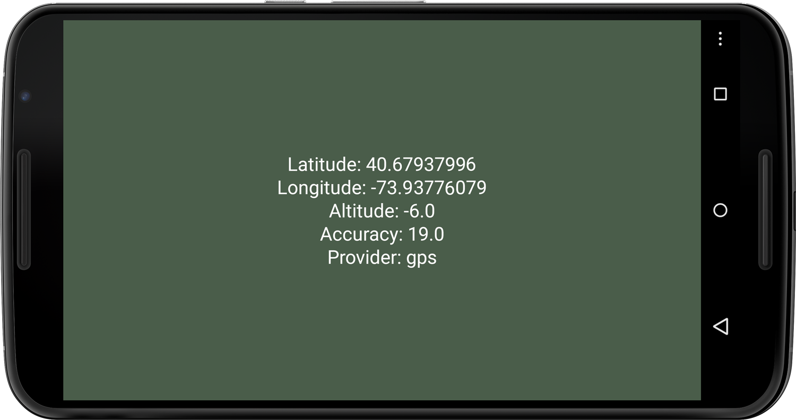
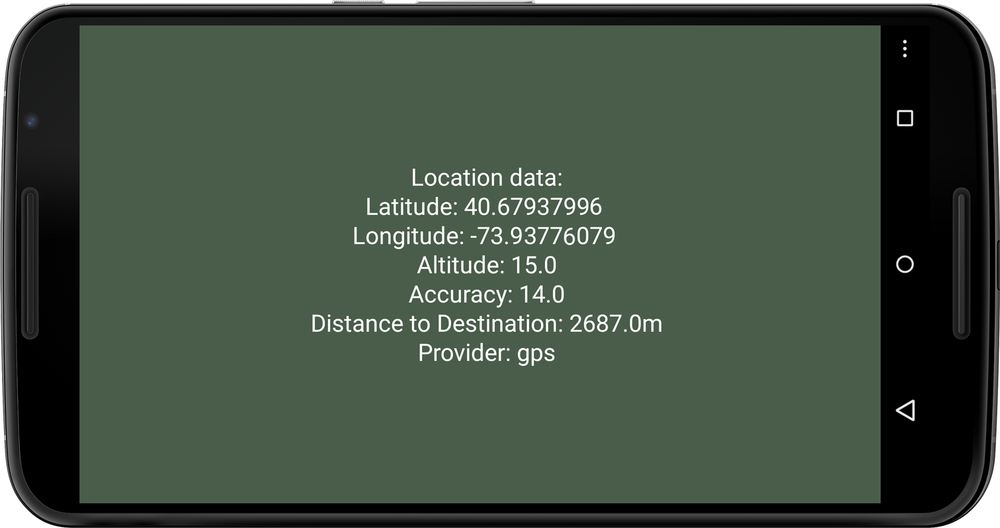
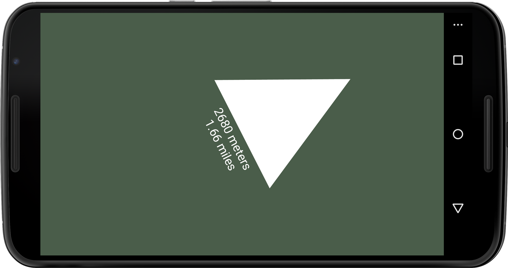

###Chapter 4:
#Using Geolocation and Compass


Location-based services have changed the way  we navigate, share, and shop. Since the FCC ruling in 1996 requiring all US mobile operators to be able to locate emergency callers, location has become embedded in the images we take, the articles we blog, the commercials we watch, and the places we check into. These services rely on location information using latitude and longitude—and sometimes altitude—to describe a north-south and east-west position on the Earth's surface.

When we search for local information, get directions to public transportation, or find the nearest bar or bargain, the Android enables us to zero in on the information that is relevant to us at a particular geographic location. Because the device is aware of its own geolocation, we can navigate, detect where we are heading, and know how we are holding the device in relation to magnetic north. A built-in Global Positioning System (GPS) receiver, accelerometer, and digital compass allow the Android to have a full picture about its location and orientation, which plays an important role for navigation apps and [location-based services.][1] 

Android apps make use of the [Android's Location Manager][2] to calculate a location estimate for the device. Its purpose is to negotiate the best location source for us and to keep the location up-to-date while we are on the move. Updates typically occur when the device detects that we've changed location or when a more accurate location becomes available. An Android device uses two different [location providers][3] to estimate its current geographic coordinates: ```gps``` on the one hand and ```network``` on the other, the latter based either on the calculated distance to multiple cell towers or on the known location of the Wi-Fi network provider to which we are connected. [A special ```passive``` provider][4] receives location updates from other apps or services that request a location.

Compared with the Global System for Mobile Communications (GSM) and Wi-Fi network localization, GPS is the most well-known and accurate method for determining the location of a device. With thirty-one GPS satellites orbiting about 20,000 kilometers above any spot on the Earth's surface twice a day (every 11 hours, 58 minutes), it's just fantastic how the fingertip-sized GPS receivers built into our smart phones are able to determine the device's latitude, longitude, and altitude at a theoretical accuracy of about three meters.

In this chapter, we'll build a series of navigation apps. We'll start by working with the Android's current geolocation. We'll continue by measuring how far we are located from a predefined destination. Finally, we'll build an app that helps us navigate toward another mobile device.

Let's first take a look at how the Android device estimates its location.

[1]: http://en.wikipedia.org/wiki/Location-based_service
[2]: http://developer.android.com/reference/android/location/LocationManager.html
[3]: http://en.wikipedia.org/wiki/GSM_localization
[4]: http://developer.android.com/guide/topics/location/obtaining-user-location.html

###Introducing the Location Manager

Given its ubiquitous use, working with geolocation data should be simple. In the end, it's just the latitude, longitude, and maybe altitude we are looking to incorporate into our apps. Because there are various location techniques, however, we are interacting with a fairly complicated system and continuously negotiating the best and most accurate method to localize the device. The Location Manager that does that work for us is a software class that obtains periodic updates of the device's geographic location from three sensors available on an Android phone or tablet, including a built-in GPS receiver, a cellular radio, and a Wi-Fi radio. Both the ```KetaiLocation``` and Android ```Location``` classes draw their data from the Location Manager, which in turn gets its information from the onboard devices.

Another localization method uses cellular tower signals to determine the location of a device by measuring the distances to multiple towers within reach. This [triangulation method][5] is less precise because it depends on weather conditions and relies on a fairly high density of cell towers.

The third method doesn't require GPS or cell towers at all but the presence of a Wi-Fi network. This technique uses the known locations of nearby Wi-Fi access points to figure out the approximate location of the mobile device. Wi-Fi access points themselves lack GPS receivers and therefore lack knowledge of their own geographic locations, but such information can be associated with their physical [MAC (media access control) addresses][6] by third parties.

The most notorious case was [Google's now abandoned effort][7] to associate GPS coordinates with the MAC address of every wireless access point it encountered as it photographed the streets of US cities and towns with GPS-enabled vehicles for its Google Maps Street View project.

Nowadays, we're the ones who do this work for Google whenever we take an Android device for a stroll. If we have activated Google's location service by selecting Settings &mapsto; "Location services" on the main menu of our device, then by default we have agreed to "collect anonymous location data" and that "collection may occur even when no apps are running." The MAC addresses of available Wi-Fi networks are sent to Google during this collection process, along with their geographic coordinates. The next user who walks through the same geographic area can then geolocate solely via the Wi-Fi network information, even if GPS is turned off.

It takes a few seconds for the Android to narrow the location estimate and improve its accuracy, so we typically need to start ```KetaiLocation``` as soon as the app launches. With fewer than ten lines of code, ```KetaiLocation``` can provide us with our geographic coordinates and notify us of changes in our location via the ```onLocationEvent``` callback method.

For the location-based apps we'll develop in this chapter, we'll use the following Ketai library and Android classes:

[*```KetaiLocation class```*][8] <br />
A class that simplifies working with Android's Location Manager—it instantiates the Location Manager, registers for location updates, and returns geolocation data.

[*```Location```*][9] <br />
A wrapper for Android's Location Manager that provides us with many useful methods for determining our position, bearing, and speed—if we're only interested in our location, we won't need this class, but we will use some of its features for later projects in this chapter.

Now let's take a look at the ```KetaiLocation``` methods we'll be using in this chapter.

[5]: http://en.wikipedia.org/wiki/Triangulation
[6]: http://en.wikipedia.org/wiki/MAC_address
[7]: http://www.nytimes.com/2012/05/23/technology/google-privacy-inquiries-get-little-cooperation.html
[8]: http://ketai.org/reference/sensors/ketailocation
[9]: http://developer.android.com/reference/android/location/Location.html

<div class="sidebar">
<h3>Introducing GPS</h3>
<p>
The transmitters built into GPS satellites broadcast with about 50 watts, similar to the light bulb in a desk lamp, and yet the GPS module in the phone is able receive a sequence of numbers sent by all the satellites simultaneously, every microsecond. The atomic clock in each satellite takes care of that. The satellite doesn't know anything about us; it's only transmitting. The receiver in our mobile device makes sense of the transmission by deciphering the sequence of numbers the satellite sends. The GPS receiver then determines from the number sequence (which includes the time it was sent by the satellite) how far each individual radio signal has travelled, using the speed of light as its velocity. If a satellite is close by (about 20,000 kilometers), the signal would take about 67 microseconds to travel. The distance is measured by multiplying the time it has taken the radio signal to reach your phone by the speed of light.
</p><p>
We need to "see" at least four satellites to determine latitude, longitude, and altitude (or three if we assume an incorrect altitude of zero). It's clear that a 50-watt signal from 20,000 kilometers away cannot penetrate buildings. We can only "see" satellites if there are no obstructions. If the signal bounces off a building surface, the estimate is less accurate as a consequence. Because the satellite orbits are arranged so that there are at always six within the line of sight, it's fine if one or two are not "seen" or are inaccurate. Accuracy is higher for military  receivers getting a signal every tenth of a microsecond, bringing it theoretically down to 0.3 meters (or about 1 ft). High-end receivers used for survey and measurement can increase accuracy even more—to within about 2 mm.
</p>
</div>

###Working with the KetaiLocation Class

The ```KetaiLocation``` class is designed to provide us with the longitude, latitude, and altitude of the device, as well as the accuracy of that estimate. Besides the typical ```start()``` and ```stop()``` methods, ```KetaiLocation``` also provides a method to identify the location provider that has been used to calculate the estimate. Let's take a look.

<!-- CHECK FOR FORMATTING CONSISTANCY - pg 72 pdf -->

*```onLocationEvent()```* <br />
Returns the device location, including latitude, longitude, altitude, and location accuracy

*```latitude```*<br />
Describes the angular distance of a place north or south of the Earth's equator in decimal degrees—positive ```lat``` values describe points north of the equator; negative values describe points south of the equator (for example, Chicago is located at ```41.87338``` degrees latitude in the northern hemisphere; Wellington, New Zealand, is located at ```-41.29019``` degrees latitude in the southern hemisphere).

*```longitude```*<br />
Describes the angular distance of a place east or west of the meridian at Greenwich, England, in decimal degrees (for example, Chicago, which is west of the Greenwich meridian, is located at -87.648798 degrees longitude; Yanqi in the Xinjiang Province, China, is located at ```87.648798``` degrees longitude.)

*```altitude```*<br />
Returns the height of the device in relation to sea level measured in meters

*```accuracy```*<br />
Returns the accuracy of the location estimate in meters

*```getProvider()```*<br />
Returns the identity of the location provider being used to estimate the location: ```gps``` or ```network```—it does not distinguish between cellular or Wi-Fi networks.

Before we can use data from the location provider, we need to take a look at the permissions the sketch needs to access this data.

###Setting Sketch Permissions

By default, [Android denies permissions][10] to any app that requests access to private data or wants to perform privileged tasks, such as writing files, connecting to the Internet, or placing a phone call. Working with privileged information such as geolocation is [no exception.][11]

If we'd like to use the device's location data, we need to ask for permission. Android prompts the user to grant permission if an app requests permission that has not been given to the app before. The Processing IDE (PDE) helps us administer permission requests through the Android Permission Selector, which is available from the menu by selecting Android &mapsto; Sketch Permissions. There we'll find a list of all the permissions that can be requested by an app on the Android.

As illustrated in Figure 4.1 below, the location permissions need to be set for this app. When we run the sketch on the device and Processing compiles the Android package, it generates a so-called ```AndroidManifest.xml``` file that corresponds to our permission settings. We don't need to worry much about the details of [```AndroidManifest.xml```;][12] owever, as follows, we can see how Processing's Permissions Selector translates our selection into a user-permissions list.

#####code/Geolocation/Geolocation/AndroidManifest.xml
[include](code/geolocation/AndroidManifest.xml)


#####Figure 4.1 — Sketch permissions.
######The Android Permissions Selector lists all permissions that can be requested by the Android app. The location permissions required by the first geolocation app are checked.

To make sure our location app is able to work with location data, we need to enable Google's location service on the device under Settings &mapsto; "Location" and agree to the prompt, shown here:

```
Let Google's location service help apps determine location.
This means sending anonymous location data to Google,
even when no apps are running.
```

Otherwise our app will will display the following warning:

```
Location data is unavailable. Please check your location settings.
```

We've programmed this warning into our sketch, assuming that ```getProvider()``` returns ```none```, which is also the case if Google's location service is switched off.

Let's go ahead and write our first location-based app.

[10]: http://developer.android.com/guide/topics/security/security.html#permissions
[11]: http://www.nytimes.com/2012/04/01/us/police-tracking-of-cellphones-raises-privacy-fears.html
[12]: http://developer.android.com/guide/topics/manifest/manifest-intro.html

###Determine Your Location

As our first step, let's write some code to retrieve and display your device's location, as shown in Figure 4.2.


#####Figure 4.2 — Displaying location data.
######The screen output shows geolocation (latitude, longitude, and altitude), estimation accuracy (in meters), and the current location provider.

This exercise will familiarize us with the kinds of values we'll use to determine our current location on the Earth's surface. Let's display the current latitude, longitude, and altitude on the screen as determined by the Location Manager, as well as display the accuracy of the values and the provider that is used for the calculation. The following example uses ```KetaiLocation``` to gather this info.

######code/Geolocation/Geolocation/Geolocation.pde
[include](code/geolocation/geolocation.pde)

Let's take a look at how the newly introduced class and methods are used in this example.

1. Declare the variable ```location``` to be of type ```KetaiLocation```. We'll use this variable to store location updates.
2. Create the ```KetaiLocation``` object we've called ```location```.
3. Check whether we currently have a location provider via the [```getProvider()``` method.][13]
4. Display location values ```latitude```, ```longitude```, ```altitude```, ```accuracy```, and the location provider using ```getProvider()```.
5. Whenever a location update occurs, use the ```onLocationEvent()``` method to retrieve location data and print them to the screen.

Ketai defaults the Location Manager to provide location updates every ten seconds or whenever the device moves more than one meter. This preset number is geared toward applications that strive for a certain level of accuracy. You can change this update rate by calling the ```KetaiLocation``` method ```setUpdateRate(int millis, int meters)```. The app will try to retrieve a ```gps``` location first via the Location Manager, and if that fails it will fall back to ```network``` localization.

[13]: http://developer.android.com/reference/android/location/LocationManager.html#getProvider%28java.lang.String%29

###Run the App

With the location service turned on, let's run the sketch on our device. Type or copy the code above into your Processing environment and run it on your Android phone or tablet. You should now see your current geographic location. If you are inside a building, chances are that the location estimate is based on the ```network``` provider, as shown in <!-- ref linkend="fig.geolocation-->. In this example, the Location Manager calculated the estimate with an accuracy of ```46``` meters, which means that the estimate can range from 46 meters, worst case, to "right on" in the best case.

Next, let's disconnect the phone and take it for a little walk. Step outside your building. Watch for a location update and a change in provider.

Great—now head back inside. Take a peek again at your latitude and longitude coordinates, and double-check the location accuracy in Google Maps, as described. How far off are you? If you walk a block, you will be able to observe a change to the third digit after the decimal in either the latitude or longitude, depending on where you are headed. The seemingly small change in this digit represents about 200 feet, which brings us to our next application.

###Working with the Location Class

The event method ```onLocationEvent()``` we worked with earlier returns the latitude, longitude, altitude, and accuracy of the device location—or alternatively, an Android ```Location``` object. If we look at the ```onLocationEvent()``` method in more detail, we can use it with the following sets of parameters:

* *```onLocationEvent(double latitude, double longitude, double altitude, float accuracy)```* Four parameters return the latitude, longitude, altitude, and accuracy of the location estimate.
* *```onLocationEvent(Location location)```* One parameter returns an [Android location object,][14] where Android location methods can be applied directly.

Depending on what location data we need for our location-based app, we can choose our preferred set of parameters from either ```latitude```, ```longitude```, ```altitude```, ```accuracy```, or the ```Location``` type. We can also select a few parameters if we don't require them all. The ```Location``` object returned in the second iteration of the ```onLocationEvent()``` implementation listed here allows us to access any [Android ```Location``` method.][15]

The ```Location``` class is loaded with useful methods for dealing with the data they contain, and it is a great way to package returned location data for use in an app. Ketai gives us complete access to the ```Location``` class; let's take a look at some of the ```Location``` methods we'll be working with.

* [*```getBearing()```*][16] Returns the direction of travel in degrees, measured clockwise in relation to magnetic north
* [*```getSpeed()```*][17] Returns the speed of the device over ground in meters per second (One meter per second is equivalent to ```2.236``` miles per hour.)
* [*```distanceTo()```*][18] Returns the distance to a given location in meters (The method takes a ```Location``` object as parameter.)
* [*```setLatitude()```*][19] Sets the latitude of a ```Location```.
* [*```setLongitude()```*][20] Sets the longitude of a ```Location```.

Now let's work on the next project, where we'll put ```Location``` methods to work and write an app that determines the distance between two locations.

[14]:http://developer.android.com/reference/android/location/LocationProvider.html
[15]:http://developer.android.com/reference/android/location/Location.html
[16]:http://developer.android.com/reference/android/location/Location.html#getBearing%28%29
[17]:http://developer.android.com/reference/android/location/Location.html#getSpeed%28%29
[18]:http://developer.android.com/reference/android/location/Location.html#distanceTo%28android.location.Location%29
[19]:http://developer.android.com/reference/android/location/Location.html#setLatitude%28double%29
[20]:http://developer.android.com/reference/android/location/Location.html#setLongitude%28double%29

###Determine the Distance Between Two Locations

In this project, we'll calculate the distance between our current device location and [another fixed location][21] that we predetermine. We provide the fixed location coordinate through latitude and longitude decimal degree values. To get a better idea about what those values represent, let's first obtain the latitude and longitude values of our current geographic location via [Google Maps.][22]

Browse Google Maps on your desktop, and find a location close to a landmark you recognize and know your approximate distance to. Now right-click anywhere close to that landmark on the map. From the menu, choose "Directions to here." You need to be zoomed in all the way so Maps doesn't grab the close-by landmark and display only the landmark's name instead of the latitude and longitude. If you hit a non-landmark spot, Maps will display the ```lat``` and ```lon``` values of the location inside the site's destination field. My current location in Brooklyn, for instance, looks like this:

```
40.67937996,-73.9377679
```

Write down your location—we'll use it in the next project. If you use the format shown above, ```lat, lon``` (latitude comma longitude), Google Maps will understand and take you to this location. This approach is a quick and easy way to double-check a location when you want to test a location app.

Now let's create a sketch to determine the distance between a fixed point and the device, as shown in Figure 4.3.


#####Figure 4.3 — Calculating distance.
######The screen output shows the device's current location, the calculated distance to the predefined ```bam``` destination, and the current location provider.

We'll use both the ```KetaiLocation``` and Android's ```Location``` classes. ```KetaiLocation``` provides us with the current device latitude and longitude, ```Location``` lets us define a destination location object that we can use to calculate the ```distance``` between both points. Finally, we'll use the ```round()``` method to calculate the closest integer and display full meters.

Let's take a look at the code.

#####code/Geolocation/LocationDistance/LocationDistance.pde
[include](code/geolocation/LocationDistance.pde)

Here's what's new in this sketch compared to our previous project.

1. Create an Android ```Location``` object to store a fixed location against which to compare your current device location. I named mine "bam" (for the Brooklyn Academy of Music). We'll use the [```setLatitude()```][23] and [```setLongitude()```][24] Android methods to set its values.
2. Use the ```distanceTo()``` method to compare the device's location via ```location.getLocation()``` with the fixed ```bam``` location. The [```round()``` method][25] calculates the closest integer number to the floating point value returned by ```distanceTo()```.
3. Receive a location update using ```onLocationEvent()```, which now returns a ```Location``` object instead of individual values for latitude, longitude, altitude, and accuracy. The different parameter options for ```onLocationEvent()``` are described next.
4. Use the Android [```toString()```][26] method to print a concise, human-readable description of the location object to the console.

Let's try this sketch.

[21]: http://en.wikipedia.org/wiki/Wikipedia:Obtaining_geographic_coordinates
[22]: http://maps.google.com
[23]: http://developer.android.com/reference/android/location/Location.html#setLatitude%28double%29
[24]: http://developer.android.com/reference/android/location/Location.html#setLongitude(double)
[25]: processing.org/reference/round_.html
[26]: http://developer.android.com/reference/android/location/Location.html#toString%28%29

###Run the App

Run the sketch on the device and take a look at the location info, including the distance to your fixed location. In this example, the app calculates the distance to the ```bam``` ```Location``` in Brooklyn's Fort Greene neighborhood. So the ```distance``` will vary significantly depending on the state or country you are currently located in.

Go back to the geolocation you've previously noted via Google Maps. Use this location now to adjust the ```bam``` location object in ```setup()```, and adjust the ```setLatitude()``` and ```setLongitude()``` parameters to match your location. Feel free to also adjust the ```bam``` variable and the ```Location``` name called ```"bam"``` to reflect your location—it's not crucial for this sketch though.

Rerun the sketch on the device, and notice how the ```distance``` has changed. You should be able to confirm the distance to the landmark you've Googled using this app.

Now that you know how to calculate the distance between two points, you're ready to use some additional Android ```Location``` methods to determine the bearing and speed of an Android phone or tablet when it's in motion. We'll take a look at that topic in the next section.

###Determine the Speed and Bearing of a Moving Device

To determine the speed and bearing of a device, three other useful Android ```Location``` methods can be applied in ways that are similar to what we did with ```distanceTo()```. Let's create a new sketch and focus for a moment on travel speed and bearing.

We've mastered latitude, longitude, and altitude and calculated the distance between two points. The next step is to determine where we are heading and how fast we are going. Because these parameters are only fun to test while we are on the move, let's create a simple new sketch that focuses on speed and bearing. Then we'll bring it all together in the next section, <!-- ref linkend="sec.destination.finder-->.

Let's take a look.

#####code/Geolocation/LocationSpeed/LocationSpeed.pde
[include](code/geolocation/LocationSpeed.pde)

Here are the two new Android ```Location``` methods we are using for this sketch.

1. Get the current travel speed using the Android ```Location``` method ```getSpeed()```, which returns the speed of the device over ground in meters per second.
2. Get the current device bearing using the Android ```Location``` method ```getBearing()```, which returns the direction of travel in degrees.

Let's run the sketch and get ready to go outside.

###Run the App

Run the sketch on the device and take the Android for a little trip—again, the app can only give us reasonable feedback when we're on the move. The ```onLocationEvent()``` method returns a ```Location``` object containing speed and bearing info, which we extract using the ```getSpeed()``` method and the ```getBearing()``` method. The numeric feedback we receive on speed and bearing is useful for the navigation apps we write. If we want to calculate bearing toward a fixed destination instead of magnetic north, however, we should use the [```bearingTo()``` method][27] instead of ```getBearing()```.

We'll look at ```bearingTo()``` in the next section, where we'll build on a destination finder app.

[27]:http://developer.android.com/reference/android/location/Location.html#bearingTo%28android.location.Location%29

###Find Your Way to a Destination

If we are heading toward a destination and want to use our Android device like a compass to guide us there, we need to calculate the angle toward the destination relative to our location. And to make it at all useful, we also need to consider the direction the device is "looking" relative to geographic north. When used together, these two numbers can then successfully point us to where we want to go. We'll build on the <!-- ref linkend="code.location.distance -->, and add a simple triangle to our user interface that points toward our destination no matter which way the device itself is facing.

The core idea here is that we'll calculate the ```bearing``` and then use it to rotate a graphic object, a triangle, which will serve as our compass needle. The rotation of our graphic object and text will be performed by moving the triangle to the center of the screen using ```translate()```. Then we'll ```rotate()``` the compass needle by the angle resulting from the difference of the device orientation toward north and the calculated ```bearing``` toward the destination. We'll calculate the ```bearing``` using the ```bearingTo()``` method, which returns values ranging ```-180..180``` measured from true north—the shortest path between our device location and the destination.

Then we'll draw the triangle and the text showing the distance to the destination in meters and miles. We convert the ```distance``` from the default measurement unit returned by the Android, meters, into miles by multiplying ```distance``` by ```0.000621371192```. Because ```bearing``` is measured in degrees and so is the compass azimuth, we'll need to convert it into ```radians()``` first before performing the rotation. Degree values range ```0..360``` degrees and radians range [```0..``````TW0_PI```.][28] All trigonometric methods in Processing require parameters to be specified in radians.

We'll use the ```PVector``` class we've already used earlier so we can keep the code concise and don't use more variables than we need.  For numeric feedback, we use the ```mousePressed()``` method to display the location values and the bearing we'll calculate.

Let's build.

[28]:http://processing.org/reference/TWO_PI.html

#####Geolocation/DestinationCompass/DestinationCompass.pde
[include](code/geolocation/geolocation.pde)

Let's take a look at the code additions.

1. Introduce the ```compass``` variable to store the rotation around the [**z**-axis.][29]
2. Apply the ```bearingTo()``` method to determine the direction of the destination pointer.
3. Move the triangle to the center of the screen using [```translate()```][30]. Translate horizontally by half of the ```width``` and vertically by half of the ```height```.
4. Rotate the triangle toward the destination. The angle is calculated by subtracting the device ```bearing``` toward the destination from the device orientation toward north stored in ```compass```. Both angles are calculated in degrees and need to be converted into [```radians()```][31] for the trigonometric [```rotate()```][32] method. ```rotate()``` adds a rotation matrix to the stack, which makes all objects drawn after the method call appear rotated in relation to the default screen orientation.
5. Draw the destination pointer using [```triangle()```][33]. Draw the triangle pointing up using three points, starting with the left base, followed by the right base, and finally by the top point, which provides direction.
6. Convert the distance to the destination from meters to miles.
7. Use the ```PVector``` variable ```locationVector``` to store the device latitude and longitude.
8. Receive bearing values from the ```onOrientationEvent()``` method, returning azimuth (**z**-axis), pitch (**x**-axis), and roll (**y**-axis).

We are  now using two methods, ```onLocationEvent()``` and ```onOrientationEvent()```, that operate in concert with each other. One tracks the location of the device in latitude, longitude, and altitude values, and the other determines where the device is pointing.

[29]: http://developer.android.com/reference/android/hardware/SensorManager.html#getOrientation%28float[],%20float[]%29
[30]: http://processing.org/reference/translate_.html
[31]: http://processing.org/reference/radians_.html
[32]: http://processing.org/reference/rotate_.html
[33]: http://processing.org/reference/triangle_.html

###Run the App

Let's run the app on the device and find out whether we are being pointed in the right direction. Make sure to set the correct permissions again, as we've discussed in <!-- ref linkend="sec.sketch.permissions-->. For this test, it's quite helpful that we've looked up the destination earlier so we can better gage how well the app is doing.

If you tap the screen, you can observe raw device location values, the ```compass``` variable we've calculated, and the calculated ```bearing``` angle of the device. The ```distance``` toward the destination and the location provider are also displayed on the screen, as shown in Figure 4.4.


#####Figure 4.4 — Compass app.
######The triangle points to the second device, whose distance is displayed at its base in meters and miles.

We've now used several pieces of location info in concert and created an app that guides us home (or to work, or wherever ```destination``` is pointing to). Before you rely on your app to find your way, please make sure ```destination``` is pointing to the right place.

Now that we've seen how to find our way to a fixed destination, the next task in line is to create an app that targets a moving destination. For our next project let's navigate toward another mobile device and address some of the challenges when it comes to sharing locations.

###Find a Significant Other (Device)

At first sight, it seems there is not much of a difference between the compass app we've just made and one that guides us  toward another mobile device. If we think about it, though, using a hard-coded latitude and longitude as we did in our previous sketch is quite different from retrieving another device's location data in real time. We'll explore networking techniques in detail in <!-- ref linkend="chp.wifi-->. The difficulty is that two mobile devices separated by some distance will not share a common IP address that we can  use to exchange our location data. So for this task, we need a shared place where each device can write its own latitude and longitude and where each can read the other device's location in return.

For this project, we'll use a web server to facilitate sharing, and we'll equip it with a simple PHP script  that takes the location info from each device and writes it to a text file. If one device knows the (made-up) name of the other, it can look it up on that server and we'll have a significant-other location to navigate to. You can certainly download the script <!-- ref linkend="code.php.io-->, and host it on your own web server as well.

Let's get started. This sketch works with the PHP script on the dedicated web server for this book project. If you point the ```serverURL``` variable to another destination, you'll store your locations there.

<!-- code/Geolocation/DeviceLocator/DeviceLocator.pde -->

There are a few new statements to look at.

1. Create a ```KetaiLocation``` type variable to be updated when our device detects a location update.
2. Create an Android ```Location``` object to store latitude and longitude data from the target device. The Location object also contains a number of useful methods for calculating bearing and distance.
3. Provide a (unique) phrase or identifier to store the location info.
4. Point to the identifier of the other device.
5. Set the PHP script URL responsible for writing location files.
6. Use Location object to retrieve location updates as opposed to individual variables.
7. Assemble the string that calls the PHP script with attached device name and location data.
8. Trigger the PHP script to write a string containing latitude, longitude, and altitude.
9. Read the other device's location file via the PHP script.
10. Check if we get a valid location containing latitude, longitude, and altitude, as well as parsing numbers contained in the string.
11. Write our location to the server via the PHP script.

For this device locater app, we maintain a ```location``` variable that stores our location. We also keep the ```otherDevice``` ```Location```, which this time is responsible for keeping track of a moving target. If we explore the code snippets that we've added to the destination compass app <!--ref linkend="code.destination.compass-->, the ```serverURL``` variable stands out. It's the path to the web server as a shared place for both devices; the server hosts the PHP script that writes and reads the device locations, which is discussed in the next section. We also introduced two string variables that identify each device. Those are necessary and need to be known to both devices—a shared "phrase" or ID that allows us to look up the other device's location. For instance, our location is identified via ```myName```, the other device refers to the location via ```otherDevice```, and vice versa. This is how the exchange is enabled.

Every time we receive a location update from ```onLocationEvent()```, ```updateMyLocation()``` is called to send the device name, latitude, longitude, and altitude to the server. When we tap the screen, we check if there is location info for the remote device called ```deviceTracked```. We connect to the same PHP script that takes care of writing the file, this time with a ```get``` request instead of an ```update``` request. When the server returns a message, we check if we have a complete data package containing all three parameters: latitude, longitude, and altitude. If that's the case, we parse the info and assign it to the ```otherDevice``` location object.

This is how the processing sketch triggers location updates to flows from and to the server to exchange location info between two known devices.	If you feel comfortable writing your location to the book's project server defined in ```serverURL```, you can give it a shot now and run the sketch on two Android devices (otherwise, please jump to [Writing to a Text File on a Web
Server]()<!-- DEAD LINK -->). For each, you will have to swap the identifier stored in ```myName``` and ```deviceTracked``` for obvious reasons. Now let's test the app.

###Run the App

Tap the screen on each device to trigger a location update on the server and observe. You should get a distance between both devices somewhere between ```0``` and ```15``` meters. Because our GPS satellites move constantly and the location provider estimates the device location on a [constant basis,][34] location, distance, and compass direction will change even when both devices are static. The closer the devices get to each other, the more erratic the compass changes. To test the compass needle, keep your devices are at least 30 feet apart from each other. You can then take the test to the next level by moving with both devices at increasing distances, which is significantly easier with another set of hands.

You can certainly host the PHP script that is responsible for writing the location data to the web server on your own server. Instructions on how the script (and how PHP) works are located in [Writing to a Text File on a Web
Server]()<!-- DEAD LINK -->.

[34]:http://developer.android.com/guide/topics/location/obtaining-user-location.html#BestPerformance

###Wrapping Up

In this chapter, you've created a series of apps where you've learned how to work with location data provided by Android's Location Manager. You've learned that Android devices use the GPS and network methods to determine their geographic location. Given a choice, they will choose the most accurate method available. You can access this information using either the Ketai Library's ```KetaiLocation``` or the Android's ```Location``` class.

You are now able to determine the distance between two geolocations and calculate the bearing toward a fixed location. You've also learned how to write a way-finding app that points to another mobile device on the move. You are able to tackle a wide range of apps that build on geolocation. To complete our investigation into Android sensors, we'll look at another very sophisticated device and common sensor next—the Android camera.