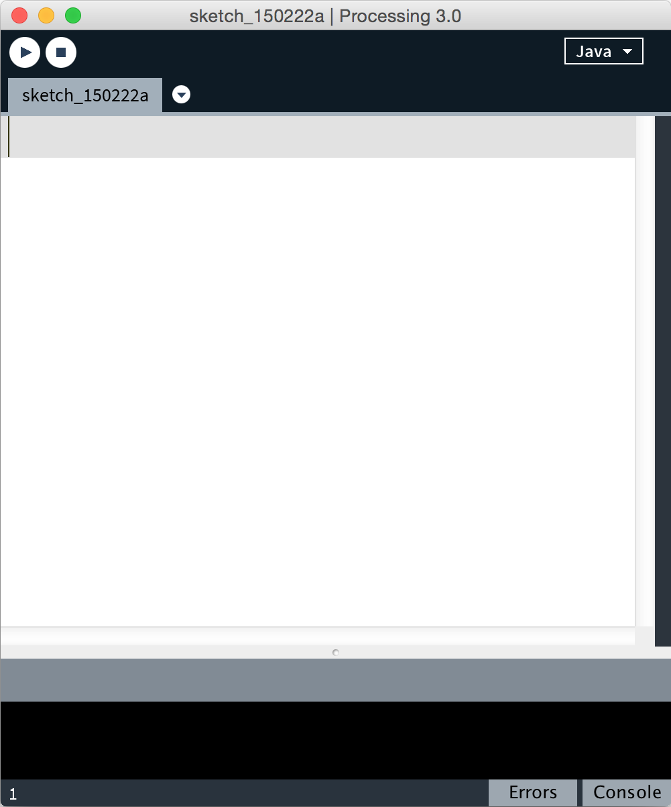
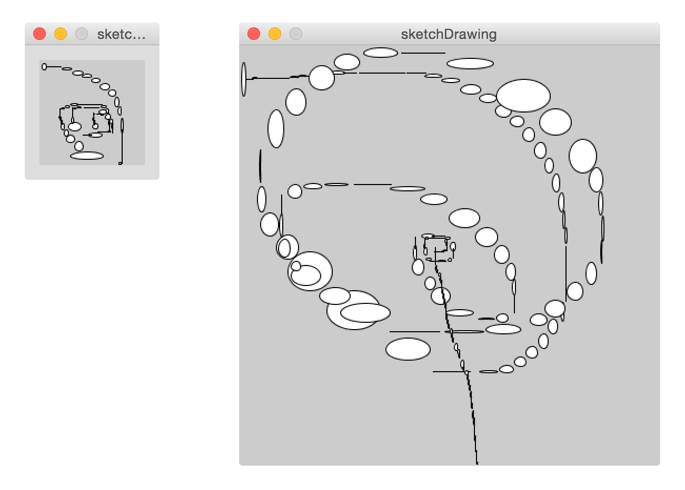
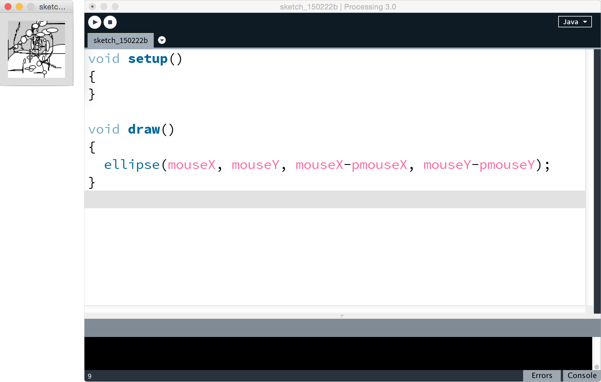
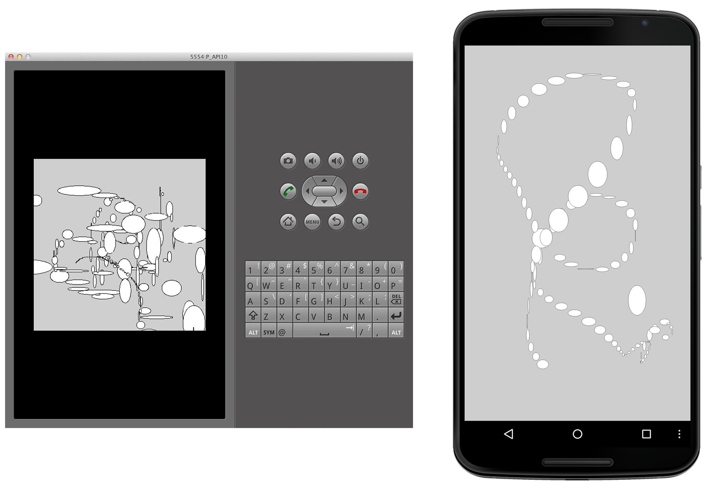

# 1. Getting Started

This book explores the cutting-edge hardware and software features that are built into Android phones and tablets today. You'll create sophisticated graphics and user interfaces in no time, and you'll develop a range of projects that build on the hardware sensors, cameras, and networking capabilities of your Android device. You'll put them to work creatively to make your Android apps more useful, usable, and exciting. We'll consider Android phones and tablets as universal sensors, processors, and remote controls in the context of this book, and we'll create projects that go beyond the typical app. Along the way, we'll spark new app ideas for you to explore in the future.

You'll learn how to create advanced Android apps using Processing, a widely popular open source programming language and environment that is free to use and was designed for learning the fundamentals of programming. With more than 150 libraries expanding the Processing core, as well as the possibility to extend it with Java and Android classes and methods, it is a simple yet powerful language to work with. Processing comes with three modes that let you create applications for different devices and operating systems:  Java mode lets us create standalone applications for GNU/Linux, Mac OS X, and Windows.  Android mode in Processing enables us to create apps for Android phones and tablets---we'll use this mode throughout the book. And finally, JavaScript mode enables us to create web apps, and those will run in all HTML5-enabled web browsers installed on smart phones, tablets, and desktop computers.

Processing's simple syntax lets you write apps whose sophisticated displays belie the straightforward, readable code in which they're written. Initially developed to serve as a software sketchbook for artists, designers, and hobbyists and to teach the fundamentals of computer programming in a more visual way, Processing is one of the most versatile production environments on the market today.

In 2010, the case for programming with Processing became even stronger with the addition of the Android mode to the Processing environment, whose intent, in the words of the Processing all-volunteer team, is to make it foolishly easy to create Android apps using the [Processing API.][1]

In this chapter, we'll begin by installing the software tools we'll need, and then we'll take a look at the basic structure of a typical Processing program, known as a sketch. We'll write our first Android sketch, one that draws figures on our desktop screen. Then we'll switch to [Android mode](#run-sketch-android-emulator) without leaving the Processing IDE and run that same app on the built-in Android emulator. Finally, we'll load the sketch onto an actual Android device and run it there.

With an understanding of the basic development cycle in hand, we'll learn [how to use the touch screen interface](../display.html#introducing-the-android-touch-screen) to add some interactivity to our sketch. We'll explore how it differs from a mouse pointer and make use of touch screen values to change the visual properties of the app, first with gradations of gray and then with color.

In addition to the traditional RGB (red, green, and blue) values that most programmers are familiar with, Processing provides additional color modes that provide greater control over hue, saturation, and brightness (HSB). As we work on our first apps, we'll take a closer look in particular at the HSB mode, which delivers all three.

Throughout the chapter we'll work with simple code that uses the Android touch screen sensor interface to change the position, color, and opacity of the 2D graphics it displays. Let's jump right in and install the software we need to develop Android apps in Processing.

[1]: http://wiki.processing.org/w/Android

###Install the Required Software

Let's get started and download the software we'll need to develop Android apps. The Processing download comes in a fairly small package of approximately 165 MB. It consists of free open source software and is available from the Processing website without prior registration. For workshops, in the lab, in an office, or in a teaching environment where multiple machines are in use, the lightweight Processing development environment (or "Processing IDE") is a good alternative to a full-featured integrated development environment (IDE) such as [Eclipse.][2]

The Processing IDE supports some of the advanced syntax highlighting and autocomplete features for which [Eclipse is valued.][3] Additionally, professional programmers appreciate the Processing IDE for its quick install. It comes with all the necessary tutorials and example sketches that allow us to explore specific programming topics right away. Processing does not require installation; just extract the application file and start.

[2]: http://en.wikipedia.org/wiki/Integrated_development_environment

[3]: http://wiki.processing.org/w/Eclipse_Plug_In

###What You Need

To implement the projects in this book, you'll need the following tools:

* [Processing 3.0][4]

* [Java 8][5]

* [Android 4.0 Ice Cream Sandwich][6] (2.3 Gingerbread is sufficient for all projects except {{ book.chapter7 }}, and {{ book.chapter8 }}.)

*These are the minimum software requirements. If you have a newer version, you'll be just fine*. Later we'll install some additional libraries that give us easier access to the features of an Android device. For now, use the following steps to build the core Processing environment we'll use throughout this book.

[4]: http://processing.org/download/

[5]: http://java.com/en/download/

[6]: https://developer.android.com/studio/index.html#Other

###Install Processing for Android

Here are the steps to install Processing for the Android.

1. Download Processing 3.0 for your operating system (OSX, Windows, or Linux) at [Processing.org/download][4]. The Processing download includes the Processing IDE, a comprehensive set of examples and tutorials, and a language reference. The Processing package does not include the Android software development kit, which you'll need to download separately.

2. [Extract the Processing][7] application from the ```.zip```file on Windows, ```.dmg``` file on Mac OS, or ```.tar.gz``` file on Linux, and move it to your preferred program folder (for example, Applications if you are developing on OSX, ```Program Files``` on Windows, or your preferred ```/bin``` folder on Linux).

[7]: http://processing.org/learning/gettingstarted/

###Install the Android SDK

1. Find and download the  Android SDK by going to http://developer.android.com/sdk/. Choose the package that's right for your operating system and complete the [installation of the Android SDK.][8] On Windows, you may wish to download and use the installer that Android provides to guide your setup. If Java JDK is not present on your system, you will be prompted to [download and install it.][9]

2. When the Android SDK download is complete, go to the Processing wiki at http://android.processing.org/install.html and open the Android installation instructions you'll find there. Follow the instructions for your OS step by step. The wiki lists which components are required to configure Processing for Android on your operating system and tells you how to get Android installed properly. Android may have dependencies that are specific to your operating system, such as additional device drivers. If you are developing on Windows, follow the USB driver installation instructions available at http://developer.android.com/tools/extras/oem-usb.html. If you are developing on Linux, follow the instructions for setting up your device for development at http://developer.android.com/tools/device.html#setting-up.

<!--
1.1 REVISION changed http://wiki.processing.org/w/Android#Instructions (development for processing page) to http://android.processing.org/install.html. Given the new install process, I'm not sure that the rest is still relevant. http://android.processing.org/tutorials/getting_started/index.html walks the user through setting up after install and includes an automatic Android SDK setup.
-->

Now that you have installed all the necessary components to develop Android apps on your own system, let's jump right into Processing and write our first sketch.

[8]: http://developer.android.com/sdk/installing.html

[9]: http://docs.oracle.com/javase/7/docs/webnotes/install/

###Write Your First Android Sketch

Go ahead and launch Processing from the applications directory. The Processing IDE launches, opening an empty sketch window, as shown in Figure 1, The Processing IDE, below.


<!-- 1.15 UPDATE: Orignal image too large. Image compressed via Photoshop 'Save For Web' -->

#####Figure 1.1 — The Processing IDE.
######We edit Processing code directly within the Processing IDE sketch window, as shown here.

Since you've launched the application for the first time, Processing has just created a sketchbook folder for you, which is located in ```Documents``` on the hard drive, independent of the OS you are developing on. I recommend you save all your sketches to this location. Then Processing can list them for you within the IDE (click the "Open..." toolbar button). Also, when you update to future versions of Processing, the sketchbook loads up exactly the same way as before.

<!-- 1.2 NOTE I'm not sure that this is exactly true in the newest version - I had to specify and create a folder. It's possible that it did not create a folder because I had previously had Processing 2.2.1 installed. 9/27/17 Checked and verified on Ubuntu Linux and Windows  -->

###Explore the Processing IDE

The toolbar on top of the sketch window contains the key features of the IDE, with a Run button to launch and a Stop button to stop your apps. You can find a more detailed description of the sketchbook and the IDE in the [Processing Development Environment tutorial][10] on the Processing website.

<!-- 1.3 NOTE
This was in the .pml file, but is not in the PDF.
* *Java mode* Run button in sketch window
* *Android mode* Run button in sketch window
* *Android mode* Export button in sketch window
* *JavaScript mode* Export button in sketch window
* *JavaScript mode* Run button in sketch window
 -->

When you start Processing for the first time, it defaults to Java mode, as indicated on the right side of the toolbar. This area also functions as a drop-down menu, allowing us to switch between the different modes the Processing IDE provides. You'll need to add the Android mode, choosing "Add mode…" from the menu. Depending on which mode you’ve selected, the Run button on the toolbar produce different results, which are listed next.

* *Java mode* "Run" displays a program window to view the sketch running on the desktop computer.

* *Android mode* "Run" launches the app on the Android device. "Export" creates a signed Android package for Google Play.

* *[JavaScript mode][11]* "Run" launches a web page in the default browser, with a Processing JavaScript canvas showing the sketch. "Export" creates a web package, including all dependent files for uploading to a web server.

A tab below the toolbar shows the current sketch name, which defaults to one containing the current date if the sketch has not been saved yet. Processing prompts us to provide another filename as soon as we save the sketch. The right-arrow button to the right of the tab allows us to add more tabs if we'd like to split the code into separate sections. As sketches grow in scope and complexity, the use of tabs can be a great way to reduce clutter by separating classes and methods for different purposes into distinct tabs. Each tab is saved as a separate Processing source file, or ```pde```, in the sketch folder.

The text editor, shown in white below the tab in the image above, is the actual area where we write and edit code. The line number of our current cursor location within the code is shown at the very bottom of the sketch window.

The message area and console below the text editor provide us with valuable feedback as we develop and debug.

You can always find more information on the key IDE features discussed here, as well as a summary of the installation, on the Learning page of the [Processing website.][7]

Now that you know how to work with the Processing editor, you're almost ready to write your first sketch.

[10]: http://processing.org/reference/environment/

[11]: http://processing.org/learning/javascript/


###Understand the Structure of a Sketch

Any Processing sketch that will interact with users or make use of animated graphics–as is the case for all the sketches in this book–must include two methods:

* An instance of the ```setup``` method, which initializes key variables and settings the sketch will use and is executed only once when the app starts

* An instance of the ```draw``` method, which continuously updates or redraws the screen to respond to user input and real-time events

If we redraw the screen fast enough, users will perceive individual images, or *frames*, as continuous movement. It's a [principle of film and animation][12] we have all experienced. A typical Processing sketch starts by defining the global variables it uses, followed by both ```setup``` and ```draw``` methods. ```setup``` is called exactly once when you start a sketch to initialize key parameters. For instance, we can set a particular  window ```size``` or screen ```orientation```, or we can load custom fonts and media assets. ```setup``` is responsible for taking care of everything we need to do once to configure a sketch.

The ```draw``` method, in contrast, is called repeatedly to update the screen sixty times per second by default. We can adjust this rate using the ```frameRate``` method. If our drawings are complex or if they require substantial amounts of processor power to compute, Processing might not always be able to keep up with the 60 fps frame rate. We can always get some information on the current playback rate through the ```frameRate``` constant Processing provides to us. As a point of reference, cinema film runs at 24 fps and digital video typically at 30 fps.

Neither ```setup``` nor ```draw``` accepts parameters. They are ```void``` methods and do not return values. Both are used in virtually every Processing sketch.

[12]: http://en.wikipedia.org/wiki/Persistence_of_vision

###Write a Sketch

Let's now say "Hi" to Processing by creating a simple sketch that draws an ellipse repeatedly at the current cursor position. We'll add some complexity to its graphical output by having the ellipse expand or contract along its vertical and horizontal axes, depending on how fast the mouse moves across the screen. This basic drawing sketch, shown in Figure 2, gives us immediate visual feedback and uses your mouse as input. As you move along, experiment and play with parameter values to better understand them.


<!-- 1.4 UPDATE: Orignal image too large. Image compressed via Photoshop 'Save For Web' -->

#####Figure 1.2 — A simple sketch.
######With the ellipse-drawing primitive, Processing can generate dynamic output. On the left is a 100 x 100 pixel window; on the right, a 400 x 400 pixel window.

We use a single drawing primitive for this sketch, the ```ellipse```, also used to draw circles by providing equal width and height for the ellipse. In Processing, an ```ellipse(x, y, width, height)``` [requires four parameters:][13]

* The horizontal ```x``` position of the ellipse center

* The vertical ```y``` position of the ellipse center

* The ellipse ```width```

* The ellipse ```height```

The following snippet contains the code we’ll need for our sketch.

<!-- CODEBLOCK ellipseMouse.pde -->
[include](code/gettingStarted/ellipseMouse.pde)

Go ahead and type this into the text editor, as illustrated below:

<a name="processing_ide_basicdrawing-sm">

</a>
<!-- 1.5 UPDATE:
Orignal image too large.
Image compressed via Photoshop 'Save For Web' -->

We want the position of the ellipse to follow the mouse, and for this we need to know where it's located at any given moment. Processing stores this information in two system defined variables: ```mouseX``` and ```mouseY```. The pair returns the ```x``` and ```y``` coordinates of the mouse in pixels relative to the origin of the display window, not the computer screen. In Processing, the origin of the display window (```[0, 0]```) is located at the upper left corner of the device window; ```[width-1, height-1]``` is located at the lower right.

We'll use ```mouseX``` and ```mouseY``` to set the horizontal and vertical position of the ellipse center. For the ```width``` and ```height``` parameters of the ellipse, we'll use two additional system defined variables: ```pmouseX``` and ```pmouseY```. ```pmouseX``` and ```pmouseY``` store the *previous* mouse position from one frame ago.

If we move the mouse, we can calculate the mouse speed by subtracting the previous from the current mouse position. By subtracting ```mouseX``` from ```pmouseX```, we determine the horizontal mouse travel distance in pixels within one frame, or  for one-sixtieth of a second. We use the same approach for the vertical trajectory by subtracting ```pmouseY``` from ```mouseY``` for the vertical speed. ```pmouseX``` and ```pmouseY``` are lesser-known system defined variables and more rarely used than ```mouseX``` and ```mouseY```, but they're very useful when we are interested in the speed of the mouse.

[13]: http://processing.org/reference/ellipse_.html

###Run the Sketch

Go ahead and run the sketch by pressing the Play button. Processing will open a display window whose default size is 100 by 100 pixels, as shown in the image above. Alternatively, you can select Sketch &mapsto; Run on the Processing menu bar. When the window appears, place your mouse pointer there and move it around.

If we move the mouse quickly from left to right or up and down inside the display window, the ellipse width and height increase, depending on where we are heading. Drawing in such a small sketch window restricts our mouse movement, so let's use the ```size``` method to increase the window size to ```[400, 400]```, as shown in Figure 2. We add the ```size``` method to ```setup```, because we need to define the window size only once when we start up the sketch. In a typical Processing sketch, the idea is to keep everything strictly away from ```draw``` so the application doesn't get bogged down executing extra statements at the rate of sixty times per second.

Go ahead and add the following statements to ```setup``` in your Processing text editor:

```
size(400, 400);
```

Now rerun the sketch. With a bit more pixel real estate (400 x 400px), we now have the space to build up some speed.

###Save the Sketch 

Let's finish by saving the sketch as ```basicDrawing.pde``` into the ```Processing``` sketchbook, located in ```Documents``` on the hard drive. When the sketch is saved, the tab is renamed to the current sketch name. Press Open in the toolbar and see your sketch listed at the top in the sketchbook.

You've just completed your first Processing sketch in Java mode. Time now to make an Android app from the sketch and run it in the Android emulator.

<a name="run-sketch-android-emulator">
###Run a Sketch in the Android Emulator 
</a>
Let's now switch our basic drawing sketch Figure 2, to Android mode. Click "Java" in the upper right corner of the Processing IDE and use the drop-down menu to add the Android mode. Click "Add mode..." and install the "Android Mode" from the list. Close the Mode Manager and use the drop-down menu to switch to "Android" mode. The structure and statements of a Processing sketch are identical across modes. So there is nothing we need to change in our sketch to run it on an Android.

###Run the App

To run the sketch in the emulator, select Sketch &mapsto; "Run in Emulator" from the Processing menu.

The following lines should appear in the console area at the bottom of the IDE when the Android emulator launches for the first time:

```
Building Android project...
Waiting for device to become available...
Installing sketch on emulator.
Stating Sketch on emulator.
Sketch launched on the emulator.
```
<!-- 1.6 NOTE: not sure if it matters, but SDK has to be properly initialized for this to work (the app itself has to be opened and it has to go through it's wizard). This was a sticking point for me. -->

<!--Compressed Image -->
<!-- 1.7 NOTE:
sketch appears as small square on the screen,
not full screen as shown in Figure 3 -->

#####Figure 1.3 — Running the drawing sketch in Android mode.
######We can run a sketch in either the Android emulator installed on our desktop computer (left) or directly on the Android device (right).

The emulator starts up the Android OS exactly as a device would, just a bit more slowly. Once Android is running, Processing then installs the Android package (```apk```) and launches the sketch. If it takes too long for the emulator to start up, Processing might time out and you might have to relaunch your sketch one more time. The sketch looks identical to the Java mode sketch illustrated in Figure 3, and if you move the mouse in the emulator window, it responds the same way it did in Java mode. The frame rate is noticeably lower, and the screen has a different aspect ratio. In the emulator, the mouse methods are a stand-in for the touch screen interface. Don't close the Android emulator as you keep testing your sketches.

Here's the first Android app for you. Congratulations! If you get an error, please jump to {{ book.troubleshooting }}.

As you can see, the emulator is a good way to check whether your sketch is operational. When it comes to testing responsiveness or the touch screen user experience of your app, however, we need an actual device. So next up is testing the sketch on an actual Android device.

###Run a Sketch on an Android Device

Let's run the sketch on a real Android device. First you'll need to check which version of Android it's running. Then you'll need to connect the device to your computer with a USB cable and enable USB debugging.

To determine which version of Android you're running, go to the home screen, tap Settings and then tap "About phone" (or "About phone/tablet") at the bottom of the menu that appears. Look for the version of Android that is installed on your device under "Android version" and make a note. The procedure for enabling USB debugging depends on that number. Now connect your device to your desktop.

* If you're running version 4.2 Jelly Bean or a more recent version of Android, activate the hidden "Developer options" menu by tapping "Build number" at the bottom of the "About phone/tablet" menu five times. Then navigate to the Settings &mapsto; "Developer options" menu and check "USB Debugging." To respond to the warning that "USB debugging is intended for development purposes only," tap OK.

* If you're running version 4.1 Jelly Bean or an earlier version of Android, tap Settings and look for the "Developer options" menu under the System section at the bottom of the list. Click OK after the warning and check "USB Debugging" at the top of the list that appears.

If you are developing on Windows or Linux, you'll need a special USB device driver. You can find instructions on the [Android website][14] for downloading and installing it.  

With all the software tools in place and the Android device plugged into your desktop, let's run our basic drawing example on the device. To run the sketch fullscreen, let's comment out ```size``` in ```setup```, so the app covers the full screen of the Android device.

```
// size(400, 400);
```

[14]:https://developer.android.com/studio/run/oem-usb.html

<!-- 1.8 REVISION: Old link:http://developer.android.com/guide/developing/device.html is dead. Swapped.-->

###Run the App

Choose Run on Device from the Sketch menu, or use the shortcut ```⌘R``` on a Mac or ```Ctrl R``` on Windows or Linux. The shortcut is a timesaver when we're testing and running a sketch frequently. Processing compiles the sketch and produces a ```basicDrawing.apk``` package, which it then moves onto the device and launches.

```
Building Android project...
Waiting for device to become available...
Installing sketch on DEVICE_ID.
Starting Sketch on DEVICE_ID.
Sketch launched on the device.
```

Your sketch is now up and running on your Android device. In contrast to running the sketch in the emulator, installing and launching it on an Android device goes fairly quickly. If you play with your sketch on the touch screen, you'll be able to tell how much more responsive the device is. This is because the device provides a higher frame rate. Being able to test the actual user experience more accurately while saving some time rerunning your sketch are the main reasons why testing on the Android device is preferable.

Let's also note what we are *not* doing! We are not signing up as a developer. We are not installing certificates, and we haven't used a credit card. Processing and Android are open platforms. The apps we create can be shared directly with other Android users. And if we intend to further develop our project in Eclipse or collaborate with Eclipse developers, Processing provides us with an Export Android Project option, which you can find on the Processing menu toolbar under File. This command will create a folder containing all the necessary Eclipse project files.

###Wrapping Up

Let's summarize. You've seen how easy it is to use Processing to create graphics for the Android. You've downloaded the Processing IDE and the Android SDK, and you've installed the software tools to develop Android apps in Processing. You've written your first Processing sketch using the mouse as input, and you are now able to switch to Android mode and write basic Android apps in Processing. The Android emulator that comes with the Android SDK and the Android device you've used in this chapter will help you test the apps you'll write throughout the book.

In the next chapter, we'll work with the touch screen interface and device display. You'll learn how to work with color, use fingertip pressure on the screen surface, and work with multitouch gestures such as *tap* and *pinch* to manipulate the graphical elements on the device display.
