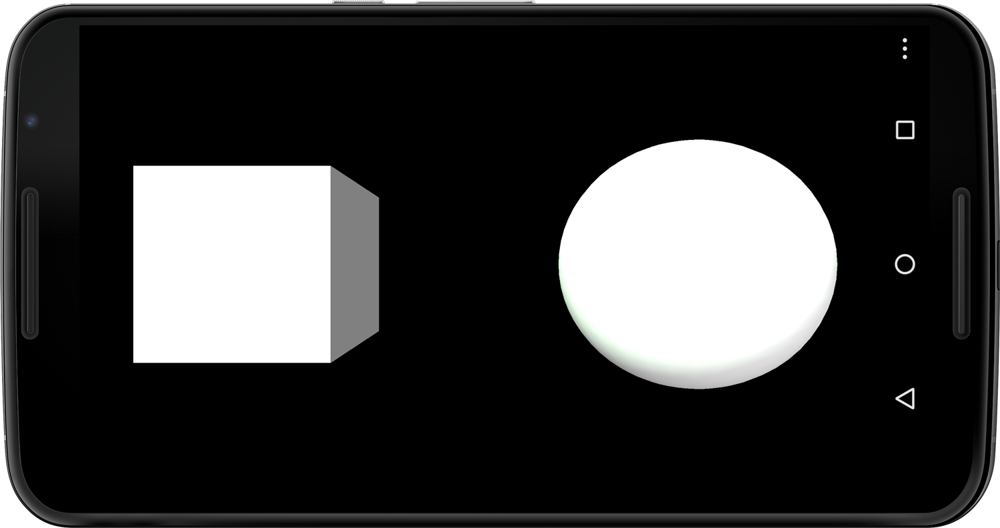
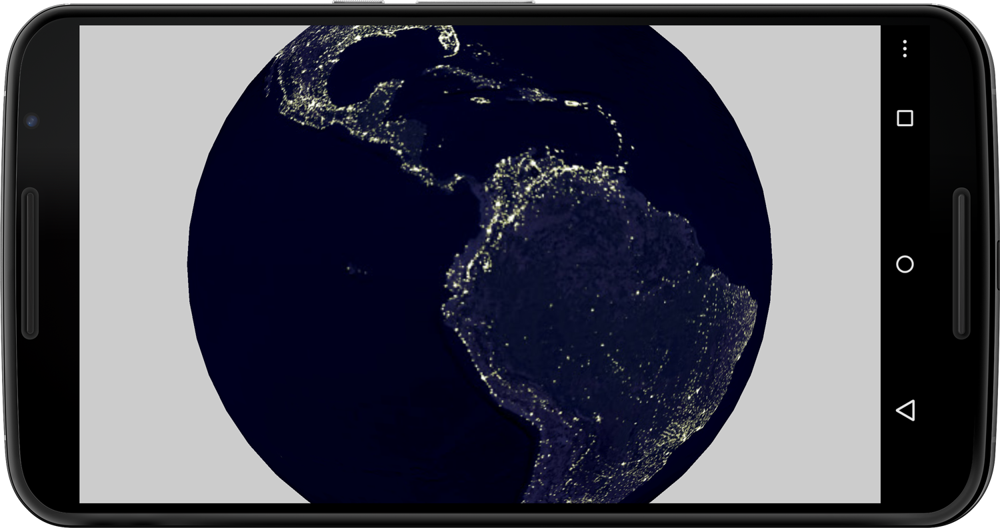
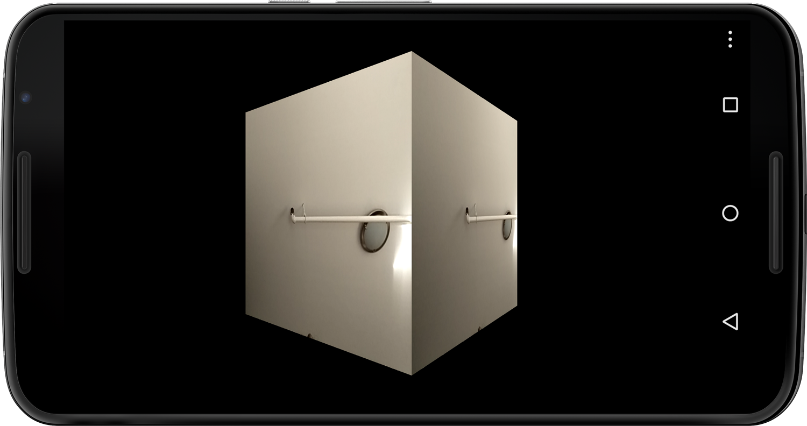
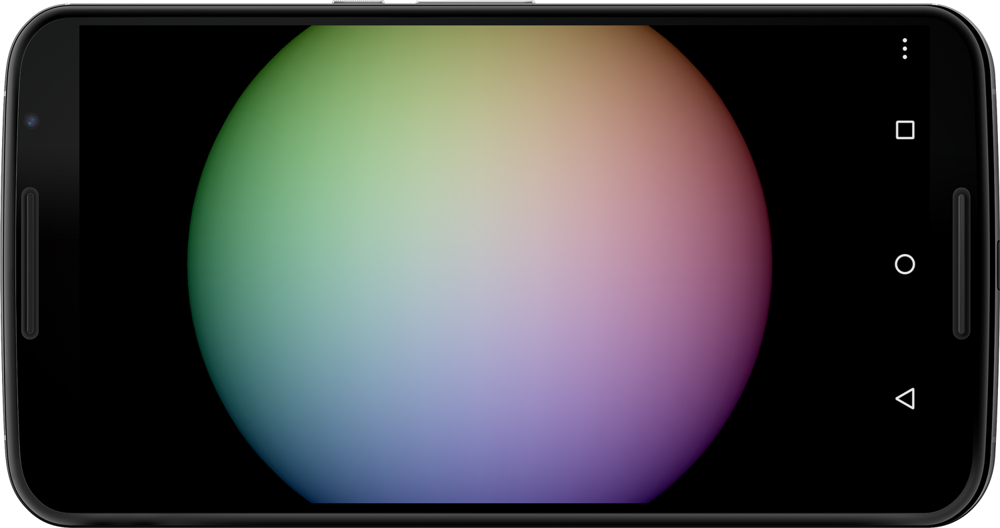
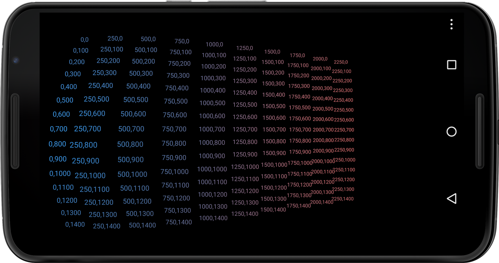
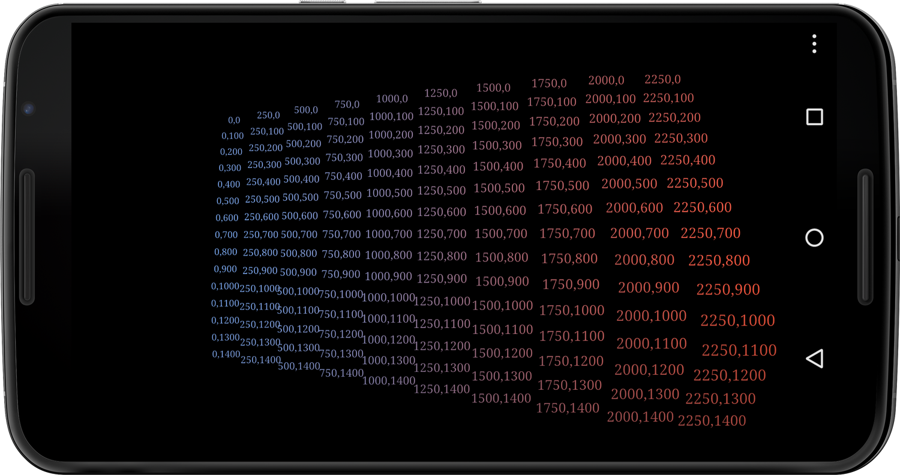
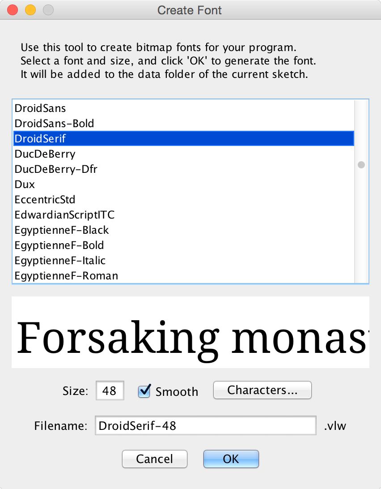

###Chapter 11:

#Introducing 3D Graphics with OpenGL
 
Rich graphics are the staple of sophisticated mobile games and data visualizations, and recent Android phones are well equipped with the necessary graphics hardware to deliver 2D and 3D graphics rendering without degrading performance. When we play 3D games or interact with complex data visualizations, the geometry that composes such a scene must be redrawn a few dozen times per second on the device screen&—ideally sixty times or more&—for animations and interactions to appear smooth and fluent. Besides the geometry, which consists of points, lines, and polygons, we typically also work in a 3D scene with textures, lighting, and virtual cameras to control the appearance of shapes and objects and to change our perspective within the scene. 
 
All Android phones and tablets sold today support [`OpenGL ES`,][0] a lightweight implementation of the popular Open Graphics Library for embedded systems&—the industry standard for developing interactive 2D and 3D graphics applications across platforms. It’s a free application programming interface and graphics pipeline that allows the software applications we create to leverage the graphics hardware built into our desktop computers, game consoles, and mobile devices for better graphics performance. 
 
Processing is a great environment to create sophisticated graphics, and it comes with an `OpenGL` library that can be used in all modes. On the Android, Processing takes advantage of the graphics processing unit, or `GPU`, built into the mobile device. Only hardware acceleration makes it possible to animate thousands of data points, text characters, polygons, image textures, and lighting effects while maintaining a sufficiently high frame rate. Despite the multicore `CPU`s built into the latest Android devices today, we rely on the graphics hardware and `OpenGL` to achieve the smooth animations and special effects we are looking for. 
 
In this chapter we’ll create basic 3D shapes, use lights and textures, and manipulate the viewpoint of a virtual camera. We’ll create apps that employ 3D cubes and spheres and use different types of lighting. We’ll texture a sphere with a NASA image of the Earth at night and superimpose our camera preview as texture onto a 3D box. We’ll also render a large amount of text with custom lighting, and we’ll position it dynamically on the screen using our familiar touch screen input. We’ll continue our investigation into shapes and 3D objects in <!--ref linkend="chp.shapes.objects-->, as the second part of our introduction to 3D graphics. 
 
 Let’s get started by taking a closer look at `OpenGL` in Processing. 

###Introducing 3D Graphics and OpenGL
 
 The Open Graphics Library (`OpenGL`) is the industry standard API for creating 3D (and 2D) computer graphics and runs on most platforms. It can be used to create complex 3D scenes from graphic primitives such as points, lines, and polygons. One of `OpenGL`’s most important features is that it provides an interface for communicating with the accelerator hardware, or `GPU`, typically built into computer graphic cards, game consoles, and mobile devices. The `GPU` is responsible for providing us with the frame rates we need to animate geometry, render complex textures and shades, and calculate lighting effects. If a particular device hardware does not support all of `OpenGL`’s feature sets, the library uses software emulation via the `CPU` instead, allowing `OpenGL` to still run the application on most platforms but at a lower frame rate. 
 
 Andres Colubri has now integrated his GLGraphics library into Processing 2.0, providing us with a major upgrade to the P2D and P3D [graphics renderer in Processing,][1] with exciting new features for creating cutting-edge graphics that make use of `OpenGL` hardware acceleration. When we use the `OpenGL` renderer in Processing 2.0, we can gain a high level of control over textures, image filters, 3D models, and [`GLSL`][2] shaders—`OpenGL`’s shading language for rendering effects on graphics hardware. Now we can also create groups of shapes using Processing’s `createShape()` method and retain geometry in the `GPU`’s memory for significantly improved graphics performance. If you’d like to [preview your sketch in the emulator][3]  using `OpenGL` hardware acceleration, you need to add the `GPU` emulation hardware property when you create your Android Virtual Device (`AVD`). 
 
 Let’s take a look at the methods we’ll use to work with the 3D graphics and `OpenGL` classes and methods we’ll use in this chapter. 
 
* *[`size(width, height, MODE)`][4]* Defines the dimension of the display window in pixels, followed by an optional render mode parameter. By default, the renderer is set to `2D`. Use `3D` to draw 3D shapes. You should call `size()` only once in `setup()` as the first line of code. 

* *[P3D and OPENGL][5]* Identical render modes defined in the `size()` method&—the `OPENGL` renderer used to differ from `P3D`, but it is now an alias pointing to the `P3D` renderer. `P3D` allows us to use the *z*-axis as the third dimension in our sketch, oriented perpendicular to the device screen. Larger *z* values move objects further into the scene, negative *z* values toward us. The `P3D` renderer uses OpenGL hardware. 

* *`displayHeight`* A Processing constant that returns the current height of the device display in pixels 

* *[`displayWidth`][6]* A Processing constant that returns the current width of the device display in pixels 
   
Let’s get started with basic 3D geometry and lighting. 

###Work with 3D Primitives and Lights
 
For our first 3D app, let’s explore simple geometry and lights to get a feel for the 3D coordinate system and learn how to control the position and scale of 3D objects on the device’s display. We’ll get started with two 3D primitives, the `sphere()` and the `box()`, and also define the scene lights using an ambient and a directional light source, as illustrated in <!--ref linkend="fig.primitives.lights-->. 
 
To create the 3D scene, we use the `size()` method, which we’ve used so far only for the desktop applications we’ve created. The method defines the window `width` and `height`, but it can also be used to replace the default Processing 2D (`P2D`) renderer. For the Android apps we’ve created so far, we haven’t used `size()`, because if we don’t use it, Processing defaults the app to full screen, which is standard for all applications on the Android. 
 
For our 3D scene, we need to switch from the default `P2D` to the `P3D` renderer. Both Processing renderers are very similar, but the `P2D` render has optimized smoothing settings to display 2D figures. If we use the `size()` method with two parameters, our sketch defaults to the `P2D` renderer. If we provide a third one for the render mode, `P3D`, we’ve created a 3D sketch. 
 
Processing also provides us with two constants to retrieve the display width and height of the device we are running our app on. They’re called `displayWidth` and `displayHeight`, and we can also use those constants to set our app to full screen via the `size()` method. 

###Working with Lights
 
The different types of virtual light sources available in Processing are defined by their direction, amount of falloff, and specular values. *Falloff* defines the falloff rate for lights due to increased distance to the object they illuminate, defined in Processing as a constant, linear, or quadratic parameter using the [`lightFalloff()` method.][7] A specular light is the highlight that appears on shiny objects, defined by the [`lightSpecular()`method,][8] which provides a more realistic 3D impression based on how specular light interacts with material surfaces. The material appearance of objects can be defined via the `specular()` method as well as via the [`shininess()`][9] and [`emissive()` methods.][26]

* *[`lights()`][10]* Sets the default values for ambient light, directional light, falloff, and specular values, making the 3D objects in the scene appear lit with medium ambient light and look dimensional. 

* *[`ambientLight()`][11]* Adds an ambient light to the scene, which is a type typically used in a 3D scene alongside directional light sources&—it makes objects appear evenly lit from all sides. The method uses three parameters for the light color and three parameters for the position of the light. 

* *[`directionalLight()`][12]* Adds a directional light to the scene coming from a defined direction—it illuminates an object more where the light hits perpendicular to the surface and less so at smaller angles. The method uses three parameters for the light color and three parameters for its direction. 

* *[`pointLight()`[][13]* Adds a point light to the scene; an omnidirectional light source emitting light from one point&—it uses the light color and position within the scene as parameters. 

* *[`spotLight()`][14]* Adds a spotlight to the scene, which offers the most control through parameters including the light color, position, direction, angle of the spotlight cone, and the concentration of the spotlight 

###Create a 3D Scene
 
We’ll use the [`lights()` method][15] for this project, which sets default light values for the scene. The default values for ambient light are then set to `ambientLight(128, 128, 128)`, defining a medium bright white ambient light. In addition, we’ll use the touch screen interface to control a directional light, where we translate the finger position on the display into a direction for this directional light, allowing us to change the objects’ illumination interactively. 
 

#####Figure 11.0 - Using 3D primitives and lights.
######The illustration shows a cube and a sphere illuminated by two light sources, a default ambient light and a directional light source, that you control with your fingertip. 

Let’s take a look at our program, which is fairly concise for this basic scene.
 
#####code/Mobile3D/PrimitivesLights/PrimitivesLights.pde
[include](code/Mobile3D/PrimitivesLights/PrimitivesLights.pde)

Let’s take a look at the methods we use to place the 3D primitives and control the directional light. 

1. Turn on the Processing 3D renderer using the `size()` method. Define the current device width as the app `width` using the `displayWidth` constant, and define the app `height` using the `displayHeight` constant. 
2. Calculate the horizontal direction of the light source by mapping the `width` of the screen to values with a range of [-1..1]. 
3. Calculate the horizontal direction of the light source by mapping the `height` of the screen to values with a range of [-1..1]. 
4. Call the default lights for the scene using default lighting values. Use the `lights()` method within `draw()` to retain the default lights in the scene instead of `setup()`, where only default lighting values are set. 
5. Use a directional light source with a greenish hue, and direct it based on the horizontal and vertical position of a fingertip on the touch screen. 
 
Let’s test the app. 

###Run the App
 
 Now run the sketch on the device. This time we don’t need to set Android permissions or import any libraries because we are not using hardware that requires authorization and it’s all part of Processing’s core functionality. When the app starts up, move your finger across the screen and see the directional light change direction based on your input. 
 
A greenish halo around the specular highlights comes from our colored directional light source, and because we also have the default ambient light at work through calling the `lights()` method, the objects in our scene do not appear completely dark on the opposite side of the directional light source. 

Now that we’ve created a 3D scene using basic 3D primitives and lights, we are ready to work with textures that we can superimpose onto 3D geometry. 

###Apply an Image Texture
 
For this next project we’ll render a 3D night view of the Earth using a NASA image texture showing the light concentrations that emanate from the urban centers of our planet. We’ll use the `NASA` `JPEG` image as a texture wrapped around a 3D `sphere()` shown in Figure 11.1 below. This time we’ll create the 3D primitive using Processing’s `PShape` class so we are able to apply a texture onto that shape. We’ll create the sphere with the `createShape()` method and a `SPHERE` parameter, and then we’ll use the `shape()` method to display the 3D object on the device screen. 
 
 [The NASA satellite image of the Earth][16] seen at night is also an equirectangular projection, as we used already in <!--ref linkend="sec.earthquakes-->, for visualizing earthquakes. An image texture with such a projection stretches perfectly around our sphere, recompensating for the distortions toward the poles that we observe in the flattened `JPEG` image. 
 

#####Figure 11.1 - Applying an image texture to a sphere.
######The bright spots on the image that covers the sphere show urban centers&—such as New York City and Rio de Janeiro&—in North and South America. 

#####code/Mobile3D/TexturedSphere/TexturedSphere.pde
[include](code/Mobile3D/TexturedSphere/TexturedSphere.pde)

Let’s take a look at the code. 

Here’s what we need to do to apply the image texture.
  
 1. Create a `PShape` variable called `sphereShape`. 
 2. Create a `PImage` variable called `sphereTexture`. 
 3. Load the `JPEG` image texture using `loadImage()`. 
 4. Create the `SPHERE` `PShape` object we’ll use to render the Earth, with a size of one-third the device’s screen height. 
 5. Apply the image texture to the shape using the `PShape` `setTexture()` method. 
 6. Rotate the sphere slowly on the spot around the *y*-axis at a rate of one revolution per second. Use the `frameCount` constant to calculate the rotation. 
 
Now let’s run the sketch. 

###Run the App
 
Run the sketch on the device and you’ll see a sphere covered with our NASA image texture on the screen. It covers one-third the screen height and rotates slowly around its vertical axis. We don’t control this scene interactively, but we can watch the Earth rotate and we can observe the bright spots where densely populated cities are located. 

Now that we’ve learned how to use static images as textures for 3D objects, we can move on to a moving image texture, which we’ll discuss in the next section. 

###Use the Camera Preview as 3D Texture
 
Let’s map a live camera preview of our front-facing Android camera next. When we use images as textures for 3D objects in Processing, we can take advantage of the fact that moving images are handled essentially like static images, displayed as a `PImage` object but updated every time we receive a new image from the camera. Building on the previous image texture project <!--ref linkend="sec.image.texture-->, we can use the Android camera previews as textures via the `KetaiCamera` class we’ve worked with in <!--ref linkend="sec.camera.back.front-->. 
 
For this project we’ll use the `BOX` 3D primitive instead of the `SPHERE`, and we’ll map the camera preview on every face of the box, as shown in Figure 11.2 below. We are already familiar with the code to instantiate a `KetaiCamera` object and the methods to start and stop the camera, which we’ll reuse from <!--ref linkend="sec.camera.back.front-->. 


#####Figure 11.2 - Use a camera preview as a 3D texture.
######The camera preview image is mapped on every face of the 3D box as an image texture. 

Now let’s take a look at the parts of the code that deal with the 3D box and camera texture. 

#####code/Mobile3D/CameraTexture/CameraTexture.pde
[include](code/Mobile3D/CameraTexture/CameraTexture.pde)

Here’s what we need to do to apply the camera preview as a shape texture. 

1. Create a `KetaiCamera` object `cam` with a resolution of `320` by `240` pixels. 
2. Set the camera ID to `1` for the front-facing camera. 
3. Apply the `cam` image as a `setTexture()` for the `boxShape`. 
 
Let’s test the sketch. 

###Run the App
 
Run the sketch on your Android device. When the scene starts up, you’ll see the 3D box rotate once every ten seconds. Tap the screen now to start up the camera. As soon as a camera preview image is available, we use it as a texture for our box. 
 
Feel free to change the `BOX` back to a `SPHERE` 3D primitive and observe how the image wraps around the sphere. 

Let’s now take a closer look at the different types of light sources we can work with in Processing. 

###Work with Spot and Point Lights
 
Lighting affects the appearance of all the geometry in a scene, which is why we’ll take a closer look now at the various lighting options we have in Processing. Let’s create a sketch using three colored spotlights, as shown in Figure 11.3, where we can see how each of the light sources interacts with the surface of the 3D geometry.


#####Figure 11.3 - Using spotlights.
######The three colored spotlights introduced to the scene (red, green, blue) add up to white in the additive color space. 

We’ll use the basic light colors red, green, and blue, because those colors mixed together create white light in the [additive color space.][17] We’ll keep the geometry simple and continue working with our basic sphere shape. But to get a more accurate sphere geometry, we’ll increase the render detail of the sphere using the [`sphereDetail()` method.][18] It defines the number of vertices of the sphere mesh, set by default to `30` vertices per full `360` circle revolution, and we increase it to `60` vertices per revolution, resulting in one vertex every six degrees (`360` degrees divided by `60` vertices). 
 
The [`spotLight()` method][19] we’ll use takes eleven parameters and offers the most amount of control compared with other light options in Processing. We can set the light color, position, direction, angle, and concentration using the method. Let’s take a look. 
 
``` 
 spotLight(v1, v2, v3, x, y, z, nx, ny, nz, angle, concentration) 
``` 

<table>
<tr>
<td><code>v1</code></td>
<td>The red or hue value of the light&#x2014;red in the default <code>RGB</code> color mode and hue in the <code>HSB</code> color mode</td>
</tr>
<tr>
<td><code>v2</code></td>
<td>The green or saturation value of the light</td>
</tr>
<tr><td>
<code>v3</code>
</td><td>
The blue or brightness value of the light
</td></tr> <tr><td>
<code>x</code>
</td><td>
The horizontal or <i>x</i> position of the light
</td></tr> <tr><td>
<code>y</code>
</td><td>
The vertical or <i>y</i> position of the light
</td></tr> <tr><td>
<code>z</code>
</td><td>
The depth or <i>z</i> position of the light
</td></tr> <tr><td>
<code>nx</code>
</td><td>
The direction of the light along the <i>x</i>-axis
</td></tr> <tr><td>
<code>ny</code>
</td><td>
The direction of the light along the <i>y</i>-axis
</td></tr> <tr><td>
<code>nz</code>
</td><td>
The direction of the light along the <i>z</i>-axis
</td></tr> <tr><td>
<code>angle</code>
</td><td>
The angle of the light cone
</td></tr> <tr><td>
<code>concentration</code>
</td><td>
The concentration exponent determining the center bias of the spotlight cone
</td></tr> </table>
 
Every object we draw after calling this or any other lighting method in Processing is affected by that light source; objects drawn before the method call are unfazed by the light source. To retain a light source in the scene, we must call the lighting method within `draw()`. If we call the lighting method in `setup()`, the light will only affect the first frame of our app and not the consecutive frames. 
 
 We’ll place our three colored spotlights slightly off-center while pointing straight ahead at the scene. Each of the lights will hit our sphere object at an individual spot off the sphere’s center, and we can observe how the three spotlights interact with the sphere’s surface when they mix together. We’ll define the spotlight cone angle at `15` degrees, which happens to match a standard lens used in theater lighting, and we’ll keep the concentration bias at `0` to achieve the maximum blending effect between the colors for now. 
 
 Once we’ve tested the spotlights, we’ll replace them with point lights and compare the difference. Point lights offer less options and control than spotlights do, which makes them arguably easier to use as well. Point lights are omnidirectional light sources emanating equally in all directions from one specified point in 3D space. The `pointLight()` method takes only the light color and position as parameters. 
 
Let’s go ahead and write our spotlight program next. 
 
#####code/Mobile3D/SpotLights/SpotLights.pde
[include](code/Mobile3D/SpotLights/SpotLights.pde)
 
Let’s take a look at the methods we use for defining the spotlight and sphere detail. 
 1. Increase the number of vertices composing the sphere to `60` for one full `360`-degree revolution. 
 2. Define a variable for the sphere size called `sSize`. 
 3. Create a red spotlight pointing straight at the scene, slightly offset to the right and up. 
 4. Create a green spotlight pointing straight at the scene, slightly offset to the left and up. 
 5. Create a blue spotlight pointing straight at the scene, slightly offset to the bottom. 
 
Let’s test the sketch. 

###Run the App
 
Now run the sketch on the device, and see how the increased sphere detail and the three spotlights produce a high-quality color blending effect on the sphere’s surface. 
 
Let’s take a look at our current frame rate to see how computationally expensive this operation is. Go ahead and add these two lines of code at the end of `draw()`: 
 
 ```
 if (frameCount%10 == 0) println(frameRate);
 ``` 
 
On the Nexus S, the slowest of the devices tested for this book (<!--ref linkend="fig.tested.devices-->), we still get minimum frame rates of `60`, which is the default Processing uses if we don’t determine otherwise via the `frameRate()` method. This is true despite the fact that we have multiple hundreds of vertices and polygons at work to create our sphere with increased detail and we superimpose multiple light sources onto the sphere surface. 
 
Let’s replace the spotlights now with point light sources and see the difference. They are already present in the <!--ref linkend="code.spot.lights-->, but currently commented out. The color and position of the point light is identical to the spotlight we’ve used. 
 
Rerun the app and take a look at how the three colored light sources cover the sphere—mixing white in the center of the sphere. The lighting seems identical to the spotlights since we’ve used a fairly wide spotlight cone earlier and we also did not add a concentration bias. Now change back to the spotlights and decrease the current `15`-degree cone angle to, let’s say, `5`, and increase the concentration bias to `1`. You’ll see how spotlights offer additional controls over the light cone and concentration in our 3D scene. 

Now that we’ve explored the different types of virtual lights in Processing, let’s continue our work on geometry, specifically typography in a 3D space. 

###Use Custom Fonts and Large Amounts of Text
 
 A typical scenario in a data visualization project is to use text with a custom font alongside graphic elements on the device display. Text labels and large amounts of body text quickly add complexity and a lot of work for our device to render the scene. We can enlist Processing’s `OpenGL` capabilities to help keep the frame rate up. Let’s create a sketch where we cover the screen dynamically with text positioned along the *z* (or depth) axis of the 3D scene, depending on where we touch the screen surface, as shown in <!--ref linkend="fig.text.lights-->. We’ll work with custom fonts for this project, both released by Google and available for us to use without restriction. 
 

#####Figure 11.4 - Text rendered in lights.
######Large amounts of text can be rendered with lighting effects using OpenGL. 

Processing uses a default font called Lucida Sans for all its modes because it is available on all platforms. We’ve come quite far in this book without switching to a custom font for our apps, focusing on the particular chapter topics and keeping any lines of code we don’t desperately need away from our sketches. Now it’s time we learned how to use a custom font for our app. 
 
Processing provides a `PFont` class to us for working with custom fonts loaded into our sketch. We can use it in two ways: 
  
* Using Processing’s [`createFont()` method,][20] we can load an already installed system font into our app at a defined font size. This way of working with a custom font requires that the font we’d like to use as the `createFont()` parameter is available on the platform we’ll run our app on. To find out what’s available on the system, the `PFont` class provides us with a `list()` method, which we can use to print a list of all available system fonts to the console. 

* Alternatively, we can use the “Create Font...” dialog in the Processing menu, shown in <!--ref linkend="fig.load.font-->, and available under Tools, which allows us to import any font we’d like—and are allowed—to import into our app. Processing opens all the fonts that are installed on our desktop system in a window. We can select the font we’d like, the point size for our import, whether we’d like to “smooth” the font, and how many characters we’d like to load, and it shows a font preview for the selections we’ve made. For the import, we can give the font a custom name for our sketch, and when we OK the dialog window, the font will be loaded as a Processing font file (`vlw`) into the `data` folder of our sketch. Once we’ve created the font, we can load it into a `PFont` object in our sketch using the [`loadFont()` method.][21] 

Both methods require that we set the current font used to draw `text()` in our sketch to the font we’ve created or loaded using the [`textFont()` method.][22] This is necessary because we could work with two or more fonts in one sketch, and therefore we use the `textFont()` method like we’d also use `fill()` or `stroke()`, this time setting the current text font for all the text we draw after the method call. 

###Load a System Font
 
Android has introduced comprehensive [typography and app design guidelines][23] with Ice Cream Sandwich to improve the user experience across the myriads of apps available for the OS. The typography guidelines build on a new font family, called Roboto, which we can use without restriction for our apps. If you are running Ice Cream Sandwich or Jelly Bean on your device, you’ll have the following Roboto font styles already installed on the system, which we can activate using the `createFont()` method in Processing. 
 
Use the code snippet below to confirm the font list on your device using the `list()` method of the `PFont` class. 

``` 
String[] fontList = PFont.list(); println(fontList); 
``` 

Printed below is the `list()` returned to the console on the Nexus 6 I tested with. 
 
```
 [0] "Monospaced-Italic" 
 [1] "Monospaced" 
 [2] "Monospaced-Bold" 
 [3] "Monospaced-BoldItalic" 
 [4] "Serif-BoldItalic" 
 [5] "SansSerif-Bold" 
 [6] "Serif" 
 [7] "SansSerif" 
 [8] "SansSerif-BoldItalic" 
 [9] "Serif-Italic" 
 [10] "SansSerif-Italic" 
 [11] "Serif-Bold" 
```
 
We’ll first work with Google’s current Roboto font and then switch over to an older [Google font called Droid Serif][24] to learn how to load a custom font that is not currently installed on the system. 
 
We’ll use two point lights, a blue one positioned to the left of the screen and an orange one positioned to the right, so we can see how the text reacts to the light sources placed into the scene when they move closer and further away from the virtual camera. 
 
Let’s take a look at the code. 

#####code/Mobile3D/TextLights/TextLights.pde
[include](code/Mobile3D/TextLights/TextLights.pde)

Here’s what we need to do to place the text dynamically.
  
 1. Define a `PFont` variable called `font`. 
 2. Create the `SansSerif` font from the Roboto font family already installed on the Android device in `48`-point size and assign it to the `font` object. 
 3. Define `font` as the current font used to draw all `text()` that follows. 
 4. Place the blue point light to the left edge of the screen, centered vertically. 
 5. Place the orange point light to the right edge of the screen, centered vertically. 
 6. Use a `for()` loop to calculate the vertical position `y` of the text, spread evenly across the screen `width`. 
 7. Use a `for()` loop to calculate the horizontal position `x` of the text, spread evenly across the screen `height`. 
 8. Calculate the `distance` between the fingertip and the text position on the screen. 
 9. Map the calculated `distance` to the *z*-axis values ranging from `-1000` to `0`, with text close to the fingertip appearing larger and text at the fingertip position placed at `z` equal to `0`. 
 10. Draw the text on the screen at the calculated position [`x`, `y`, `z`]. 
 
 Let’s run the sketch. 

###Run the App
 
Run the sketch on the device and observe how the screen shows a grid of text labels in the Roboto system font, indicating their individual [x, y] positions on the screen. Because the `mouseX` and `mouseY` constants each default to `0` when the app starts up, you’ll see how the text labels in the upper left corner appear larger than the ones in the lower right corner. 
 
Move your finger across the touch screen surface and observe how the text closest to the fingertip enlarges and the other text scales proportionally due to their *z* positions ranging from `0` (close by) to `-1000` (distant and small). 

Using Roboto as the default font for our app adheres to Android’s typography guidelines. It’s generally a good idea, though, for us to choose the best font for the job, which is why we’ll look next at loading custom fonts that are not already available in the Android OS. 

###Load a Custom Font
 
Different fonts are good for different things, and the limited pixel real estate that is available to us on a mobile screen poses particular typographic challenges. We want to use the best font for a particular task and scale. When we introduce a font other than Roboto to the equation, we’ll need to use Processing’s `loadFont()` method for loading a custom font into our app. Before we can load the font into the app, we first need to create it via the “Create Font...” tool in the Processing IDE. Let’s modify our prior sketch (<!--ref linkend="code.text.lights-->) now to use a custom font and make the text we’ll display scalable so we can evaluate the font’s particular text details at different text sizes, as shown in Figure 11.5. 
 

#####Figure 11.5 - Use a custom font in Processing.
######The illustration shows the custom Droid Serif font at different scales, resized based on finger position on the screen. 

This sketch is very similar to the previous one. Let’s start by making the font we’ll use available to our sketch. Let’s use Google’s Droid Serif font as our custom font for this sketch: it’s available for us to use without restriction and has been used on the Android since 2008. Let’s download it from the Font Squirrel website, where we can find many other fonts both for free, for personal use, or for purchase. 
 
Download Droid Serif now at http://www.fontsquirrel.com/fonts/Droid-Serif, and extract the file onto your desktop computer. Follow the [Displaying Text tutorial on the Processing website][25] to load the font into your system, and then go back to Processing. Now open “Create Font...” from the Tools menu; a window opens as shown in Figure 11.6. Let’s use `48` points for this sketch, and click OK to close the window. 
 

#####Figure 11.6 - Create a Processing font.
######The dialog available under Tools &mapsto; “Create Font...” creates a vlw file in the sketch data folder. 

Processing has just created a custom Droid Serif font for us to use in our sketch, compiling the Processing font file called `DroidSerif-48.vlw` into our sketch’s `data` folder. It contains all the text characters we need, also called glyphs, as bitmap images that are optimally displayed on the screen at `48` points due to the settings we’ve chosen when we created the font. Now we are ready to use this custom font in our app. 
 
To display our text at different sizes, let’s introduce a variable called `scaleFactor` to set the individual size for each text box. If we map `scaleFactor` to values ranging `[0..48]`, we can use the variable as the parameter for `textSize()` directly. We use `48` points as a maximum, because if we scaled our text beyond that number, we’d quickly see individual characters appear pixelated with jagged edges. After all, we’ve created the Droid Serif font at `48` points, and because each glyph is rendered as a bitmap image, the same rule applies as for any other pixel image: if you enlarge a pixel image beyond the size and resolution it’s optimized for, it appears pixelated and jagged. `OpenGL` will try to compensate by anti-aliasing, but the quality of the text’s appearance will always be highest if rendered at the size it has been created initially. 
 
 Let’s look at the code. 
 
 #####code/Mobile3D/LoadFont/LoadFont.pde
 [include](code/Mobile3D/LoadFont/LoadFont.pde)
 
 Here are the steps we need to take to load the custom font. 
 1. Load the font from the font file `DroidSerif-48.vlw` and assign it to the `PFont` object `font`. 
 2. Set the `textSize()` to the size determined by the vertical position of a fingertip on the screen. 
 3. Calculate the `scaleFactor` for the text size we use to draw the text. 
 
 Let’s test the app next. 

###Run the App
 
Run the sketch on your device and move your finger across the screen. You’ll now see the Droid Serif font appear on the screen, illuminated by our two point lights. The vertical position of the finger defines the text size of each individual text block, becoming bigger as you move your finger down and smaller as you move up. You can recognize the text serifs better as you move your finger down the screen and increase the text size. The text behaves the same way as our previous one with the scale difference: the *z* (depth) of each text box remains defined by its distance to the fingertip. 

Now that we know how to load and use custom fonts into our apps, we can use the font that’s best for a specific task and scale. 

###Wrapping Up
 
You’ve now learned how to work with geometric shapes, including the 3D primitives sphere and box, and how to illuminate them in a 3D scene. You’ve applied image textures to these shapes (still and moving) and learned to manipulate the properties of spotlights, ambient lights, and point lights. You’ve worked with system fonts and loaded a custom font into a Processing sketch using Processing’s 3D renderer, which takes advantage of the device’s `OpenGL` hardware acceleration. 
 
If you've mastered this introduction to 3D graphics and OpenGL, you should now be ready to build and control basic 3D scenes and manipulate their elements. There is more to explore, though, when it comes to 3D geometry and interactive 3D apps. Let's dive a little deeper into the subject in the next chapter, where we'll work with Scalable Vector Graphics and 3D Objects and use the Android gyro sensor and the camera as interactive interfaces for controlling a 3D scene.

[0]: http://www.khronos.org/opengles/
[1]: http://www.processing.org/reference/size_.html
[2]: http://en.wikipedia.org/wiki/GLSL
[3]: http://developer.android.com/tools/devices/emulator.html#acceleration
[4]: http://processing.org/reference/size_.html
[5]: http://wiki.processing.org/w/Android#Screen.2C_Orientation.2C_and_the_size.28.29_command
[6]: http://wiki.processing.org/w/Android#Screen.2C_Orientation.2C_and_the_size.28.29_command
[7]: http://www.processing.org/reference/lightFalloff_.html
[8]: http://www.processing.org/reference/lightSpecular_.html
[9]: http://www.processing.org/reference/shininess_.html
[26]: http://www.processing.org/reference/emissive_.html.
[10]: http://processing.org/reference/lights_.html
[11]: http://processing.org/reference/ambientLight_.html
[12]: http://processing.org/reference/directionalLight_.html
[13]: http://processing.org/reference/spotLight_.html
[14]: http://processing.org/reference/spotLight_.html
[15]: http://processing.org/reference/lights_.html
[16]: http://visibleearth.nasa.gov/view.php?id=55167
[17]: http://en.wikipedia.org/wiki/Additive_color
[18]: http://processing.org/reference/sphereDetail_.html
[19]: http://processing.org/reference/spotLight_.html
[20]: http://www.processing.org/reference/createFont_.html
[21]: http://processing.org/reference/loadFont_.html
[22]: http://processing.org/reference/textFont_.html
[23]: http://developer.android.com/design/style/typography.html
[24]: http://www.fontsquirrel.com/fonts/Droid-Serif
[25]: http://processing.org/learning/text/