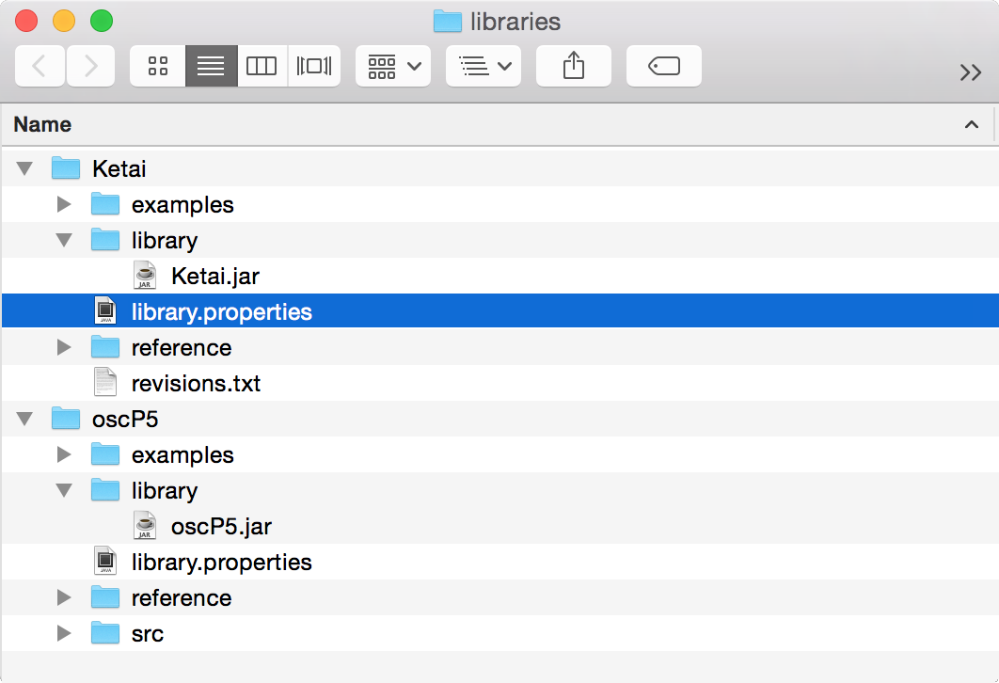
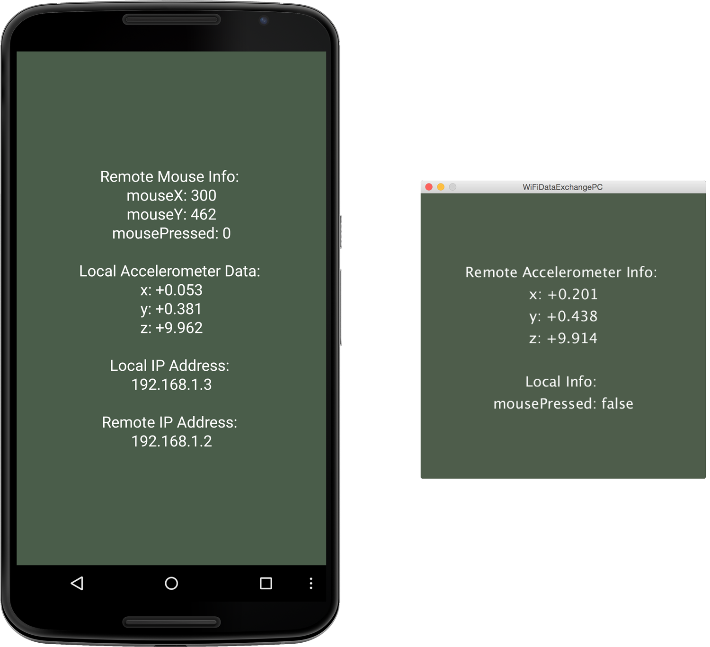
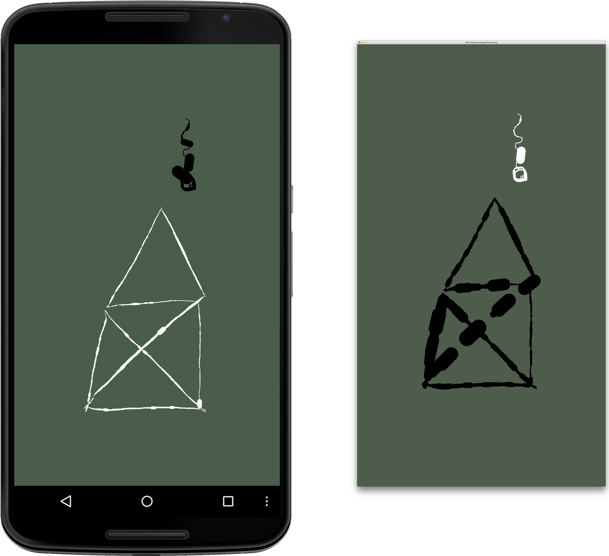
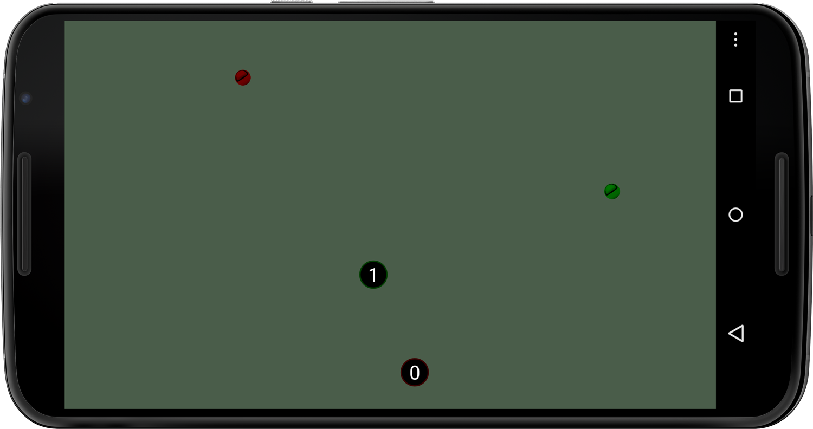

 
###Chapter 6:
#Networking Devices with Wi-Fi

Social media, location-based services, and multiplayer games are just a few examples of mobile applications that rely on frequent updates delivered over the Internet via cellular, cable, or satellite networks. In this chapter we’ll focus on wireless local area networks. The ability to exchange data between Android devices and PCs within a local area network allows us to write mobile apps that can connect multiple users without a mobile carrier data plan. 

By the end of this chapter, you’ll be able to send data between computers and Androids within a Wi-Fi network. You will be able to write real-time interactive apps running on multiple devices that take advantage of the high bandwidth offered by a Wi-Fi network. This can be useful, for example, to inventory stock in a retail store, monitor a patient, view data from a home security or automation system, or participate in a multiplayer game. 

There are four ways to connect devices without sending data over the Internet: Wi-Fi, Wi-Fi Direct, Bluetooth, and near field communication (`NFC`), listed in decreasing order in terms of connection distance, power consumption, and speed. We will cover peer-to-peer networking, to which Wi-Fi Direct and Bluetooth belong, in the next chapter, called {{ book.chapter7 }}, and cover NFC in the following one, called {{ book.chapter8 }}. 

We’ll start this chapter by creating an app that exchanges data between an Android device and a desktop PC using the Open Sound Control (`OSC`) networking format. Then we’ll build a collaborative drawing app, where we use the Wi-Fi network to share a drawing canvas between two Android devices. As the final project for this chapter, we’ll create a game for two players using the accelerometer on each device to control the tilt of a shared playing surface with two balls in play. Local Wi-Fi networks offer us the bandwidth and response time we need for multiplayer games while freeing us from worry about data plans and transmission quotas. 

###Working with Wi-Fi on Android Devices

Wi-Fi is so ubiquitous in cities that you can find a Wi-Fi network virtually anywhere you go. It’s true that most Wi-Fi networks that you encounter while you’re on the move are protected and won’t allow devices to connect. But most domestic and workplace destinations that we visit regularly—including many coffee shops, libraries, and airports—do offer the opportunity to subscribe or connect for free. Once connected, the phones, tablets, and laptop devices that you carry will remember a particular Wi-Fi network, making it easy to connect again when you return. 

Most Wi-Fi networks are set up to connect to the Internet. But you can also use a wireless network access point to set up a local Wi-Fi network for the sole purpose of connecting multiple Wi-Fi-enabled devices between one another. Many Android devices will even let you create a Wi-Fi hotspot using the device itself (Settings &mapsto; Wireless & networks &mapsto; More... &mapsto; Tethering & portable hotspots). 

When a Wi-Fi-enabled device connects to a Wi-Fi access point, it is assigned an IP address. An IP address is a unique identifier (see also [Working with Networking Classes](../networking.html#working-with-networking-classes
)) that is used to identify the device within a network. It functions as a numeric label that other devices can use to access it. Likewise, to connect our Android to other devices within the network, we need to know their IP addresses as well. 

When two devices wish to communicate, they must also share a common [port number][0] in addition to knowing each other’s IP addresses. A port is an agreed-upon number that establishes communication in conjunction with the IP address. Certain ports are [reserved for services such as FTP (Port 21) or HTTP (Port 80) and should not be used.][1] Port numbers greater than 1000 usually work just fine. 

If we’re on the move and a known Wi-Fi network is not available to us, the Android device requests an IP address from the cell phone carrier’s 3G or 4G network. Although it is possible to network two devices over the carrier network, we cannot sustain a peer-to-peer network as the device connects from cell tower to cell tower. Connecting two (or more) devices inside a Wi-Fi network is significantly different from connecting them outside the network, which is described in further detail in Peer-to-Peer Networking. In this chapter, we’ll stay focused on Wi-Fi communications. 

<!--sidebar--> 

<h3>Peer-to-Peer Networking (P2P)</h3>

When it comes to peer-to-peer networking, the difference between an IP address provided by a local area network and an IP address from a 4G or 3G cellular network is that we can send data to a local area network address directly. If we go outside the local area network, our IP address undergoes network address translation, or [`NAT`][2]. There is no way to connect directly to a device without knowing exactly how to translate that new number in reverse. “Getting through” the NAT router is often referred to as “traversing” the NAT, or NAT-busting. Applications such as Skype (voice-over-IP), Hamachi, or LogMeIn (remote desktop) are very good at traversing. IP addresses are managed centrally, and the techniques that companies use to traverse the NAT are proprietary. It is clear, though, that NAT-busting is a messy and complicated process, one that exploits NAT router and firewall loopholes. Why the trouble? Because of the great benefit that we can have very efficient [peer-to-peer][3]
connections that provide high update rates at no cost while “off-the-grid”.

If we are on the move, we will lose the IP address provided by a cellular network and will get a new one as we hop from tower to tower. A cellular provider might also have services in place that try to maintain a particular address using an address translation that takes place on the carrier’s side. Being handed over from cell tower to cell tower or from Wi-Fi network to Wi-Fi network, however, is the nature of being on the move. 

In short, for true P2P, we need a [public IP address.][4] In the prevalent IPv4 addressing system, there are virtually too few IP addresses available for the number of devices on the planet. An enormous global transition to the new IPv6 addressing system is currently underway, rendering NAT practically obsolete. You can keep an eye on the [IPv6 deployment][5] as it unfolds. For now we need to sit tight; all our toasters, clothes, and children have a dedicated IP address. 

 <!--/sidebar-->
 <!--6.0 COMMENT - We'll want to figure out how to address <sidebar> content at some point. -->

Let’s first take a look at the networking classes we’ll be using in this chapter. 

###Working with Networking Classes
  For the networking projects in this chapter, we’ll be working with the following classes provided by Processing, Ketai, and oscP5 libraries. 

* *[netP5][6]* Processing’s core library for reading and writing data across networks—it allows the creation of clients and servers over a specified port. A server connects to a list of clients for reading and writing data. A client is able to read and write data to that server. 

* *[KetaiNet][7]* A library containing Android-device-specific methods to complement `netP5`, including a method to look up the Android device IP address, as it frequently changes when we are on the move 

* *[oscP5][8]* An Open Sound Control library for Processing developed by Andreas Schlegel—`OSC` is a networking protocol for communication among computers, sound synthesizers, and other multimedia devices in many application areas. 

When two or more devices communicate in a distributed application through a network, they typically interact through a server-client computing model. The server provides resources, and a client requests them. There can be more than one client connected to the central server, and multiple clients can communicate with each other through that server. The server is responsible for establishing a connection between itself and one or more clients. 

To transfer data between devices, we need a protocol to package, send, and receive different data types in an efficient manner. We’ll use the Open Sound Control protocol for that. Let’s take a look at what `OSC` has to offer. 

###Using the Open Sound Control Networking Format
Open Sound Control (`OSC`) is a very flexible and popular data protocol. We can wrap pretty much any data format into an OSC message and send it over the network. We can also package several messages at a time in an OSC bundle before sending it on its way, giving us a lot of control over how much we send at once. So instead of taking our data, chopping it into individual pieces (bytes), and precariously assembling it on the other side of a network, we can send different data types within one OSC message. OSC allows us to change how many pieces of data we put into a message as well, and we don’t have to change the way we package it. This is particularly useful when we build networking apps, where we start with a simple message and add data to the payload as we get more complex. 

For the projects in this chapter, we’ll use the `netP5` library to read and write data over the network. It’s already available because it’s part of Processing’s core library. The `KetaiNet` class is also available because it’s part of the Ketai library, which we’ve already installed. 

Let’s go download the `oscP5` library now. You can find it at http://www.sojamo.de/libraries/oscP5/ and also among other Processing libraries in the [Data/Protocols][9] section of the Processing libraries website.

Let’s follow the same process we already used to install the Ketai library, which is the same process we use for installing any Processing library: 

1. Choose “Add Library...,” which you can find under Sketch &mapsto; “Import Library...” 

2. In the search field of the window that opens, enter `oscP5`. 

3. Select the “oscP5” library that appears in the list, and press the Install button on the right. 

4. The download starts immediately, and a bar shows the download’s progress. When the library is installed, the button on the right changes to Remove. 

Alternatively, you can use your web browser to download the library and install it manually within Processing’s library folder: 

1. Download and unzip the oscP5 library folder. 

2. Check what’s inside the folder. Locate the `library` subfolder that contains the actual Processing library `.jar`. The OSC library and most other Processing libraries also include `reference`, `examples`, and `src` subfolders. 

3. Move the complete `oscP5` directory, including `library`, `reference`, `examples`, and `src` into the Processing sketchbook, located at `Documents/Processing/libraries`. 

The sketchbook `libraries` folder now looks something like the figure below. Now let’s put OSC to work and network the Android with the PC.

<!-- 6.1 REVISION - removed reference link to images/Networking/libraries.png -->



###Network an Android with a Desktop PC
For our first project, we’re going to network a desktop PC and an Android device and then use the Wi-Fi network to exchange data between them. Wireless local area networks provide us with a high-bandwidth connection, which allows us to write applications that let us interact with peers within the network in real time. We can send fairly large data payloads without noticeable delays, making it a good choice for a diverse range of multiuser applications. 

We’ll need to import the networking classes described in [Working with Networking Classes](../networking.html#working-with-networking-classes), so we can exchange data over a common port, as illustrated in Figure 6.1. We’ll use oscP5, which builds on and requires Processing’s core netP5 library for the exchange of data. We also use the `KetaiNet` class to look up the Android’s IP address, and we’ll use the familiar `KetaiSensor` class to receive accelerometer data. 


#####Figure 6.1 - Connecting an Android to a PC.
######The screen output shows remote mouse data from the PC on the Android screen (left) and accelerometer data from the Android in the PC display window (right). The local Android IP address and the remote PC address are shown at the bottom of the Android screen.  

Before we get started, let’s make sure that both devices are connected to the same Wi-Fi network. Go ahead and check the Android (Settings &mapsto; Wireless & networks) to activate Wi-Fi. If your device is not already connected to a Wi-Fi network, choose the same network that the PC is connected to. Once connected, write down the IP address that has been assigned to the Android device. On your desktop machine, check your network settings so your desktop computer is connected to the same network as the Android. You can use an Ethernet connection for the PC as well, as long as you are connected to the same network as the Android. 

We’ll build this application in two steps: first we’ll write a sketch for the Android device and then for the PC. 


###Program the Android Device
Before you can connect your Android to the PC, you first need to figure out the IP address of the desktop computer on the local network. Make sure your PC is on the same network as the Android via Wi-Fi. 

* On a Mac, you’ll find your IP address under System Preferences &mapsto; Network. 

* On a PC, try Control Panel &mapsto; Network and Internet. 

* On Linux you can go to Administration &mapsto; Network Tools. 

My IP address looks like this: 
 
```
 192.168.1.2 
```

Your address most likely looks different. Write yours down, as it is not very intuitive, and this needs to be correct to connect successfully. 

We’ll first code the Android sketch using the oscP5 [`NetAddress` class][10] to specify the destination of the OSC message. We’ll create a `NetAddress` object called `remoteLocation` and consisting of the IP address of the remote device—in this case our PC—and the port number (12000) that both devices will use to communicate. For this first sketch, the OSC message we send will consist of three floating point numbers, the values of the *x*-, *y*-, and *z*-axes of the accelerometer that we’ll `add()` to the message before it’s sent. In turn, we’ll receive three integer values from the desktop PC, consisting of the *x* and *y* positions of the mouse cursor, followed by a `0` or a `1`, depending on whether the mouse button is pressed (`1`) or not (`0`). 

Now let’s take a look at the code for the sketch: 

#####code/Networking/WiFiDataExchangeAndroid/WiFiDataExchangeAndroid.pde
[include](code/Networking/WiFiDataExchangeAndroid/WiFiDataExchangeAndroid.pde)

Here are the steps outlining what the sketch does.

1. Import the Processing networking library `netP5` to read and write data over the network. Import the `oscP5` library to send data using the OSC protocol. Import the Ketai networking class to look up the device’s current IP address and the `KetaiSensor` class to work with the accelerometer sensor. 

2. Set the remote IP address variable (`remoteAddress`) of the desktop to exchange data with. 

3. Print all info about remote mouse position, state, and local accelerometer data. Android accelerometer data `myAccelerometerX`, `myAccelerometerY`, and `myAccelerometerZ` are presented with one digit to the left and two digits to the right of the decimal point and a plus or minus number prefix using the `nfp()` method. At the bottom of the screen we display our local Android IP address followed by the remote desktop IP. 

4. Create a new outgoing OSC message (`myMessage`) with an assigned label (`accelerometerData`) that contains our local accelerometer info. OSC labels can also be used on the receiving side to distinguish between multiple incoming messages. 

5. Add the `x`, `y`, and `z` accelerometer axes to the outgoing OSC message. 

6. Send the OSC message `myMessage` to `remoteLocation`. 

7. Check the incoming OSC message for the `iii` value pattern, which specifies a packet of three integer values. 

8. Once a complete OSC data package containing three integers is detected, we set `x`, `y`, and `p` to the incoming values. 

9. Instantiate an OSC object from the [`oscP5` library][11] and start an OSC connection on port `12000`. 

<!-- 6.1 REVISION - removed dead link and replaced with http://www.sojamo.de/libraries/oscP5/-->

10. Set the destination IP and port number to the `remoteAddress` at port number `12000`; the port number must be identical to successfully exchange data. 

11. Look up the Android IP address assigned by the Wi-Fi network using `getIP()`. 

The `oscP5` library relies on some methods from the core [network library in Processing called `netP5`,][12] which is why we `import` both at the beginning of the code. To work with the accelerometer, we use the `KetaiSensor` class again, which is why we `import` the `ketai.sensors` package. To look up the Android’s assigned Wi-Fi IP address we use the `getIP()` method contained in the [`ketai.net` package.][13] Make sure to customize `remoteAddress` to match your desktop IP address. 

Now we are ready on the Android side to start talking. 

<!-- 6.2 ISSUE - link [14] is no longer working, not sure what to replace it with, currently removed. Link [15] can be copied and pasted into the browser, but gitbook will not link directly to the page, perhaps because it is insecure; currently removed. Both links still present in link ref at bottom of page -->

###Open Sound Control
Developed by Matt Wright and Adrian Freed at the Center for New Music and Audio Technologies in 1997, the OSC protocol has been used for a variety of applications, including sensor-based electronic music instruments, mapping data to sound, multiuser controls, and web interfaces, to name a few. OSC messages consist of numeric and symbolic arguments, 32-bit integers and floats, time tags, strings, and blobs. Messages can be bundled so they can act simultaneously when received. Pattern matching allows OSC to specify multiple targets for a single message as well. This allows us to broadcast values to a number of devices. Optional time tags (64 bit) allow highly accurate synchronization of timed events. Many data exchange applications don’t require the optional time tags, as they utilize only the OSC data structure, triggering events upon delivery. 

Although less convenient and more fundamental in nature, other widespread communication protocols include [TCP (Transmission Control protocol),][16] [UDP (User Datagram protocol),][17] and asynchronous serial communication. [They use different ports to exchange data,][18] and they “shake hands” slightly differently. Handshaking is the process of negotiating communication parameters on both sides before the actual communication begins. 

###Run the App
Before we run the sketch, let’s check the `INTERNET` permissions in the Android Permissions Selector that we’ll need in order to send data through the network. We’ve already worked with different types of permissions for geolocation and cameras, and we follow the same procedure ([Setting Sketch Permissions](../geolocation.html#setting-sketch-permissions)) in the Permissions Selector, choosing `INTERNET` from the Android &mapsto; Sketch Permissions dialog. 

We’ll take the following steps to network the Android and the PC. First, we’ll run the Android sketch we’ve just created on the Android device. Then we’ll check the Processing console to see if OSC is up and running. Since the Android device is connected to the PC via USB, it gives us some feedback with regard to the OSC status when the app starts up. Finally, when the app is running on the device and the OSC server is running, we move on to run the PC sketch and start the connection. 

Now run the sketch on the Android device. It should start up fine, even if we don’t have a partner to talk to yet. When the app is starting up, the device reports to the console that OSC is initialized and that the OSC server is running on port `12000`. 

Here’s the output you can expect to see in the PDE (Processing IDE) console. 

```
PROCESS @ UdpClient.openSocket udp socket initialized.
PROCESS @ UdpServer.start() new Unicast DatagramSocket
created @ port 12000 INFO @ OscP5 is running. you (127.0.0.1)
are listening @ port 12000 PROCESS @ UdpServer.run() 
UdpServer is running @ 12000 
```

With the app launched on the Android, let’s shift our focus to the desktop to complete the OSC server-client network. 

###Program the PC
  The sketch for the PC is nearly identical to the one for the Android sketch. It’s a bit more concise because there’s no accelerometer data to capture on the desktop, and we don’t have to look up the device IP address because we’ve already written it down. The desktop sketch receives accelerometer values from the Android and sends its `mouseX`, `mouseY`, and `mousePressed` values in return. Let’s take a look: 

#####code/Networking/WiFiDataExchangePC/WiFiDataExchangePC.pde 
[include](code/Networking/WiFiDataExchangePC/WiFiDataExchangePC.pde)  

On the desktop, we make the following adjustments. 

1. Point OSC to the remote Android IP address `remoteLocation`, displayed on the Android as “Local IP Address.” Go ahead and customize this address using your Android’s IP address now. 

2. Add the horizontal mouse position `mouseX` to the OSC message. 

3. Add the vertical mouse position `mouseY` to the OSC message. 

4. Add the `mousePressed` boolean, cast as an integer number to send either `0` or `1` via OSC. 

5. Send the OSC message `myMessage` on its way to the Android via port `12000`. 

6. Check the OSC message for packages containing three incoming floating point values patterned “fff.” 

7. Assign incoming floating point values to `accelerometerX`, `accelerometerY`, and `accelerometerZ`, shown on the desktop screen. 

We are sending three global integers `x`, `y`, and `p` from the desktop to the Android (the horizontal and vertical mouse position and `mousePressed`) and will receive `accelerometerX`, `accelerometerY`, and `accelerometerZ` in return. For the data exchange, we are using port `12000` in both sketches. This port number (`12000`) could change, but it must be identical on both sides to work properly and [shouldn’t conflict with the lower numbers for ports][19] already in use.


###Run the App
Let’s run the sketch on the PC in Java mode. The display window starts up on the desktop, and we can now move the mouse in the window to send OSC messages containing mouse info to the Android. On the Android screen we see the horizontal and vertical position of the mouse update and the mouse button state change. Changing the orientation of the Android device gives us a range of accelerometer values, which we can observe on the desktop screen. Value updates seem to occur instantaneously. There is no perceivable lag time, and while we are certainly only sending a few values, it gives us an idea about the bandwidth Wi-Fi has to offer—a highly interactive setup. 

If communication fails, make sure you’ve adjusted `remoteAddress` in the Android sketch to match the IP address of your desktop PC. It’s close to impossible that your Wi-Fi router assigned the same IPs used in the example sketches here. And while you are at it, go ahead and also check that the port number matches on both sides. The IP address must be correct, and port numbers must match to exchange data successfully. 

Let’s note that when we use OSC networking, it won’t complain if there is no other device to talk to. The connection sits and waits until another device enters the conversation on port `12000`. Likewise, OSC doesn’t throw a networking error when a device leaves the conversation; it can also reconnect at any time. This is another great feature of the OSC communication protocol, whether we use it on the Android or the desktop—a robust connection process combined with a straightforward method to send messages containing different data types. 

In terms of networking across devices, this is a major milestone we can continue to build on. It’s a small step for us to change the values we’ve sent via OSC to take on different new tasks. So for the next project, we’ll use [Networking/WiFiDataExchangeAndroid/WiFiDataExchangeAndroid.pde](../networking.html#codenetworkingwifidataexchangeandroidwifidataexchangeandroidpde) to create a drawing canvas that the Android and the PC can share. 

<!-- 6.0 REVISION - minor revision to text for link grammar -->

###Share Real-Time Data
For our next project, we’re going to create a program for the Android and the PC that allows users of the two devices to draw on a shared surface, or virtual whiteboard, as shown in Figure 6.2, below. We’ll refine the previous sketches [Networking/WiFiDataExchangeAndroid/WiFiDataExchangeAndroid.pde](../networking.html#codenetworkingwifidataexchangeandroidwifidataexchangeandroidpde) and [Networking/WiFiDataExchangePC/WiFiDataExchangePC.pde](../networking.html#codenetworkingwifidataexchangepcwifidataexchangepcpde) that we’ve written to connect the Android and the desktop PC. The Wi-Fi network has the necessary bandwidth and update rates that we need to draw collaboratively. Whatever one of the users draws will appear instantaneously on the other’s device, and vice versa. 

Let’s start by programming the Android; then we’ll program the PC. 


#####Figure 6.2 - Networked drawing app.
######The image illustrates the app running on the Android (left) and the sketch running on the desktop PC (right). 

###Program the Android
Compared to the previous sketch, where we sent accelerometer data from the Android to the desktop and mouse info from the desktop to the Android, we’ll focus now on the `mouseX` and `mouseY` integer values we’ll need to draw, sending only those two constants back and forth using OSC. The sketches for the Android and the PC are identical, with the exception of the single line of code that specifies the remote IP address. Since we now know the IP addresses of both the Android and the PC, we can complete this project using only the oscP5 and netP5 libraries. 

Let’s take a look: 

#####code/Networking/WiFiDataExchangeAndroidDrawing/WiFiDataExchangeAndroidDrawing.pde
[include](code/Networking/WiFiDataExchangeAndroidDrawing/WiFiDataExchangeAndroidDrawing.pde)

Here are the steps we take to change the `draw()` and `oscEvent()` methods from the previous sketch [Networking/WiFiDataExchangeAndroid/WiFiDataExchangeAndroid.pde](../networking.html#codenetworkingwifidataexchangeandroidwifidataexchangeandroidpde): 

1. Create a new OSC connection on port `12001` to avoid conflicts with the previous sketch [Networking/WiFiDataExchangePC/WiFiDataExchangePC.pde](../networking.html#codenetworkingwifidataexchangepcwifidataexchangepcpde), which runs an OSC connection on port `12000`. 

2. Calculate the speed of the remote mouse, which we’ll use for the stroke weight. 

3. Define a stroke weight for the line drawing sent from the desktop via OSC. It is determined by the mouse speed and calculated from the difference between the previous to the current mouse position using the `dist()` method. 

4. Draw a line from the previous mouse position stored in `px` and `py` to the current mouse position’s `x` and `y`, received via OSC. 

5. Assign the current horizontal mouse position `x` to the previous position `px` once we are done drawing. 

6. Assign the current vertical mouse position `y` to the previous position `py` once we are done drawing. 

7. Calculate the speed of the fingertip moving across the screen using the distance `dist()` from the previous position (`pmouseX`, `pmouseY`) to the current position (`mouseX`, `mouseY`). 

8. Set the stroke weight for the line drawing on the Android to the fingertip’s `speed`. 

9. Draw a line from the previous to the current finger position. 

We moved a port number higher compared to the previous sketch so that the number would not conflict with the already established connection there. An OSC conflict with an already established connection on a specific port would be reported to the Processing console like this: 
 
```
ERROR @ UdpServer.start() IOException, couldnt create new DatagramSocket @ port 12000 java.net.BindException: Address already in use 
```

If we stopped the app that occupies the port, we can reuse that port number. To stop a sketch, hold down the home button on the Android device and swipe the app horizontally to close it, or choose Settings &mapsto; Manage Apps &mapsto; Wi-FiDataExchangeAndroid &mapsto; Force Stop. 

Because we’ve moved to port number `12001` for this sketch, we won’t run into a conflict. Let’s go ahead and test the app now. 

###Run the Android App
Load the sketch for the Android and run it on the device. When the app launches, the console reports that we are running an OSC server on port `12001`: 

 
```
 UdpServer.run() UdpServer is running @ 12001 
```
  When you move your finger across the touch screen surface, you draw white lines in different thicknesses, depending on how fast you are going. 

The Android sketch is now complete, and we can move on to the PC sketch so that we have two devices that can doodle collaboratively. 

###Program the PC

Now let’s work on the PC sketch. As mentioned earlier, the Android and desktop sketch involved in this virtual canvas project are identical; we only need to make sure the IP address matches the remote Android device. Let’s take a look at the following code snippet, where only the IP address differs from the Android sketch. 

#####code/Networking/WiFiDataExchangePCDrawing/WiFiDataExchangePCDrawing.pde 
[include](code/Networking/WiFiDataExchangePCDrawing/WiFiDataExchangePCDrawing.pde) 
 
To enable a graphical output on the PC, we add the following single line of code. 

1. Adjust the IP address as a parameter in the `NetAddress` object `remoteLocation` to match the Android IP. 


Now we are ready to doodle and communicate both ways. 


###Run the PC App
Let’s go ahead and run the sketch on the desktop PC. The Android sketch is already running. If you draw with your mouse in the display window on the desktop, you will cause white lines to appear on the screen whose weight increases the faster you draw. 

Now let’s go back to the Android and draw on its touch screen surface while keeping an eye on the desktop window. Notice that the lines you draw “locally” appear in white, while those that appear “remotely” are in black. Keep doodling using either the desktop or the Android, and you should see the same image you draw on one device appear in reverse colors on the other, as shown in Figure 6.2 (above). Black and white marks perpetually override each other as we keep doodling. 

You’ve exchanged data between the Android and a desktop PC using Wi-Fi; now is a good time to test OSC communication between two Android devices using Wi-Fi. For this, you’ll need to go find a second Android device. 


###Run the Sketch on a Pair of Androids

Now that you have located a second Android device—let’s call it Android 2—you can go ahead and confirm that you are able to send OSC messages between a pair of Android devices as well. Let’s make sure again that you are on the correct network with the second device, and choose Settings &mapsto; “Wireless & networks.” Write down the IP address of the second device. With the IP addresses of both devices ready, open the sketch [Networking/WiFiDataExchangeAndroidDrawing/WiFiDataExchangeAndroidDrawing.pde](../networking.html#codenetworkingwifidataexchangeandroiddrawingwifidataexchangeandroiddrawingpde), that we’ve already loaded onto the first device. 

Adjust the IP address for `remoteLocation` to match Android 2, and run the sketch on Android 1. The app starts up and Android 1 is ready. Repeat the steps on the other device, adjusting the IP address to match Android 1 and running the sketch on Android 2. If you are still running the other app on port `12001`, adjust the port number to use another port. 

You’ve mastered networking Android devices using Wi-Fi. Now let’s explore a slightly more advanced networking app, where we work with an extended set of OSC messages to develop a simple marble-balancing game for two devices. 


###Network a Pair of Androids for a Multiplayer Game
For this project, we are going to build on the previous sketch, in which we connected two Android devices using Wi-Fi and OSC. Let’s build a simple multiplayer game where each player uses an Android device to tilt a marble toward a selected target, as illustrated in Figure 6.3. Instead of a scenario in which one player controls the outcome on a single device, two devices will share a virtual game board whose orientation reflects the actions of the two players. One player influences the tilt of the other’s game board, and vice versa. 


#####Figure 6.3 - Multiplayer balancing game
######Played with two Android devices, two players compete in navigating individual marbles to the targets on a shared board, where the orientation of both devices influence each other.  

To make the marbles for this game look three-dimensional, we’ll load an image that provides us with the image texture we need for the desired effect. We’ll use Processing’s [`PImage` class][20]  again to store the image.We can load `gif`, `jpg`, `tga`, and `png` images using the `loadImage()`. We are going to use a [PNG-formatted image][21] because it supports a transparent background. With a transparent background, the image will appear to float on the surface of the game board without the background color showing up as a rectangle as the marble moves across it. `PImage` also offers us a `tint()` method, which we can use to create two differently [colored marbles][22] from one image.

The sketch we are going to build is identical on both devices with the exception of the value assigned to the variable `remoteAddress`, which points to the other Android device. This time we’ll send a few more values via OSC compared with the earlier [Networking/WiFiDataExchangeAndroidDrawing/WiFiDataExchangeAndroidDrawing.pde](../networking.html#codenetworkingwifidataexchangeandroiddrawingwifidataexchangeandroiddrawingpde)—seven instead of three, including the position of the marble, its speed, the position of each target, and the score for each player. OSC allows us to mix the data types we send within one message, so we’ll send four floating point values followed by three integers and determine a valid OSC message using the `checkTypetag(ffffiii)` method. 

To assign random positions to the marbles and targets when the app starts up, we’ll use [Processing’s `random()` method.][23] It generates random floating point numbers every time the method is called. We can use it with one parameter (floating point or integer number), causing `random()` to generate values ranging from zero to that number. We can also use it with two parameters, making `random()` return values ranging from the first to the second number parameter. 

Let’s take a look: 

#####code/Networking/MultiplayerBalance/MultiplayerBalance.pde 
[include](code/Networking/MultiplayerBalance/MultiplayerBalance.pde)  

Here’s what we are working with for the balancing game. 

1. Load a marble image from the sketch `data` folder using `loadImage()`. 

2. Tint the remote marble red to distinguish the two players. The [`tint()` method][24] is applied to the `marble.png` image, drawn next. 

3. Draw the tinted marble image at the remote position (`remoteX`, `remoteY`). 

4. Calculate the horizontal marble speed `speedX` by adding the horizontal accelerometer values of both devices, called `myAccelerometerX` and `rAccelerometerX`. Reduce the speed by multiplying the accelerometer sum by a factor of `0.1`. Do the same for the vertical direction in the following line. 

5. Bounce the marble off the screen edge whenever its distance from the edge is less then `25` pixels, which happens to equal half the diameter of the marble image. Consider the `speedX`, and dampen the speed at every bounce, reducing it to 80% (`0.8`) of the previous speed. Do the same for the *y*-axis next. 

6. Update the horizontal position `x` of the local marble. 

7. Add all the local marble positions (`x` and `y`), the local accelerometer values (`myAccelerometerX` and `myAccelerometerY`), the local target (`targetX` and `targetY`), and the local `score` to the OSC message (`myMessage`), and send it to the other device. 

8. Look for a package of four floating point numbers followed by three integers, and parse the message to assign values for the remote position (`remoteX` and `remoteY`), the remote accelerometer values (`rAccelerometerX` and `rAccelerometerY`), the remote target position (`remoteTargetX` and `remoteTargetY`), and the remote score (`remoteScore`). 

9. Initialize the local marble position and target position to appear randomly on the screen. 

Now let’s test the game. 

###Run the App

To run the game, let’s first check the IP addresses on both of the Android devices we’ll be using so that we can adjust the `remoteAddress` variable in the sketch for each Android device. 

Connect the first Android device (Android 1) to the desktop computer via USB and load the `MultiPlayerBalance` sketch into Processing. Locate the `remoteAddress` variable in the code; we’ll adjust this in a moment. 

Now look up the IP address of the second Android device (Android 2), which is currently not connected via USB cable. Navigate to Settings &mapsto; “Wireless & networks” on the device, and tap the Wi-Fi network the device is connected to. The IP address assigned to the device is shown on the bottom of the list. Write it down; it’s the IP address for Android 2. 

Now go back to the Processing sketch and adjust the IP address for `remoteAddress` to match the IP address (for Android 2) that you’ve just looked up. 

Run the sketch on Android 1, which is already connected via USB cable. When the sketch is launched on the device, disconnect Android 1 and connect Android 2. We’ll repeat those steps for the other device. 

With Android 2 connected via USB cable, locate `remoteAddress` in the code so we can adjust the IP address again. Look up the IP address of Android 1 now, which is currently not connected via USB cable. Write it down. 

Go back to the Processing code and adjust the IP address for `remoteAddress` to match the IP address (of Android 1) that you’ve just looked up. 

Run the sketch on Android 2, which is already connected via USB cable. When the sketch launches on the device, we are ready to play. 

Grab a friend and hand over one device. Now hold the device as level as possible to balance the green (local) marble toward its target, shown with a green stroke. Your friend is pursuing the same objective, which makes the balancing act more difficult as it probably interferes with the path of your marble toward the target. Once you’ve hit the target, or vice versa, the score increases and the game restarts. You can see score updates immediately when the target is reached. Enjoy your game! 

This two-player game concludes our explorations into wireless networking using Wi-Fi networks. 

###Wrapping Up
You’ve mastered the exchange of data across devices within a Wi-Fi network. You’ve learned how to package diverse data types into OSC messages, send them across wireless local area networks, and unpack them on the other side. You’ve got devices talking to each other, which you can now easily expand into other application contexts, including making the Android a remote control for other devices on the network. 

But if we don't have access to a Wi-Fi network and we'd like to exchange data with other Android devices directly, peer-to-peer, what can we do? All fourth-generation Android devices are equipped with Bluetooth, so in the next chapter we'll take a look at this short-distance wireless technology, and we'll also explore an emerging peer-to-peer networking standard known as Wi-Fi Direct. Then, in the following chapter, we'll explore near field communication, the emerging short-range wireless standard for contactless payment and smart cards. When you're done, you'll be an Android networking pro.

[0]: http://en.wikipedia.org/wiki/Port_%28computer_networking%29
[1]: http://en.wikipedia.org/wiki/Well-known_ports#Well-known_ports
[2]: http://en.wikipedia.org/wiki/Network_address_translation
[3]: http://en.wikipedia.org/wiki/Peer-to-peer
[4]: http://en.wikipedia.org/wiki/Public_IP_address#Public_address
[5]: http://en.wikipedia.org/wiki/IPv6_deployment
[6]: http://processing.org/reference/libraries/net/
[7]: http://ketai.org/reference/net/ketainet
[8]: http://www.sojamo.de/libraries/oscP5/
[9]: http://processing.org/reference/libraries/#data_protocols
[10]: http://www.sojamo.de/libraries/oscP5/reference/netP5/NetAddress.html
[11]: http://www.sojamo.de/libraries/oscP5/
[12]: http://processing.org/reference/libraries/net/index.html
[13]: http://ketai.org/reference
[14]: http://archive.cnmat.berkeley.edu/ICMC97/OpenSoundControl.html
[15]: http://www.opensoundcontrol.org/
[16]: http://en.wikipedia.org/wiki/Transmission_Control_Protocol
[17]: http://en.wikipedia.org/wiki/User_Datagram_Protocol
[18]: http://en.wikipedia.org/wiki/List_of_TCP_and_UDP_port_numbers
[19]: http://en.wikipedia.org/wiki/List_of_TCP_and_UDP_port_numbers
[20]: http://processing.org/reference/PImage.html
[21]: http://en.wikipedia.org/wiki/Portable_Network_Graphics
[22]: http://ketaiLibrary.org/rapidAndroidDevelopment/marble.png
[23]: http://processing.org/reference/random_.html
[24]: http://processing.org/reference/tint_.html